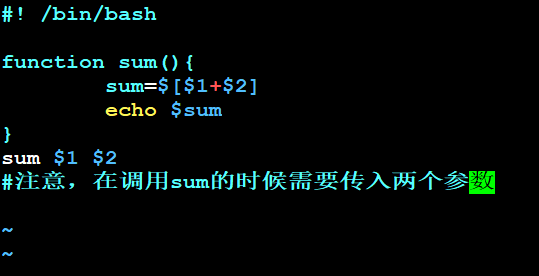
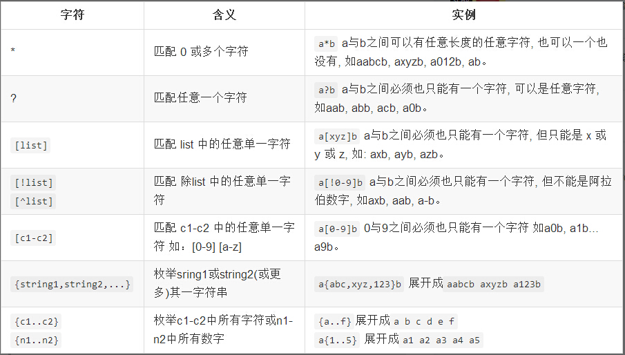

# siben

## Scala
### Scala之文件操作

Scala中，所有对文件的操作都是在scala.io.Source包中，比如常见的读取文件、写入等

当然，所有的Java对文件的操作，在scala中都可以直接调用的，毕竟scala是站在java这个巨人的肩膀上的

### Scala之apply

其实一直听到apply方法，但是具体不知道是什么含义？

> 调用某个的对象的apply方法，其含义是，当我们在对一个类（比如Array时），我们往往是直接调用的如下代码  val array = Array("1","2","3")
>
> 这里其实就是一个apply，为什么这么说呢？因为我们都知道类是不能直接调用方法的（除非是像Java中的静态类），因此我们这里的Array就是调用了Array类的伴生对象（同名的Array）的里面的apply方法，这个伴生对象其实就是Java中的静态实例了，因为它不能再被实例化了

因此，以后再听见说是某某类的apply方法时，其实调用了它的伴生对象的apply方法，传入了指定的参数；

当然与之对偶的还有一个unapply方法，这个以后我理解后再记

### Scala之List操作

```scala
package com.liang.scala

import java.util.Date
import java.text.SimpleDateFormat

/**
 * shiro.liang.yi@gmail.com
 * 18-08-24 21:05:34
 */
object List_self {
  
  
  def main(args: Array[String]){
    
		  println(List(1,2,3) :: List(4,5,6,7,8,9) :: List(10,11,12)) //List(List(1, 2, 3), List(4, 5, 6, 7, 8, 9), 10, 11, 12)
		  println((List(1,2,3)) ::: (List(4,5,6,7,8,9)) ::: (List(10,11,12))) //三个冒号直接操作的是List，两个冒号操作的是元素List(1, 2, 3, 4, 5, 6, 7, 8, 9, 10, 11, 12)
    
		  val bigData = List("NetBean","Intellij IDEA","Eclipse")
		  println(bigData.last)//Eclipse
		  println(bigData.init)//List(NetBean, Intellij IDEA)
		  println(bigData.reverse)//List(Eclipse, Intellij IDEA, NetBean)
		  println(bigData)//List(NetBean, Intellij IDEA, Eclipse)
		  println(bigData take 2) //‘take 2 ’操作是取出前两个元素 List(NetBean, Intellij IDEA)
		  println(bigData drop 2)//List(Eclipse)
		  println(bigData splitAt 2)//(List(NetBean, Intellij IDEA),List(Eclipse))
		  println(bigData apply 2)//Eclipse
		  println(bigData(2))//Eclipse
		  println()
		  
		  val data = List('a','b','c','d','e','f')
		  println(data.indices)//Range 0 until 6
		  println(data.indices zip data)//Vector((0,a), (1,b), (2,c), (3,d), (4,e), (5,f))
		  println(data.zipWithIndex)//List((a,0), (b,1), (c,2), (d,3), (e,4), (f,5))
		  println(data.toString())//List(a, b, c, d, e, f)
		  println(data.mkString("<", "*", ">"))//<a*b*c*d*e*f>
		  println(data.mkString("     "))//a     b     c     d     e     f
		  println(data.mkString)//abcdef
		  println()
		  
		  
		  val buffer = new StringBuilder
		  data addString(buffer, "(", ";;", ")")
		  println(buffer)//(a;;b;;c;;d;;e;;f)
		  println()
		  
		  val array = data.toArray
		  println(array.toList)//List(a, b, c, d, e, f)
		  println()
		  
		  val new_Array = new Array[Char](10)
		  data.copyToArray(new_Array,3)
		  new_Array.foreach(print)//   abcdef  前三个去掉
		  println()
		  
		  val iterator = data.toIterator
		  println(iterator.next)//a
		  println(iterator.next)//b
		  println(iterator.next())//c
		  
		  //Scala中调用当前系统时间  SimpleDateFormat这个类不是Scala包中的，因此没有可供直接使用的伴生对象apply方法，必须new
		  println(new SimpleDateFormat("yy-MM-dd HH:mm:ss").format(new Date()))
		  
		  
  }
}
```

```Scala
package com.liang.scala.list

import java.util.Date
import java.text.SimpleDateFormat

/**
 * shiro.liang.yi@gmail.com
 * 18-08-25 09:17:05
 */
object List_Highorder_Function_Ops {
  
  def main(args : Array[String]) : Unit = {
    
    /* 纯粹是为了熟悉Scala中的取出当前系统时间方法
    println(new SimpleDateFormat("YY-MM-dd HH:mm:ss").format(new Date()))*/
    
    /*map(_ + 1)的这种简写法,其实是map(i => i + 1)的简写*/
    println(List(1,2,3,4,6) map(_ + 1))//List(2, 3, 4, 5, 7)
    val data = List("Scala", "Hadoop", "Spark")
    /*其实最好不要调用length方法(效率太低)，判空时调用isEmpty要好点*/
    println(data map(_.length)) //List(5, 6, 5)
    /*mkString("","","")默认是三个参数的，但是你可以选择性的写*/
    println(data map(_.toList.reverse.mkString("","","")))//List(alacS, poodaH, krapS)
    println
    
    println(data.map(_.toList))//List(List(S, c, a, l, a), List(H, a, d, o, o, p), List(S, p, a, r, k))
    println(data.flatMap(_.toList))//List(S, c, a, l, a, H, a, d, o, o, p, S, p, a, r, k)
    println(List.range(1,10) flatMap(i => List.range(1,i) map(j => (i,j))))//List((2,1), (3,1), (3,2), (4,1), (4,2), (4,3), (5,1), (5,2), (5,3), (5,4), (6,1), (6,2), (6,3), (6,4), (6,5), (7,1), (7,2), (7,3), (7,4), (7,5), (7,6), (8,1), (8,2), (8,3), (8,4), (8,5), (8,6), (8,7), (9,1), (9,2), (9,3), (9,4), (9,5), (9,6), (9,7), (9,8))

    println    
    
    var sum = 0
    List(1,2,3,4,5) foreach(sum += _)
    println("sum: " + sum)//sum: 15
    println
    
    println(List(1,2,3,4,6,7,8,9,10) filter(_ % 2 == 0))//List(2, 4, 6, 8, 10)
    println(data filter(_.length == 5))//List(Scala, Spark)
      
    /*partition其实是分裂（即将List分成两部分的操作）*/
    println(List(1,2,3,4,5) partition(_ % 2 == 0))//(List(2, 4),List(1, 3, 5))
    println(List(1,2,3,4,5) find(_ % 2 == 0))//Some(2)
    println(List(1,2,3,4,5) takeWhile(_ < 4))//List(1, 2, 3)
    println(List(1,2,3,4,5) dropWhile(_ < 4))//List(4, 5)
    /*span()也是将元素分为两部分,但是List的partition是会遍历所有元素的;而span是碰到第一个不满足的元素即返回*/
    println(List(1,2,3,4,5) span(_ < 4))//(List(1, 2, 3),List(4, 5))
    println
    
    val left = List(1,2,3)
    val right = List(4,5,6)
    /*以下操作等价*/
    println(left ++ right)//List(1, 2, 3, 4, 5, 6)
    println(left ++: right)//List(1, 2, 3, 4, 5, 6)
    println(right.++:(left))//List(1, 2, 3, 4, 5, 6)
    println(right.:::(left))//List(1, 2, 3, 4, 5, 6)
    /*以下操作等价*/
    println(0 +: left)//List(0, 1, 2, 3)
    println(left.+:(0))//List(0, 1, 2, 3)
    println
    
    def hastotallyZeroRow(m : List[List[Int]]) = m exists(row => row forall(_ == 0))
    val m = List(List(1,0,0), List(0,1,0), List(0,0,0))
    println(hastotallyZeroRow(m))//true
    
  }
}
```
### Scala ::: and ++

With ':::'  you can only concatenate two List 

With '++' you can append any collection to List 

```scala
scala> List(1,2,3) ++ "ab"
res0: List[AnyVal] = List(1,2,3,a,b)
scala> List(1,2,3) + "ab"
res1: String = List(1,2,3)ab
```

### Scala之入门

```scala
package com.liang.scala

/**
 * shiro.liang.yi@gmail.com
 * 18-08-27 21:44:13
 */
object ScalaBasics {
  
  def looper(x : Long,y : Long) : Long = {
    var a = x
    var b = y
    while(a != 0){
      val temp = a
      a = b % a
      b = temp
    }
    b
  }
  //println(looper(123,432))
    
  /**
   * 普通读取控制台输入方法
   */
  def doWhile(){
    var line = ""
      do{
        line = readLine()
        println("Read: " + line)
      }while(line != "")
  }
   //doWhile() //调用
   
   /**
    * 入口方法
    */
   def main(args: Array[String]): Unit = {
//    print("Spark is scala; hadoop is java")
//    for(arg <- args) println(arg)
     
     //流程判断
     var file = "scala.txt"
     if(!args.isEmpty) file = args.apply(0)
      // val file = if(!args.isEmpty) args(0) else "Spark.xml"
         //println(file)
        // println(if(!args.isEmpty) args(0) else "Spark.xml")
         
     //打印出当前目录下的所有子文件或文件夹
      /* val files = (new java.io.File(".")).listFiles()
       for(file <- files){
         println(file)
       }
     */
     
     
     //从控制台读取内容
     var line = ""
     do{
       println("please input some words blow......")
       line = readLine()
       println("Read: " + line)
     }while(line != "")
  }
   
  
}
```

### Scala之Tuple

```scala
package com.liang.scala

/**
 * shiro.liang.yi@gmail.com
 * 18-08-27 21:44:13
 */
object TupleOps {
  
  def main(args: Array[String]) : Unit = {
    //这里scala能够推导出triple是一个Tuple
    //Tuple的声明就是直接一个圆括号
    val triple = (100,"Scala","Spark")
    println(triple._1)
    println(triple._2)
  }
}
```

### Scala之基本集合类

### List

```scala
//标准的LinkedList
scala> List(1,2,3)
res0: List[Int] = List(1,2,3)
//你也可以像在函数式语言里一样把它们串接起来
scala> 1 :: 2 :: 3 :: Nil
res1: List[Int] = List(1,2,3)
//参考API文档:https://www.scala-lang.org/api/current/scala/collection/immutable/List.html
```

### Set

```scala
//Set里面不包含重复元素
scala> Set(1,1,2)
res2: scala.collection.immutable.Set[Int] = Set(1,2)
//参考API文档:https://www.scala-lang.org/api/current/scala/collection/immutable/Set.html
```

### Seq

```scala
//Sequence都有一个预定义的顺序
scala> Seq(1,1,2)
res3: Seq[Int] = List(1,1,2)
/*注意返回的结果是一个List,Seq是一个trait;List是它的一个实现类.Seq对象是一个工厂对象,正如你所看到的,它会创建一个List*/    
//参考API文档:https://www.scala-lang.org/api/current/scala/collection/immutable/Seq.html
```

### Map

```scala
//Map是保存键-值对的容器
scala> Map('a' -> 1, 'b' -> 2)
res4: scala.collection.immutable.Map[Char,Int] = Map((a,1), (b,2))
//参考API文档:https://www.scala-lang.org/api/current/scala/collection/immutable/Map.html
```

### 层级关系

上面的这些都是trait，在可变（mutable）包和不可变（immutable）包里都有对应的实现，同时也有其它特殊用途的实现

### Traversable

> 所有的集合都可遍历的。这个trait定义了标准函数组合器。这些组合器都是通过foreach这个方法来实现的，并且所有的集合都实现了这个方法 

### Iterable

> 这个trait有一个`iterator()`方法，它返回一个可以遍历所有元素的Iterator 
>
> 参考API文档：https://www.scala-lang.org/api/current/scala/collection/Iterable.html

### Scala和Java进行交互

> 你可以通过 [JavaConverters 包](http://www.scala-lang.org/api/current/index.html#scala.collection.JavaConverters$)在Java和Scala的集合类之间进行转换. 它给常用的Java集合提供了`asScala`方法，同时给常用的Scala集合提供了`asJava`方法 

```scala
import scala.collection.JavaConverters._
val sl = new scala.collection.mutable.ListBuffer[Int]
val jl : java.util.List[Int] = sl.asJava
val sl2 : scala.collection.mutable.Buffer[Int] = jl.asScala
assert(sl eq sl2)
```

双向转换

```scala
scala.collection.Iterable <=> java.lang.Iterable
scala.collection.Iterable <=> java.util.Collection
scala.collection.Iterator <=> java.util.{ Iterator, Enumeration }
scala.collection.mutable.Buffer <=> java.util.List
scala.collection.mutable.Set <=> java.util.Set
scala.collection.mutable.Map <=> java.util.{ Map, Dictionary }
scala.collection.mutable.ConcurrentMap <=> java.util.concurrent.ConcurrentMap
```

另外，下面还提供了一些单向的转换方法

```scala
scala.collection.Seq => java.util.List
scala.collection.mutable.Seq => java.util.List
scala.collection.Set => java.util.Set
scala.collection.Map => java.util.Map
//其实从这里可以看出：Scala中的Seq类似于Java中的List、其它的基本一样
```

### Scala之Set和Map进阶操作

```scala
package com.liang.scala.map
import java.text.SimpleDateFormat
import java.util.Date
import scala.collection.immutable.TreeSet
import scala.collection.immutable.TreeMap

/**
 * shiro.liang.yi@gmail.com
 * 18-08-27 20:49:19
 */
object Set_Map {

  def main(args: Array[String]): Unit = {
    
    import scala.collection.mutable
    /*调用Set的empty生成空的Set【注意：因为是空的,所以必须指明类型/其它同理】*/
    val data = mutable.Set.empty[Int]
    data ++= List(1,2,3)
    data += 4
    data --= List(2,3)
    println(data)//Set(1, 4)
    data += 1
    println(data)//Set(1, 4)
    data.clear()
    println(data)//Set()
    println()
    
    val map = mutable.Map.empty[String,String]
    map.put("key", "Hadoop")//这两种赋值方式是一样的
    map("Scala") = "Spark"
    println(map)//Map(key -> Hadoop, Scala -> Spark)
    println(map("Scala"))//Spark
    println
    
    /*【Scala中关于TreeSet、TreeMap等带Tree的,都会默认实现排序功能】*/
    val treeSet = TreeSet(9,3,1,8,0,2,7,4,6,5)
    println(treeSet)//TreeSet(0, 1, 2, 3, 4, 5, 6, 7, 8, 9) 默认会排序好
    val treeSetForChar = TreeSet("Spark","Scala","Hadoop")
    println(treeSetForChar)//TreeSet(Hadoop, Scala, Spark)
    println
    
    val treeMap = TreeMap("Scala" -> "Spark", "Java" -> "Hadoop")
    println(treeMap)//Map(Java -> Hadoop, Scala -> Spark) //用key排序的
    

  }
}
```

### Scala之IO操作

```scala
package com.liang.scala

import scala.io.Source

object FileOps {
  def main(args: Array[String]): Unit = {
    //读取一个目标位置文件的内容,一定要注意引入的是scala.io.Source这个包
    val file = Source.fromFile("E:\\tcp-async-log")
    for(line <- file.getLines())
      println(line)
      
    //也可以指定一个网址地址,调用的方法就变成了从URL了
      val file_web = Source.fromURL("http://blog.sina.com.cn/") 
      for(line <- file_web.getLines()) {
        println(line)
      }
  }
}
```

### Scala之Array初识

````scala
package com.liang.scala

/**
 * shiro.liang.yi@gmail.com
 * 18-08-27 21:44:13
 */
object ArrayOps {
  
  def main(args: Array[String]): Unit = {
    val array = Array(1,2,3,4,5)
//    for(a <- array){
//      println(a)
//    }
    for(i <- 0 until array.length)
      println(array(i))
  }
}
````

### Scala之Map初识

```scala
package com.liang.scala

/**
 * shiro.liang.yi@gmail.com
 * 18-08-27 21:44:13
 */
object MapOps {
  
  def main(args: Array[String]): Unit = {
    val ages = Map("siben"->"aa","age"->20)
//    for(age <- ages) println(age)
//    for(age <- ages.keys) println(age)
//    for(age <- ages.values) println(age)
//    for((k,v) <- ages) println("key: "+k,"value: "+v)
//      for((kk,vv) <- ages) println(kk,vv)
    for((_,vvv) <- ages) println("vvv: "+vvv)
    for((kkk,_) <- ages) println("kkk: "+kkk)
  }
}
```

### Scala之对List伴生对象的操作

```scala
package com.liang.scala.list

import java.text.SimpleDateFormat
import java.util.Date

/**
 * shiro.liang.yi@gmail.com
 * 2018-08-27 19:38:05
 */
object List_obj {

  def main(args: Array[String]): Unit = {
    
    //回顾时间的操作
    //println(new SimpleDateFormat("yyyy-MM-dd HH:mm:ss").format(new Date()))
    
    /**
     * 主要是对List的伴生对象的操作
     */
    println(List.apply(1,2,3)) //List(1, 2, 3)
    println(List.range(2, 7))//List(2, 3, 4, 5, 6) 产生一个前闭后开的List
    println(List.range(2, 7, 2))//List(2, 4, 6) range(start,end,step)
    println
    
    val zipped = "abcde".toList.zip(List(1,2,3,4,5))
    println(zipped)//List((a,1), (b,2), (c,3), (d,4), (e,5))
    println(zipped.unzip)//就是对zip操作的逆向操作(List(a, b, c, d, e),List(1, 2, 3, 4, 5))
    
  }
  
}
```
### Scala中的String格式转换

```scala
/*
我有一个类似这样的字符串“232302001A710218641004529”；
现在我想将它转化为这种形式：'23,23,02,00,1A'等这种形式，怎么做？
*/

//第一种方式
val str = "232302001A710218641004529" +
    "8B9A000A00000E100010160120903130108920050433630315F433133302E3030342E31" +
    "32372E30315F54312E312E300000006466626635613532613761346463303963343065" +
    "0000000000000000000000000000000000000000000001005D28"

  val ans = str.sliding(2,2).toList
  println(ans)
//List(23, 23, 02, 00, 1A, 71, 02, 18, 64, 10, 04, 52, 98, B9, A0, 00, A0, 00, 00, E1, 00, 01, 01, 60, 12, 09, 03, 13, 01, 08, 92, 00, 50, 43, 36, 30, 31, 5F, 43, 31, 33, 30, 2E, 30, 30, 34, 2E, 31, 32, 37, 2E, 30, 31, 5F, 54, 31, 2E, 31, 2E, 30, 00, 00, 00, 64, 66, 62, 66, 35, 61, 35, 32, 61, 37, 61, 34, 64, 63, 30, 39, 63, 34, 30, 65, 00, 00, 00, 00, 00, 00, 00, 00, 00, 00, 00, 00, 00, 00, 00, 00, 00, 00, 00, 00, 00, 00, 01, 00, 5D, 28)

//第二种方式
val string = "232302001A710218641004529"
val res = string.grouped(2).toList
println(res)   //List(23, 23, 02, 00, 1A, 71, 02, 18, 64, 10, 04, 52, 9)

//ps一定要多用，多练习，多看源码(这个是提高你的能力的捷径；多去StackOverflow上问大神，这是对于你解决问题的很重要的一个途径)
```
### Scala creating Actors

```scala
import akka.actor.Actor
import akka.actor.Props
import akka.event.Logging

class MyActor extends Actor{
    val log = Logging(context.system, this)
    
    def receive = {
        case "test" => log.info("received test")
        case _ => log.info("received unknow message")
    }
}
```

### scala巧码

```scala
/*
从指定的输入文件中移除空行
*/
object RemoveBlanks{
	def apply(path: String,compressWhiteSpace:Boolean=false):Seq[String]=
	for{
		line <- scala.io.Source.fromFile(path).getLines.toSeq
		if line.matches("""^\s*$""") == false
		line2 = if(compressWhiteSpace) line replaceAll("\\s+","")
			else line
	} yield line2
	
	/*
	从指定的输入文件中移除空行，并将其它行内容依次发送给标准输出
	@param 参数列表包含了文件路径，为每一个文件路径都增加了可选的‘-’前缀，
	    并会压缩以‘-’前缀开头文件中的剩余空白符
	*/
	def main(args:Array[String]) = for{
		path2 <- args
		(compress,path) = if(path2 startsWith "-")(true,path2.substring(1))
						else(false,path2)
					line <- apply(path,compress)
	}println(line)
}
```


## maven

### 创建maven工程

> groupId 项目组织唯一的标识符，实际对应 Java 的包的结构，是 main 目录里 java 的目录结构。
>
> artifactId 就是项目的唯一的标识符，实际对应项目的名称，就是项目根目录的名称

### maven的配置文件

> 在maven中的setting.xml配置文件中profiles标签指定jdk的版本方法

```xml
<profiles>
	<profile>
		<id>jdk-1.8</id>
		<activation>
			<activeByDefault>true</activeByDefault>
			<jdk>1.8</jdk>
		</activation>
		<properties>
			<maven.compiler.source>1.8</maven.compiler.source>
			<maven.compiler.target>1.8</maven.compiler.target>
			<maven.compiler.comilerVersion>1.8</maven.compiler.compilerVersion>
		</properties>
	</profile>
</profiles> 
```
### mvn install

### mvn install 与 mvn package的区别：

一般来说，二者都可以打成一个包，而具体打成什么包，得在你项目的pom.xml文件中的<package>标签中看；

mvn install 准确的说是将新创建(即打包)的jar包安装到你的仓库中了，即你需要到你的maven仓库中去寻找这个jar包

而mvn package则是官方意义上的打包【个人推荐使用】

### maven仓库查找

当我们在别人的项目上看到一个类，想要引用时，但是不知道具体的maven依赖，怎么办？

只需要在这个网站上输入 别人引用的包名即可 http://www.mvnrepository.com/

然后选中某一版本，点击进去，拷贝到你的pom.xml中即可


### maven本地仓库配置

> 从中央仓库下载的 jar 包，都会统一存放到本地仓库中，我们需要配置本地仓库的位置。打开 maven 安装目录，打开 conf 目录下的 setting.xml 文件
>
> 可以参照下图配置本地存储仓库位置
>
> ```xml
>   <!-- localRepository
>    | The path to the local repository maven will use to store artifacts.
>    |
>    | Default: ${user.home}/.m2/repository
>   <localRepository>/path/to/local/repo</localRepository>
>   -->
>   <localRepository>E:\maven-respository</localRepository>
>
>   <!-- interactiveMode
>    | This will determine whether maven prompts you when it needs input. If set to false,
>    | maven will use a sensible default value, perhaps based on some other setting, for
>    | the parameter in question.
>    |
>    | Default: true
>   <interactiveMode>true</interactiveMode>
>   -->
> ```
>
> 你还可以在运行时指定本地仓库位置：
>
> ```shell
> mvn clean install -Dmaven.repo.local=d:yourpath
> ```
>
> 【注意：maven的命令参数一般都是以 -D 开始】

### maven中央仓库配置

> 当构建一个 Maven 项目时，首先检查 pom.xml 文件以确定依赖包的下载位置，执行顺序如下：
>
> 1、从本地资源库中查找并获得依赖包，如果没有，执行第二步
>
> 2、从 Maven 默认中央仓库中查找并获得依赖包 （http://repo1.maven.org/maven2）,如果没有，执行第三步
>
> 3、如果在 pom.xml 中定义了自定义的远程仓库，那么也会在这里的仓库中进行查找并获得依赖包，如果都没有找到，那么 maven 就会抛出异常
>
> 

#### 修改默认中央仓库地址

```xml
<mirror>
    <id>nexus-aliyun</id>
    <mirrorOf>*,!jeecg,!jeecg-snapshots</mirrorOf>
    <name>Nexus aliyun</name>
    <url>http://maven.aliyun.com/nexus/content/groups/public</url>
</mirror>
```

> 常用地址：
>
> ```bash
> http://www.sonatype.org/nexus/ 私服nexus工具使用
> http://mvnrepository.com/ （推荐）
> http://repo1.maven.org/maven2
> http://maven.aliyun.com/nexus/content/groups/public/ 阿里云 （强力推荐）
> http://repo2.maven.org/maven2/ 私服nexus工具使用
> http://uk.maven.org/maven2/
> http://repository.jboss.org/nexus/content/groups/public
> http://maven.oschina.net/content/groups/public/ 
> http://mirrors.ibiblio.org/maven2/
> http://maven.antelink.com/content/repositories/central/
> http://nexus.openkoala.org/nexus/content/groups/Koala-release/
> http://maven.tmatesoft.com/content/groups/public/
> ```
>
> 

### maven工程配置tomcat

> maven项目在配置Tomcat部署项目时，有两种方式；
>
> 第一种：直接点击fix，
>
> 
>
> 
>
> 第二种，手动选择要部署出去的项目，特别是有多个项目的情况；
> 
>
> 配置项目结构，特别是要注意依赖的包需要部署到WEB-INF的lib目录下：
>
> 

#### war和war exploded的区别

> 是选择war还是war exploded，这里首先看一下它们两个的区别：
>
> * war模式这种可以称之为是发布模式，看名字也知道，这是先打成war包，再发布；
>
> * war exploded模式是直接把文件夹、jsp页面、classes等等移到Tomcat部署文件夹里面，进行加载部署，因此这种方式支持热部署，一般在开发的时候也是用这种方式
>
> * 在平时开发的时候，使用热部署的话，应该对Tomcat进行相应的设置，这样的话修改的jsp页面什么的东西才可以即时的显示出来。
>
> * 两种方式的部署方式是不一样的，在获取项目的路径的时候得到的结果也是不一样的：
>
>   ```java
>   String contextPath = request.getSession().getServletContext().getRealPath("/");
>   ```

### maven修改项目结构

> maven有一个很重要的功能是规范项目，标准的项目结构如下所示：
>
> 
>
> 
>
> 

#### 不能添加Servlet的解决方法

> 打开项目描述文件，指定源代码目录：
>
> ```xml
>  <sourceRoots>
>  <root url="file://$MODULE_DIR$/src/main/java" />
>  </sourceRoots>
> ```
>
> 修改方法：
>
> 
>
> 这样就可以了：
>
> 
>
> 如果没有添加 tomcat 的配置信息或没有servlet的核心包也可能出现该问题，建议修改 pom 加上：
>
> ```xml
>  <!-- JSTL -->
>  <dependency>
>  <groupId>javax.servlet</groupId>
>  <artifactId>jstl</artifactId>
>  <version>1.2</version>
>  </dependency>
>  <!-- Servlet核心包 -->
>  <dependency>
>  <groupId>javax.servlet</groupId>
>  <artifactId>javax.servlet-api</artifactId>
>  <version>3.0.1</version>
>  <scope>provided</scope>
>  </dependency>
>  <!--JSP -->
>  <dependency>
>  <groupId>javax.servlet.jsp</groupId>
>  <artifactId>jsp-api</artifactId>
>  <version>2.1</version>
>  <scope>provided</scope>
>  </dependency>
> ```
>
> 

### 在idea中使用maven指令

> 工具栏介绍：
>
> 
>
> 图标1：重新导入所有的maven项目，刷新
>
> 图标2：重新生成所有源代码并更新文件夹
>
> 图标3：下载所有源码或文件
>
> 图标4：添加一个外部的 Maven 项目
>
> 图标5：执行选择的指令
>
> 图标6：执行自定义的指令
>
> 图标7：切换离线模式
>
> 图标8：切换成跳过测试模式
>
> 图标9：显示依赖结构图
>
> 
>
> 图标10：折叠所有
>
> 图标11：Maven设置

### 如何使用Maven插件(Plugin)

> 要添加 Maven 插件，可以在 pom.xml 文件中添加 <plugin> 标签
>
> ```xml
> <plugins>
>  <!-- jetty插件 -->
>  <plugin>
>  <groupId>org.mortbay.jetty</groupId>
>  <artifactId>maven-jetty-plugin</artifactId>
>  <version>6.1.26</version>
>  <configuration>
>  <webAppSourceDirectory>src/main/webapp</webAppSourceDirectory>
>  <scanIntervalSeconds>3</scanIntervalSeconds>
>  <contextPath>/jetty</contextPath>
>  <connectors>
>  <connector implementation="org.mortbay.jetty.nio.SelectChannelConnector">
>  <port>4000</port>
>  </connector>
>  </connectors>
>  </configuration>
>  </plugin>
>  </plugins>
> ```

#### 常用maven插件

> Maven 是一个执行插件的框架，每一个任务实际上是由插件完成的。Maven 提供以下两种类型插件：构建插件，在生成过程中执行，并在 pom.xml 中的<build/> 元素进行配置；报告插件，在网站生成期间执行，在 pom.xml 中的 <reporting/> 元素进行配置。
>
> **maven-antrun-plugin**
>
> http://maven.apache.org/plugins/maven-antrun-plugin/
>
> maven-antrun-plugin能让用户在Maven项目中运行Ant任务。用户可以直接在该插件的配置以Ant的方式编写Target，然后交给该插件的run目标去执行。在一些由Ant往Maven迁移的项目中，该插件尤其有用。此外当你发现需要编写一些自定义程度很高的任务，同时又觉得Maven不够灵活时，也可以以Ant的方式实现之。maven-antrun-plugin的run目标通常与生命周期绑定运行。
>
> **maven-archetype-plugin**
>
> http://maven.apache.org/archetype/maven-archetype-plugin/
>
> Archtype指项目的骨架，Maven初学者最开始执行的Maven命令可能就是mvn archetype:generate，这实际上就是让maven-archetype-plugin生成一个很简单的项目骨架，帮助开发者快速上手。可能也有人看到一些文档写了mvn archetype:create，但实际上create目标已经被弃用了，取而代之的是generate目标，该目标使用交互式的方式提示用户输入必要的信息以创建项目，体验更好。 maven-archetype-plugin还有一些其他目标帮助用户自己定义项目原型，例如你由一个产品需要交付给很多客户进行二次开发，你就可以为他们提供一个Archtype，帮助他们快速上手。
>
> **maven-assembly-plugin**
>
> http://maven.apache.org/plugins/maven-assembly-plugin/
>
> maven-assembly-plugin的用途是制作项目分发包，该分发包可能包含了项目的可执行文件、源代码、readme、平台脚本等等。 maven-assembly-plugin支持各种主流的格式如zip、tar.gz、jar和war等，具体打包哪些文件是高度可控的，例如用户可以按文件级别的粒度、文件集级别的粒度、模块级别的粒度、以及依赖级别的粒度控制打包，此外，包含和排除配置也是支持的。maven-assembly- plugin要求用户使用一个名为assembly.xml的元数据文件来表述打包，它的single目标可以直接在命令行调用，也可以被绑定至生命周期。
>
> **maven-dependency-plugin**
>
> http://maven.apache.org/plugins/maven-dependency-plugin/
>
> maven-dependency-plugin最大的用途是帮助分析项目依赖，dependency:list能够列出项目最终解析到的依赖列表，dependency:tree能进一步的描绘项目依赖树，dependency:analyze可以告诉你项目依赖潜在的问题，如果你有直接使用到的却未声明的依赖，该目标就会发出警告。maven-dependency-plugin还有很多目标帮助你操作依赖文件，例如dependency:copy-dependencies能将项目依赖从本地Maven仓库复制到某个特定的文件夹下面。
>
> **maven-enforcer-plugin**
>
> http://maven.apache.org/plugins/maven-enforcer-plugin/
>
> 在一个稍大一点的组织或团队中，你无法保证所有成员都熟悉Maven，那他们做一些比较愚蠢的事情就会变得很正常，例如给项目引入了外部的 SNAPSHOT依赖而导致构建不稳定，使用了一个与大家不一致的Maven版本而经常抱怨构建出现诡异问题。maven-enforcer- plugin能够帮助你避免之类问题，它允许你创建一系列规则强制大家遵守，包括设定Java版本、设定Maven版本、禁止某些依赖、禁止 SNAPSHOT依赖。只要在一个父POM配置规则，然后让大家继承，当规则遭到破坏的时候，Maven就会报错。除了标准的规则之外，你还可以扩展该插件，编写自己的规则。maven-enforcer-plugin的enforce目标负责检查规则，它默认绑定到生命周期的validate阶段。
>
> **maven-help-plugin**
>
> http://maven.apache.org/plugins/maven-help-plugin/
>
> maven-help-plugin是一个小巧的辅助工具，最简单的help:system可以打印所有可用的环境变量和Java系统属性。help:effective-pom和help:effective-settings最为有用，它们分别打印项目的有效POM和有效settings，有效POM是指合并了所有父POM（包括Super POM）后的XML，当你不确定POM的某些信息从何而来时，就可以查看有效POM。有效settings同理，特别是当你发现自己配置的 settings.xml没有生效时，就可以用help:effective-settings来验证。此外，maven-help-plugin的describe目标可以帮助你描述任何一个Maven插件的信息，还有all-profiles目标和active-profiles目标帮助查看项目的Profile。
>
> **maven-release-plugin**
>
> http://maven.apache.org/plugins/maven-release-plugin/
>
> maven-release-plugin的用途是帮助自动化项目版本发布，它依赖于POM中的SCM信息。release:prepare用来准备版本发布，具体的工作包括检查是否有未提交代码、检查是否有SNAPSHOT依赖、升级项目的SNAPSHOT版本至RELEASE版本、为项目打标签等等。release:perform则是签出标签中的RELEASE源码，构建并发布。版本发布是非常琐碎的工作，它涉及了各种检查，而且由于该工作仅仅是偶尔需要，因此手动操作很容易遗漏一些细节，maven-release-plugin让该工作变得非常快速简便，不易出错。maven-release-plugin的各种目标通常直接在命令行调用，因为版本发布显然不是日常构建生命周期的一部分。
>
> **maven-resources-plugin**
>
> http://maven.apache.org/plugins/maven-resources-plugin/
>
> 为了使项目结构更为清晰，Maven区别对待Java代码文件和资源文件，maven-compiler-plugin用来编译Java代码，maven-resources-plugin则用来处理资源文件。默认的主资源文件目录是src/main/resources，很多用户会需要添加额外的资源文件目录，这个时候就可以通过配置maven-resources-plugin来实现。此外，资源文件过滤也是Maven的一大特性，你可以在资源文件中使用${propertyName}形式的Maven属性，然后配置maven-resources-plugin开启对资源文件的过滤，之后就可以针对不同环境通过命令行或者Profile传入属性的值，以实现更为灵活的构建。
>
> **maven-surefire-plugin**
>
> http://maven.apache.org/plugins/maven-surefire-plugin/
>
> 可能是由于历史的原因，Maven 2/3中用于执行测试的插件不是maven-test-plugin，而是maven-surefire-plugin。其实大部分时间内，只要你的测试类遵循通用的命令约定（以Test结尾、以TestCase结尾、或者以Test开头），就几乎不用知晓该插件的存在。然而在当你想要跳过测试、排除某些测试类、或者使用一些TestNG特性的时候，了解maven-surefire-plugin的一些配置选项就很有用了。例如 mvn test -Dtest=FooTest 这样一条命令的效果是仅运行FooTest测试类，这是通过控制maven-surefire-plugin的test参数实现的。
>
> **build-helper-maven-plugin**
>
> http://mojo.codehaus.org/build-helper-maven-plugin/
>
> Maven默认只允许指定一个主Java代码目录和一个测试Java代码目录，虽然这其实是个应当尽量遵守的约定，但偶尔你还是会希望能够指定多个源码目录（例如为了应对遗留项目），build-helper-maven-plugin的add-source目标就是服务于这个目的，通常它被绑定到默认生命周期的generate-sources阶段以添加额外的源码目录。需要强调的是，这种做法还是不推荐的，因为它破坏了 Maven的约定，而且可能会遇到其他严格遵守约定的插件工具无法正确识别额外的源码目录。
>
> build-helper-maven-plugin的另一个非常有用的目标是attach-artifact，使用该目标你可以以classifier的形式选取部分项目文件生成附属构件，并同时install到本地仓库，也可以deploy到远程仓库。
>
> **exec-maven-plugin**
>
> http://mojo.codehaus.org/exec-maven-plugin/
>
> exec-maven-plugin很好理解，顾名思义，它能让你运行任何本地的系统程序，在某些特定情况下，运行一个Maven外部的程序可能就是最简单的问题解决方案，这就是exec:exec的用途，当然，该插件还允许你配置相关的程序运行参数。除了exec目标之外，exec-maven-plugin还提供了一个java目标，该目标要求你提供一个mainClass参数，然后它能够利用当前项目的依赖作为classpath，在同一个JVM中运行该mainClass。有时候，为了简单的演示一个命令行Java程序，你可以在POM中配置好exec-maven-plugin的相关运行参数，然后直接在命令运行mvn exec:java 以查看运行效果。
>
> **jetty-maven-plugin**
>
> http://wiki.eclipse.org/Jetty/Feature/Jetty_Maven_Plugin
>
> 在进行Web开发的时候，打开浏览器对应用进行手动的测试几乎是无法避免的，这种测试方法通常就是将项目打包成war文件，然后部署到Web容器中，再启动容器进行验证，这显然十分耗时。为了帮助开发者节省时间，jetty-maven-plugin应运而生，它完全兼容 Maven项目的目录结构，能够周期性地检查源文件，一旦发现变更后自动更新到内置的Jetty Web容器中。做一些基本配置后（例如Web应用的contextPath和自动扫描变更的时间间隔），你只要执行 mvn jetty:run ，然后在IDE中修改代码，代码经IDE自动编译后产生变更，再由jetty-maven-plugin侦测到后更新至Jetty容器，这时你就可以直接测试Web页面了。需要注意的是，jetty-maven-plugin并不是宿主于Apache或Codehaus的官方插件，因此使用的时候需要额外的配置settings.xml的pluginGroups元素，将org.mortbay.jetty这个pluginGroup加入。
>
> **versions-maven-plugin**
>
> http://mojo.codehaus.org/versions-maven-plugin/
>
> 很多Maven用户遇到过这样一个问题，当项目包含大量模块的时候，为他们集体更新版本就变成一件烦人的事情，到底有没有自动化工具能帮助完成这件事情呢？（当然你可以使用sed之类的文本操作工具，不过不在本文讨论范围）答案是肯定的，versions-maven- plugin提供了很多目标帮助你管理Maven项目的各种版本信息。例如最常用的，命令 mvn versions:set -DnewVersion=1.1-SNAPSHOT 就能帮助你把所有模块的版本更新到1.1-SNAPSHOT。该插件还提供了其他一些很有用的目标，display-dependency- updates能告诉你项目依赖有哪些可用的更新；类似的display-plugin-updates能告诉你可用的插件更新；然后use- latest-versions能自动帮你将所有依赖升级到最新版本。最后，如果你对所做的更改满意，则可以使用 mvn versions:commit 提交，不满意的话也可以使用 mvn versions:revert 进行撤销。
>
> 更多详情请参考https://maven.apache.org/plugins/

### dependencies和dependencyManagement、plugin和pluginManagement的区别

> dependencyManagement 是表示依赖 jar 包的声明，即你在项目路中的 dependencyManagement 下声明了依赖，maven 不会加载该依赖，dependencyManagement 声明可以被继承；
>
> dependencyManagement 的一个使用案例是当有父子项目的时候，父项目中可以利用 dependencyManagement 声明子项目中需要用到的依赖 jar 包，之后，当某个或者某几个子项目需要加载该插件的时候，就可以在子项目中 dependencies 节点只配置 groupId 和artifactId 就可以完成插件的引用
>
> dependencyManagement 主要是为了统一管理插件，确保所有子项目使用的插件版本保持一致，类似的还有 plugins 和 pluginManagement
>
> 

## SpringBoot
### spring boot之HelloWorld
#### 1、编写一个主程序，启动Spring Boot应用
```java
    /**
     * @author shiro.liang.yi@gmail.com
     * @date 2018-08-09 20:48
     * @SpringBootApplication 来标注一个主程序类，说明这是一个Spring Boot应用
     */
    @SpringBootApplication
    public class HelloWorldController {
    	
        //Spring应用启动起来
        public static void main(String[] args) throws Exception {
            SpringApplication.run(HelloWorldController.class, args);
        }
    }
```

#### 2、编写相关的Controller、Service

    /**
     * @author shiro.liang.yi@gmail.com
     * @date 2018-08-19 11:36
     */
    @Controller
    public class HelloController {
    
        @ResponseBody  //将return "Hello World";写给浏览器
        @RequestMapping("/hello")  //接收浏览器的/hello请求
        public String hello(){
            return "Hello World";
        }
    }

#### 3、测试

直接跑到主程序里面，将main方法运行起来即可【注意：我并没有配置tomcat】

【切记，如果你在idea中另外配置了tomcat，一定要删除掉，否则，spring boot的本身的starter并没有起作用，反而会报错】

#### 4、简化部署

     <!-- 这个插件，可以将应用打包成一个可执行的jar包 -->
        <build>
            <plugins>
                <plugin>
                    <groupId>org.springframework.boot</groupId>
                    <artifactId>spring-boot-maven-plugin</artifactId>
                </plugin>
            </plugins>
        </build>

#### 5、打包

```java
点击 Lifecycle（生命周期）中的package，如下所示：
```


将这个应用打成jar包，直接使用 java -jar的命令进行执行【注意在打包成的jar包中，已经自带了tomcat的jar包，因此和你本地装没装tomcat没有关系】；得到目标jar包后，用java -jar 运行目标jar包，然后直接浏览器访问即可

具体参看1

 1：C:\shiro-liang-yi-gitlab\udan\spingBoot 的atguigu分支

图示如下：


用war打开如下：


### Hello World探究

#### 1、POM文件

     <!--Spring Boot启动父依赖-->
    <parent>
        <groupId>org.springframework.boot</groupId>
        <artifactId>spring-boot-starter-parent</artifactId>
        <version>1.5.8.RELEASE</version>
    </parent>
    
    它的父项目是
    <parent>
    		<groupId>org.springframework.boot</groupId>
    		<artifactId>spring-boot-dependencies</artifactId>
    		<version>1.5.8.RELEASE</version>
    		<relativePath>../../spring-boot-dependencies</relativePath>
    </parent>
    它是来真正管理Spring Boot应用里面的所有依赖版本

Spring Boot的版本仲裁中心

以后我们导入依赖默认是不需要写版本的；因为所有的版本管理都在spring-boot-dependencies这个xml文件中进行了管理；但是也有一些是没有在spring-boot-dependencies中定义了的，那么就需要我们自己声明版本号的

#### 2、启动器

    <dependency>
                <groupId>org.springframework.boot</groupId>
            	<artifactId>spring-boot-starter-web</artifactId>
    </dependency>

spring-boot-starter-web

    spring-boot-starter：spring-boot场景启动器；帮我们导入了web模块正常运行所依赖的组件；

Spring Boot 将所有的功能场景都抽取出来，做成一个个的starter（启动器），只需要在项目里面引入这些starter相关场景的所有依赖都会导入进来，要用什么功能就导入什么场景的启动器

#### 3、使用Spring Initializr快速创建Spring Boot项目

IDE都支持使用Spring的项目创建向导快速创建一个Spring Boot项目

选择我们需要的模块，想到会联网创建模块

默认生成的Spring Boot项目：

- 主程序已经生成好了，我们只需要我们自己的逻辑
- resources文件夹中目录结构
  - static：保存所有的静态资源：js css images

  - templates：保存所有的模板页面（Spring Boot默认jar包使用嵌入式的tomcat，默认不支持JSP页面）；可以使用模板引擎（freemarker、thymeleaf）

  - application.properties：Spring Boot应用的配置文件：可以修改一些默认配置，比如启动端口，就在里面修改即可

    

## node.js

我发现我之前的理解一直是错的，今天我重新梳理一下：

### 定义

> 首先 node 并不是一门语言，而是 javascript 的一个新的运行环境（准确地说是 js 的一个运行时）
>
> 传统上，js 的运行环境依赖于浏览器，是借助于浏览器渲染的，因此这也限制了 js 的表演领域只能是浏览器(web)端
>
> 但是，当出现了 nodejs (node和nodejs一回事)后，js 又有了一个全新的运行时(还是习惯这么叫)，js 搭上了 node 这列快车后，使得 js 的用武之地拓展到了 服务端、游戏端、tcp、web端、桌面端等（不依托于浏览器等地方），因此这两者的强势结合，在业界（尤其前端）掀起了一阵风暴
>
> 我们常用的还是 它在桌面端和 web 端这种全新的开发模式
>
> 说到 node在 web 端的开发，就不得不提及一个伟大的 node 在 web 端的库（类似于框架，准确地说我也不知道库和框架的真正意义上区别是什么），那就是 Express 库
>
> 而 node 在桌面端的开发中，也有两个大名鼎鼎的 库：nw 和 electron（谷歌力推的）
>
> 由此看来，node 的前景无限美好啊，同志们仍需努力啊，废话就不多说了，开始撸吧

接下来，我说一下利用 node 和 Express 库 来搭建一个站点的原理吧，流程模式类似于：浏览器发起一个请求，然后服务端接受(或者是叫拦截 intercept)这个请求，然后响应函数，将处理结果返回给浏览器，交给浏览器去渲染该相应结果

一个完整的 node Express 库的项目结构如下：

```bash
|__node_modules
|__routers
	|__main.js
|__views
	|__index.html
	|__about.html
|__package.json
|__app.js
```

上面这些是一个 Express 库项目所必需的 

接下来，开始真正的表演了

### 1、创建 Express 的服务器(server)

我在前面说过，node 的项目最关键的是处理 js，因此在 node 中，最重要以及控制整个项目的运行都是依赖于 js 的，但是这些 js 文件是依赖于 node 去加载处理的，所以即使你看到一大堆 html 页面，也是不能直接在浏览器中正确运行的

而控制整个项目的最高一级 js 是一个叫 app.js 的文件（你完全可以重新命名，并重写它，但是约定俗成叫这个名）；请注意这个文件的目录级别，是位于项目根目录的，切记（因为是最高级别的）

* 接下来，我们就手写这个文件，并说明这个文件的每一处代码的作用

```javascript
//1、要想构建一个浏览器端访问，服务端响应的系统(暂且称之为系统吧),在node中，有很多种方式，这里我们采用Express库来创建服务端
var express = require('express');

//2、这个库对外提供了一个 express() 的入口方法,用来创建服务端实例
var app = express();

//3、设置服务端的响应 url 映射地址
app.get('/index', function (req, res) {
    res.send("哇塞，你真的进来了哦");
});

//4、让这个服务端的实例监听一个浏览器的端口,同时附带一些友好提示信息
app.listen('3333', function () {
    console.log("Server is running on http://127.0.0.1:3333");
});

```

到此，一个最简单的 demo 就完成了，然后你进入到该文件所在的目录下，执行命令 `node app.js`（注意，这里我还是按照大部分人的习惯，起名叫 app.js 了）

这个时候，你就可以在浏览器输入控制台打印出的这个地址访问了，是不是 so easy！（注意，我这里设置的拦截请求是 /index,因此按照我的来的话，你得这样访问：http://127.0.0.1:3333/index）,好了，先总结到这里吧

* 但是实际上，我们的响应绝不是几个字符串那么简单呐，而是需要根据不同的请求去渲染不同的页面，因此光是上面那样是不行的哦；别灰心，接下来我们再来修改上面的内容，实现根据接受不同的请求从而渲染不同的页面，好了，让我们开始吧，是不是有点迫不及待了。。。

```javascript
//1、复制上面代码，然后修改响应数据
var express = require('express');

var app = express();

//2、既然是 响应各种页面，那么我们就需要一个视图渲染引擎了，在 Express node 中，就是 ejs
var ejs = require('ejs');

//3、将创造出的这个服务端实例的视图引擎修设置为 ejs
app.set('view engine', 'ejs');

//4、在设置 ejs 引擎处理的是哪一类文件
app.engine('html', ejs.renderFile);

//5、下面这些代码保持不动就行了,无非就是多加了几个页面 【注意，get表示我这里只处理的是 get 请求哦】
app.get('/index', function (req, res) {
  res.render('./index.html'); //这里是绑定该响应将要渲染的那个页面
});
app.get('about', function (req, res) {
    res.render('./about.html'); //同上,但是我多说一句，这里一般经常会出现渲染页面路径写的不对的问题，这个需要你自己慢慢观察了【ps：渲染时，系统会自动去 views 文件夹下面找视图，因此，如果你的页面是views的直接子目录，那就直接写目标页面即可】
});

app.listen('3333', function () {
    console.log("Server is running on http://127.0.0.1:3333");
});

```

嚄，终于完成了，虽然累，但是理解的还是深刻的嘛，入门的不二选择哦，欢迎交流哦

### 在webstorm中创建node项目

#### 创建node项目

一般都是创建 express 框架的 nodejs 项目，整个过程我就不写了，先下载 node 插件，然后新建选中 该目标项目结构即可，一直下一步

新创建的 node 项目，一般并不是 html 模板引擎的，我们需要修改：

只需要修改 `app.js` 文件：该文件是程序的启动文件

​	1、加入 html 模板引擎

```javascript
app.engine('html', require('ejs').renderFile);
```

​	2、将 view 模板引擎修改为 html

```javascript
app.set('view engine', 'html');
```

整个过程只需要这两步即可

#### 项目结构介绍

新建的项目的结构如下：

* bin：是真实的执行程序
* node_modules：存放所有的项目依赖库
* public：静态文件
* routes：路由文件
* views：视图文件
* app.js：程序启动文件
* package.json：项目依赖配置文件及开发者的信息配置

【切记】：nodejs 的项目不能直接在浏览器中运行，因为它有特定的运行环境；nw 或 electron 

### NodeJs去除所有空格

```html
orderNo: _self.form.orderId.replace(/\s+/g, ''),
去除所有空格使用replace(/\s+/g, '')这个；
去除两端的空格使用trim()
```

```
https://github.com/TheTorProject/gettorbrowser
在github.com上staring的项目很不错
```

### package.json和node_modules的关系

> 在node.js工程中，一定会有一个叫node_modules的文件夹；但是不一定有package.json文件（不过一般为了随大流，都有。。。）
>
> package.json这个文件可以手工编写，也可以使用 npm init命令自动生成
>
> ```bash
> npm init
> ```
>
> 这个命令采用互动方式执行，要求用户回答一些问题，然后在当前目录生成一个基本的`package.json`文件，所有问题中，只有项目名称(name)和项目版本(version)是必填的，其它都是选填的
>
> 有了`package.json`文件，直接使用`npm install`命令，就会在当前目录中安装所需要的模块
>
> 如果一个模块不在package.json文件之中，可以单独安装这个模块，并使用相应的参数，将其写入package.json文件之中
>
> ```bash
> npm install express --save
> npm install express --save-dev
> ```
>
> 上面代码表示单独安装express模块，`- - save`参数表示将该模块写入 `dependencies`（生产环境）属性，`- - save-dev` 表示将该模块写入 `devDependencies `（开发环境）属性

### node_modules的创建

#### npm是什么

> npm是一个让JavaScript程序员分享和复用代码的工具，有了它，JS程序员能高效地管理和发布自己要分享的代码
>
> 一般提到npm，就是 指的是Node.js工程，因为这正是Node.js能火遍大江南北的一个最亮的特点（便是采用了npm）

#### 用npm安装模块

> 用npm安装模块有两种方式：本地安装和全局安装，如果你需要用`Node.js`的`require`来获取依赖，那么你需要的是本地安装，也就是默认的方式
>
> 本地安装的命令：
>
> ```bash
> npm install <package_name>
> ```
>
> 这个命令的结果就是在你命令行的当前目录下面创建一个叫 `node_modules`的文件，然后把安装的代码放到这个文件夹下面
>
> 全局安装：
>
> 如果需要在命令行里使用包，那就需要全局安装：
>
> ```bash
> npm install -g axios
> ```

##### 我一般安装模块的方式

> 我习惯于：想要安装哪个模块时，现在package.json中的dependencies（生产环境）属性下写入对应的包名称和版本号，再利用ide工具的自动导入

##### 查看安装成功与否

> 在`install`之后，如果没有异常的话，安装的代码将会出现在 `node_modules`的目录下，查看一下成功与否：
>
> ```bash
> ls node_modules
> ```
>
> 如果是windows的话，是：
>
> ```bash
> dir node_modules
> ```
>
> 安装一个叫做 `underscore` 的包：
>
> ```bash
> npm install underscore
> ls node_modules
> ```
>
> 如果没有问题的话，就能在一堆文件里面找到 underscore；如果当前文件夹下面没有 `pacakage.json`，那么就会自动下载到最新的版本，如果有 `pacakage.json`，那么可能会根据 `pacakage.json` 下载指定的版本

#### 使用安装好的包

> 一旦这个包安装到了 `node_modules` 文件夹下面，你就能在你的代码里使用它了；新建一个 `index.js` ，随便在哪个文件下面都行：
>
> ```js
> //index.js
> var _ = require("underscore");
> var result = _.map([1,2,3], function(num){return num * 3;});
> console.log(result);
> ```
>
> 然后在 `index.js` 的目录下输入 `node index.js` ，就会得到结果：`[3,6,9]`

### package.json

> 命令行运行 npm install，然后你需要填入很多关于这个包的信息，如果只是测试一下，不打算发布，直接回车确定就行；当然省略这些步骤也可以敲：`npm init --yes` ，然后所有的项都会使用默认值

#### 指定依赖

> package.json里面有两个对象是用来指定依赖的：
>
> * "dependencies"：这个对象下面列出生产环境下的依赖
> * "devDependencies"：这个对象下面列出开发环境的依赖
>
> 当然，也可以手动编辑 package.json

#### - - save 和 - - save-dev

> 往package.json里面添加依赖更好的办法就是用命令行，添加生产环境的依赖：
>
> ```bash
> npm install <package_name> --save
> ```
>
> 添加开发环境的依赖：
>
> ```bash
> npm install <package_name> --save-dev
> ```
>
> 如果当前目录下面有package.json文件，然后你敲入npm install命令，然后就会安装好dependencies里面的依赖

### 创建Node.js模块

> Node.js模块就是发布到npm的代码包，创建一个新模块的第一步就是创建一个`package.json`文件。你可以用`npm init`来创建`package.json`文件。这个过程中命令行会逐步提示你输入这个模块的信息，其中模块的名字和版本号是必填项，你还需要一个`main`，如果你使用默认值的话，那就会是`index.js`.
>
> 创建完`package.json`文件之后，你就要开始写代码包里的内容了，这里举个最简单的例子，在默认的`index.js`里写一个要导出的函数，这个函数也就是别人的代码里可以`import`或者`require`的。
>
> ```bash
> exports.printMsg = function(){
>         console.log("This is a message from the demo package");
>     }
> ```
>
> 写完之后可以用`npm publish `来发布，当然，在发布之前还需要一个账号

#### 发布代码

> 首先当然是新建账号：
>
> ```bash
> npm adduser //新建账号
> npm login //登录
> ```
>
> 然后是发布：
>
> ```bash
> npm publish
> ```
>
> 发布完之后可以去`http://npmjs.com/package/<package>`查看一下是否成功了
>
> 假设已经成功发布了，并且包名叫做`test`，这时候可以新建一个空目录，cd 进去，运行 npm install test，然后在这个目录下会出现一个叫 node_modules的文件夹，你之前写的包就会出现在这个文件夹下面，然后写一个 test.js
>
> ```js
> var printMsg = require("test");
> printMsg();
> ```
>
> 这个test.js可以在任意的目录下，在这个test.js里面require你之前写的包，得到那个包里导出的函数，然后在这个test.js的目录下敲入node test.js ， 你就会看到 This is a message from the demo package，表示成功引入了自己写的包

### 关于require

#### 导入路径问题

> `NodeJs` 中的 `require` 默认就是导入 `node_modules` 文件夹下面的模块，因此在导入 `node_modules` 下面的模块时不需要给出路径

### 关于html页面引入js控制脚本

我们一般是将html页面与其 js控制项分开成多个文件，然后在html页面中通过script脚本标签来引入，这时候注意，我们再html引入的其它js，在别的js里面也是可以直接调用到的，因为浏览器在加载时，是将整个html和所有引入的js脚本一起加载为一个dom树，因此，彼此js之间可以直接调用，就像是在上下文中调用

例如：files-analyze-tool.html 如下

```html
<!DOCTYPE html>
<html lang="en">
<head>
    <meta charset="UTF-8">
    <link rel="stylesheet" href="../public/stylesheets/style.css">
    <!--引入bootstrap.css-->
    <link type="text/css" href="../node_modules/bootstrap/dist/css/bootstrap.css"/>
    <title>files-analyze-tool</title>
</head>
<body class="card-body">
<h1 class="h1">文件解析工具</h1>

<div class="form-control" id="app">
    <p>{{msg}}</p>
    <input type="file" id="choosedFile" @click="openFile">
</div>

<!--引入Vue.js-->
<script src="../node_modules/vue/dist/vue.js"></script>
<script src="../routes/renderer.js"></script>
<!--引入控制js-->
</body>
</html>
```

renderer.js 如下：

```js
/**
 * require 需要用到的js
 */
let fs = require('fs'); // fs 文件系统模块
let path = require('path'); // 文件路径模块


// 实例化Vue 【注意：此处不需要再引入Vue.js,因为加载后它与html页面都在一颗dom树下,可以直接调用到html页面引入的其它脚本】
let vm = new Vue({
    el:'#app',
    data(){
        return{
            msg : 'hello shiro.liang.yi@gmail.com'
        }
    },
    methods:{}
```


### 关于npm安装node-pty模块的报错

当时是报的 windows 的各种环境错误，等

建议使用 `PowerShell（管理员身份）` 安装  `npm install --global windows-build-tools` 试试

### fs文件操作

#### fs.write和fs.writeFile的区别

二者最主要的区别是两点（也可以说是一点）：read(write)是一次性完成读取(写入)，不经过缓存区的读取操作；而readFile(writeFIle)是必经过缓存区的操作

1、readFile方法是将要读取的文件内容完整读入缓存区，再从该缓存区中读取文件内容

```javascript
let fs = require('fs');
fs.readFile('./test.txt', 'utf8', function(error, data){
    if(error){
       	console.error(error);
    }else{
        console.log('success');
    }
});
```

与之对应的其同步方法为：

```javascript
let data = fs.readFileSync('./text.txt', 'utf8');
// 注意同步与异步操作形式上最大的区别就是：同步操作没有回调函数
```

同步方法和异步方法的区别是：在使用同步方法执行的操作结束之前，不能执行后续代码的执行，而异步方法将操作结果作为回调函数的参数进行返回，方法调用之后，就可以立即执行后续的代码，读取完毕后会调用对应的回调函数

2、writeFile方法是将要写入的文件内容完整的读入缓存区，然后一次性的将缓存区中的内容都写入文件中，向一个指定的文件中写入数据，如果不存在则创建，如果存在则直接写入【之所以这样，是因为writeFile默认的flag是w，当是w模式时，如果不存在就会自动创建】

3、文件操作涉及到的参数，以writeFile为例：

​	path：路径

​	encoding：编码格式

​	flags：要打开文件的方式（w、r、a、w+等）

​	mode：设置文件的模式（权限） 读/写/执行

​	callback：回调

4、如何区分该方法是否是需要缓存？可以这样记忆：凡是方法名中带有file的都不需要写入缓存区（比如：writeFile和readFile）；而write、read、writeSync、readSync等都是需要先写入缓存区，再从缓存区读写

## NWJS

### NWJS 定义

> 我们学习一个东西都是从最基本的两方面入手：是什么？怎么用？
>
> nwjs(以前简称node-webkit)允许你直接从 DOM 调用所有 node.js 模块，并启用一种使用所有 web 技术编写应用程序的新方法
>
> nw.js 是 intel 支持的一个基于 nodeJs 和 chromium 的应用程序运行环境，还有一个是 github 支持的 Electron ，这个相对于 nw 比较火
>
> 使用 nw 打包的程序虽然看起来是一个电脑应用程序，但它实质上相当于一个 UI 浏览器，只不过是以一个轻量级的应用程序呈现出来，因此完全支持浏览器的所有功能，同时也支持本地的接口，可以直接从 DOM 和 Web Workers 调用 nodeJs 模块，适用于 linux、Mac、windows
>
> 总之个人理解一句话即可：nwjs 是 node.js 的一个桌面化运行环境（这里是一个，还有其它的哦）

## npm

### 查看npm当前安装的版本

```bash
npm -v
```

### npm更新到指定版本

```bash
npm install npm@latesst -g
```

这样就可以更新到最新版本了

其中`@`符号后面可以添加你想更新到的版本号

### npm全局安装

全局安装的命令：`npm install node-pty --global` ；全局安装就是安装在 `Node` 的安装目录下的 `node_modules` 文件夹中，一般在  `\Users\用户名\AppData\Roaming\ ` 目录下，可以使用 `npm root -g` 查看全局安装目录

全局安装后可以供命令行（command line）使用，用户可以在命令行中直接运行该组件包支持的命令

### npm本地安装

本地安装命令是： npm install node-pty 或 `npm install node-pty --save-dev`，其中参数 `--save-dev`的含义是代表把你的安装包信息写入`package.json`文件的 `devDependencies` 字段中，包安装在`指定项目的node_modules` 文件夹下

本地安装后可以直接通过 `require()` 的方式引入项目中的 `node_modules` 目录下的模块

### 查看全局安装目录

使用`npm root -g`查看全局安装目录

## nvs

### 介绍

> `NVS`（节点版本切换器）是一个跨平台的应用程序，用于在 Node.js 的不同版本和分支之间进行切换，它是专门用来管理 node 版本的工具。NVS本身是用节点 JavaScript 编写的。
>
> 这个工具显然受到其它节点版本管理器工具的启发，尤其是nvm，它借鉴了很多想法和一些命令行语法

## Chocolatey

### 介绍

> 对于l inux 用户来说，安装软件基本都是使用系统自带的包管理工具，比如：yum，apt，yast等第三方软件，但是在 windows 上通常我们就只能使用 cygwin 或者 MinGW 来模拟 linux 的命令，但是它们的包管理实在是不好用，今天就介绍一个 Windows 平台的包管理工具 Chocolatey
>
> 通过 Choco安装的包是不需要考虑依赖问题的，因为如果有需要的话，Choco 会在安装时一并安装好；此外，比如 Node、Python 安装后的环境变量也会自动设置好
>
> 在 Chocolatey 的官方网站（https://chocolatey.org/）的主页上点击 Install 便可进入安装页面。Choco 的安装是在 cmd/powershell 下安装的，必须要以管理员身份启动，不然的话会安装失败，由于是使用命令进行安装的，默认是安装在 c:\Program Files 目录下的

### 安装 Chocolatey

在cmd中运行以下这条命令即可

```bash
@"%SystemRoot%\System32\WindowsPowerShell\v1.0\powershell.exe" -NoProfile -InputFormat None -ExecutionPolicy Bypass -Command "iex ((New-Object System.Net.WebClient).DownloadString('https://chocolatey.org/install.ps1'))" && SET "PATH=%PATH%;%ALLUSERSPROFILE%\chocolatey\bin"
```

> 安装完成后，运行下面的命令查看帮助
>
> ```bash
> choco
> ```

### 管理包

> 首先查看一下有哪些第三包可被安装，下面的命令会列出大概4000+的第三方包
>
> ```bash
> choco list
> ```
>
> 可以看到，很多常用的软件我们都可以使用 choco 命令安装，比如： nodejs、vscode、sublime、atom、virtualbox等等

这里假定我要安装一下 wget 工具，首先查看一下是否有这个包

```bash
choco search wget
```

可以看到列出了7个包

下面执行安装

```bash
choco install wget
```

如果要卸载包，可以执行

```bash
choco uninstall wget
```


其实除了如 Python 、Nodejs 这类的程序外，还有许多比如 WinRAR、chrome 等这样的软件也可以通过 Choco 来安装，不过鉴于国内不可名状的原因，一般应用程序还是走迅雷可能会更快吧

### 常用命令


> 备注：
>
> `choco list` 命令是查看的是所有软件包，包括本地已安装和远程存在的软件包，所以这个命令执行很耗时，一般我们查看的都是本地已安装的软件包，所以要加上 `--local-only` 参数，如果要查看远程的软件包，直接使用`choco search` 搜索指定的软件包

### 常用软件


## Scoop

### 介绍

> `Scoop` 也是 windows 下面的包管理工具，一般配合 `Chocolatey` 使用

### 安装Scoop

1、首先要保证电脑有 PowerShell 3

2、使用 PowerShell 在你当前的Windows的账户下

```bash 
set-executionpolicy remotesigned -s cu
```

3、在 PowerShell 下输入

```bash
iex (new-object net.webclient).downloadstring('https://get.scoop.sh')
```

4、等下载完，就可以使用 scoop help来查看命令行操作了

### 安装软件

```bash
scoop install jdk
scoop install git
```

### 一键装机

当你在一台电脑上用 Chocolatey 和 Scoop（非程序员可以不装 Scoop） 配置过一次工作环境后，你只需要记住你所使用的软件包的名称，然后将所有的安装命令的清单云同步，那么当你换电脑了就可以很轻松的同步工作环境的配置，是不是非常酷


## StackOverflow

### StackOverflow地址

> 我的StackOverflow地址：https://stackoverflow.com/users/9826686/%E6%A2%81liang
>
> 账号：shiro.liang.yi@gmail.com
>
> 密码：通用

### StackOverflow释疑
#### 问题记录1、
```scala
为什么List (1 , 2 , 3) :: List (4 , 5 , 7 , 8 , 9) :: List (10, 11 , 12) 的运算结果是List(List(1, 2, 3), List(4, 5, 6, 7, 8, 9), 10, 11, 12)；而不是List (1 , 2 , 3) :: List (4 , 5 , 7 , 8 , 9) :: List (10, 11 , 12)这个呢？求解???
引用回答：
The "cons" method :: is for adding a new element to the head of a List.【注意这句话，cons的操作是添加一个新元素到a的头部】

val pet = 'c' :: List('a', 't')  //pet: List[Char] = List(c, a, t)
So what happens when you do this: List(4,5,7,8,9) :: List(10,11,12)? You are adding one new element of type List[Int] to a list of Ints. The result is a list with four elements: List[Int],Int,Int,Int. Since types Int and List[Int] are unrelated, the result is type List[Any].

val bad = List(4,5,7,8,9) :: List(10,11,12)
//bad: List[Any] = List(List(4, 5, 7, 8, 9), 10, 11, 12)
Extrapolate to one more List[Int] element and you can see why it returns the result you're getting.

val notGood = List(1,2,3) :: List(4,5,7,8,9) :: List(10,11,12)
//notGood: List[Any] = List(List(1, 2, 3), List(4, 5, 7, 8, 9), 10, 11, 12)

//到此，这个问题就解决了，可以看出确实很不错
var a = List(8,9,10) :: List(4,5,6) :: List(1,2,3)
println(a) //这样的结果是在List(1,2,3)的 ‘1’前面添加了两个List元素，由于List[Int]与Int类型并不相关，因此返回的是一个List[Any]
```

## Linux

### 常见linux命令

| 命令                | 功能                                       | 用法                                       |
| ----------------- | ---------------------------------------- | ---------------------------------------- |
| cal               | 查看当前日历                                   | cal 、cal -y 2018、 date、date "+%y、%m、%d" > >1.txt |
| ps                | 查看进程【默认显示的是当前终端下 的进程，如果想查看该服务器上所有的进程用：ps -aux】 | ps、ps   -aux、                            |
| htop              | 后台进程的实时刷新显示                              | htop、top                                 |
| kill              | 杀死进程                                     | kill  对应进程的pId  、 kill  -9  pId【强制杀死】    |
| reboot            | 重新启动操作系统                                 |                                          |
| shutdown -r now   | 重新启动操作系统，shutdown会给别的用户提示                |                                          |
| shutdown -h 20:25 | 系统在今天的20:25会关机                           |                                          |
| shutdown -h  now  | 立刻关机，其中now相当于时间为0的状态                     |                                          |
| shutdown -h +10   | 系统再过十分钟后自动关机                             |                                          |
| init  0           | 关机                                       |                                          |
| init  6           | 重启                                       |                                          |
| df                | 磁盘使用情况                                   | df  、  df  -h                            |
| du                | 当前所在的文件夹所占用的空间大小                         | du、du  -h                                |
| ifconfig          | 查看网络地址                                   | 【注意与windows不一样ipconfig】                  |
| ping              | 测试网络连通性                                  | ping                                     |
| whoami            | 查看当前用户                                   |                                          |
| ctrl + shift + t  | 打开多个操作页面                                 | 不用打开多个终端                                 |
| useradd  -m  aaa  | 创建用户，带参数m表示自动在/home/目录下创建组               |                                          |
| who               | 显示当前有哪些终端登录这台设备                          |                                          |
| sudo              | 当前用户不变，但是是以sudo超级管理员的身份去执行的；新创建的用户，默认不能sudo，需要进行下一步操作：sudo  usermod  -a -G adm 用户名；sudo usermod -a  -G sudo 用户名【这两步操作都需要执行】 |                                          |
| chmod             | 总共十位数，去掉第一位（区分文件和文件夹），剩余九位每三位一组，第一组表示文件拥有着、第二组表示同组、第三组表示others | 修改一个文件（以2.py为例）的拥有着的权限：chmod u=rwx 2.py；chmod u=r,g=r,o=r 2.py |
|                   |                                          |                                          |
### Linux运维命令

| 命令                            | 功能说明                                     |
| :---------------------------- | :--------------------------------------- |
| man                           | 查看命令帮助，命令的词典，更复杂的还有 info，但不常用。如：man cd   |
| help                          | 查看 Linux 内置命令的帮助，比如 cd 命令。 cd --help     |
| 文件和目录操作命令 (18 个)              |                                          |
| ls                            | 全拼list，功能是列出目录的内容及其内容属性信息    ls    -lah  \|  more |
| cd                            | 全拼change directory，功能是从当前工作目录切换到指定的工作目录  cd  - |
| cp                            | 全拼copy，其功能为复制文件或目录                       |
| find                          | 查找的意思，用于查找目录及目录下的文件                      |
| mkdir                         | 全拼make directories，其功能室创建目录              |
| mv                            | 全拼 move，其功能是移动或重命名文件。                    |
| pwd                           | 全拼 print working directory，其功能是显示当前工作目录的绝对路径。 |
| rename                        | 用于重命名文件。                                 |
| rm                            | 全拼 remove，其功能是删除一个或多个文件或目录。              |
| rmdir                         | 全拼 remove empty directories，功能是删除空目录。    |
| touch                         | 创建新的空文件，改变已有文件的时间戳属性。                    |
| tree                          | 功能是以树形结构显示目录下的内容。                        |
| basename                      | 显示文件名或目录名。                               |
| dirname                       | 显示文件或目录路径。                               |
| chattr                        | 改变文件的扩展属性。                               |
| lsattr                        | 查看文件扩展属性。                                |
| md5sum                        | 计算和校验文件的 MD5 值。                          |
| file                          | 显示文件的类型。                                 |
| cat                           | 全拼 concatenate，功能是用于连接多个文件并且打印到屏幕输出或重定向到指定文件中。 |
| gedit                         | 也是编辑打开文件                                 |
| hostname                      | 显示或者设置当前系统的主机名。                          |
| find ./ -name test.sh         | 查找当前目录下所有名为test.sh的文件                    |
| find ./ -name '*.sh'          | 查找当前目录下所有后缀为.sh的文件                       |
| find ./ -name "[A-Z]"         | 查找当前目录下所有以大写字母开头的文件                      |
| find /tmp -size 2M            | 查找在/tmp目录下等于2M的文件                        |
| find /tmp -size +2M           | 查找在/tmp目录下大于2M的文件                        |
| find ./  -size +4k  -size -5M | 查找当前目录下大于4K，小于5M的文件                      |
| find ./  -perm 777            | 查找当前目录下 权限为777的文件或目录                     |
|                               |                                          |
| 文件压缩及解压缩命令（4 个）               |                                          |
| tar                           | 打包压缩。oldboy                              |
| unzip                         | 解压文件。                                    |
| gzip                          | gzip 压缩工具。                               |
| zip                           | 压缩工具。                                    |
| 信息显示命令（11 个）                  |                                          |
| uname                         | 显示操作系统相关信息的命令。                           |
| dmesg                         | 显示开机信息，用于诊断系统故障。                         |
| uptime                        | 显示系统运行时间及负载。                             |
| stat                          | 显示文件或文件系统的状态。                            |
| top                           | 实时显示系统资源使用情况。                            |
| free                          | 查看系统内存。                                  |
| date                          | 显示与设置系统时间。                               |
| cal                           | 查看日历等时间信息。                               |
| 搜索文件命令（4 个）                   |                                          |
| which                         | 查找二进制命令，按环境变量 PATH 路径查找。                 |
| find                          | 从磁盘遍历查找文件或目录。                            |
| whereis                       | 查找二进制命令，按环境变量 PATH 路径查找。                 |
| locate                        | 从数据库 (/var/lib/mlocate/mlocate.db) 查找命令，使用 updatedb 更新库。 |
| 用户管理命令                        |                                          |
| useradd                       | 添加用户。                                    |
| usermod                       | 修改系统已经存在的用户属性。                           |
| userdel                       | 删除用户。                                    |
| passwd                        | 修改用户密码。                                  |
| groupadd                      | 添加用户组。                                   |
| chage                         | 修改用户密码有效期限。                              |
| id                            | 查看用户的 uid,gid 及归属的用户组。                   |
| su                            | 切换用户身份。                                  |
| visudo                        | 编辑 / etc/sudoers 文件的专属命令。                |
| sudo                          | 以另外一个用户身份（默认 root 用户）执行事先在 sudoers 文件允许的命令。 |
| 基础网络操作命令                      |                                          |
| telnet                        | 使用 TELNET 协议远程登录。                        |
| ssh                           | 使用 SSH 加密协议远程登录。                         |
| scp                           | 全拼 secure copy，用于不同主机之间复制文件。             |
| wget                          | 命令行下载文件。                                 |
| ping                          | 测试主机之间网络的连通性。                            |
| route                         | 显示和设置 linux 系统的路由表。                      |
| ifconfig                      | 查看、配置、启用或禁用网络接口的命令。                      |
| ifup                          | 启动网卡。                                    |
| ifdown                        | 关闭网卡。                                    |
| netstat                       | 查看网络状态。                                  |
| ss                            | 查看网络状态。                                  |
| 深入网络操作命令                      |                                          |
| nmap                          | 网络扫描命令。                                  |
| lsof                          | 全名 list open files，也就是列举系统中已经被打开的文件。     |
| mail                          | 发送和接收邮件。                                 |
| mutt                          | 邮件管理命令。                                  |
| nslookup                      | 交互式查询互联网 DNS 服务器的命令。                     |
| dig                           | 查找 DNS 解析过程。                             |
| host                          | 查询 DNS 的命令。                              |
| traceroute                    | 追踪数据传输路由状况。                              |
| tcpdump                       | 命令行的抓包工具。                                |
| 系统权限及用户授权相关命令                 |                                          |
| chmod                         | 改变文件或目录权限。                               |
| chown                         | 改变文件或目录的属主和属组。                           |
| chgrp                         | 更改文件用户组。                                 |
| umask                         | 显示或设置权限掩码。                               |
| 查看系统用户登陆信息的命令（7 个）            |                                          |
| whoami                        | 显示当前有效的用户名称，相当于执行 id -un 命令。             |
| who                           | 显示目前登录系统的用户信息。                           |
| w                             | 显示已经登陆系统的用户列表，并显示用户正在执行的指令。              |
| last                          | 显示登入系统的用户。                               |
| lastlog                       | 显示系统中所有用户最近一次登录信息。                       |
| users                         | 显示当前登录系统的所有用户的用户列表。                      |
| finger                        | 查找并显示用户信息。                               |
| 内置命令及其它（19 个）                 |                                          |
| echo                          | 打印变量，或直接输出指定的字符串                         |
| printf                        | 将结果格式化输出到标准输出。                           |
| rpm                           | 管理 rpm 包的命令。                             |
| yum                           | 自动化简单化地管理 rpm 包的命令。                      |
| watch                         | 周期性的执行给定的命令，并将命令的输出以全屏方式显示。              |
| alias                         | 设置系统别名。                                  |
| unalias                       | 取消系统别名。                                  |
| history                       | 查看命令执行的历史纪录。                             |
| eject                         | 弹出光驱。                                    |
| nc                            | 功能强大的网络工具。                               |
| time                          | 计算命令执行时间。                                |
| xargs                         | 将标准输入转换成命令行参数。                           |
| exec                          | 调用并执行指令的命令。                              |
| export                        | 设置或者显示环境变量。                              |
| bc                            | 命令行科学计算器                                 |
| 系统管理与性能监视命令 (9 个)             |                                          |
| chkconfig                     | 管理 Linux 系统开机启动项。                        |
| vmstat                        | 虚拟内存统计。                                  |
| mpstat                        | 显示各个可用 CPU 的状态统计。                        |
| iostat                        | 统计系统 IO。                                 |
| sar                           | 全面地获取系统的 CPU、运行队列、磁盘 I/O、分页（交换区）、内存、 CPU 中断和网络等性能数据。 |
| ipcs                          | 用于报告 Linux 中进程间通信设施的状态，显示的信息包括消息列表、共享内存和信号量的信息。 |
| ipcrm                         | 用来删除一个或更多的消息队列、信号量集或者共享内存标识。             |
| strace                        | 用于诊断、调试 Linux 用户空间跟踪器。我们用它来监控用户空间进程和内核的交互，比如系统调用、信号传递、进程状态变更等。 |
| ltrace                        | 命令会跟踪进程的库函数调用, 它会显现出哪个库函数被调用。            |
| 关机 / 重启 / 注销和查看系统信息的命令（6 个）   |                                          |
| shutdown                      | 关机。                                      |
| halt                          | 关机。                                      |
| poweroff                      | 关闭电源。                                    |
| logout                        | 退出当前登录的 Shell。                           |
| exit                          | 退出当前登录的 Shell。                           |
| Ctrl+d                        | 退出当前登录的 Shell 的快捷键。                      |
| 进程管理相关命令（15 个）                |                                          |
| bg                            | 将一个在后台暂停的命令，变成继续执行  （在后台执行）。             |
| fg                            | 将后台中的命令调至前台继续运行。                         |
| jobs                          | 查看当前有多少在后台运行的命令。                         |
| kill                          | 终止进程。                                    |
| killall                       | 通过进程名终止进程。                               |
| pkill                         | 通过进程名终止进程。                               |
| crontab                       | 定时任务命令。                                  |
| ps                            | 显示进程的快照。                                 |
| pstree                        | 树形显示进程。                                  |
| nice/renice                   | 调整程序运行的优先级。                              |
| nohup                         | 忽略挂起信号运行指定的命令。                           |
| pgrep                         | 查找匹配条件的进程。                               |
| runlevel                      | 查看系统当前运行级别。                              |
| init                          | 切换运行级别。                                  |
| service                       | 启动、停止、重新启动和关闭系统服务，还可以显示所有系统服务的当前状态。      |
| 查看文件及内容处理命令（21 个）             |                                          |
| cat                           | 全拼 concatenate，功能是用于连接多个文件并且打印到屏幕输出或重定向到指定文件中。 |
| tac                           | tac 是 cat 的反向拼写，因此命令的功能为反向显示文件内容。        |
| more                          | 分页显示文件内容。                                |
| less                          | 分页显示文件内容，more 命令的相反用法。                   |
| head                          | 显示文件内容的头部。                               |
| tail                          | 显示文件内容的尾部。                               |
| cut                           | 将文件的每一行按指定分隔符分割并输出。                      |
| split                         | 分割文件为不同的小片段。                             |
| paste                         | 按行合并文件内容。                                |
| sort                          | 对文件的文本内容排序。                              |
| uniq                          | 去除重复行。oldboy                             |
| wc                            | 统计文件的行数、单词数或字节数。                         |
| iconv                         | 转换文件的编码格式。                               |
| dos2unix                      | 将 DOS 格式文件转换成 UNIX 格式。                   |
| diff                          | 全拼 difference，比较文件的差异，常用于文本文件。           |
| vimdiff                       | 命令行可视化文件比较工具，常用于文本文件。                    |
| rev                           | 反向输出文件内容。                                |
| grep/egrep                    | 过滤字符串，三剑客老三。                             |
| join                          | 按两个文件的相同字段合并。                            |
| tr                            | 替换或删除字符。                                 |
| vi/vim                        | 命令行文本编辑器。                                |


### screen

#### screen

```html
 Screen是一款由GNU计划开发的用于命令行终端切换的自由软件。用户可以通过该软件同时连接多个本地或远程的命令行会话，并在其间自由切换。GNU Screen可以看作是窗口管理器的命令行界面版本。它提供了统一的管理多个会话的界面和相应的功能。

会话恢复
只要Screen本身没有终止，在其内部运行的会话都可以恢复。这一点对于远程登录的用户特别有用——即使网络连接中断，用户也不会失去对已经打开的命令行会话的控制。只要再次登录到主机上执行screen -r就可以恢复会话的运行。同样在暂时离开的时候，也可以执行分离命令detach，在保证里面的程序正常运行的情况下让Screen挂起（切换到后台）。这一点和图形界面下的VNC很相似。

多窗口
在Screen环境下，所有的会话都独立的运行，并拥有各自的编号、输入、输出和窗口缓存。用户可以通过快捷键在不同的窗口下切换，并可以自由的重定向各个窗口的输入和输出。Screen实现了基本的文本操作，如复制粘贴等；还提供了类似滚动条的功能，可以查看窗口状况的历史记录。窗口还可以被分区和命名，还可以监视后台窗口的活动。 会话共享 Screen可以让一个或多个用户从不同终端多次登录一个会话，并共享会话的所有特性（比如可以看到完全相同的输出）。它同时提供了窗口访问权限的机制，可以对窗口进行密码保护。
```
#### 开启一个screen
```
screen -S [yourname]           // 新建一个叫yourname的session,参数S是大写的
```
#### 继续之前的screen
```xml
screen -r   //即可
```
#### 杀死一个screen
```xml
在杀死之前先用 ： screen  -ls
查看当前在运行的有哪些screen
然后记住前面的  id标识
screen -X -S  [session # you want to kill]    quit
'[]'里面填写你想要杀死的screen的id标识号，即可完成
```
#### 常用的screen参数

```xml
screen -S yourname 			-> 新建一个叫yourname的session
screen -ls 				    -> 列出当前所有的session
screen -r yourname 		     -> 回到yourname这个session
screen -d yourname 		     -> 远程detach某个session
screen -d -r yourname 		 -> 结束当前session并回到yourname这个session
```
#### 逃离当前screen
进入后，按ctrl +a+d，就是逃离当前session、进入到未进入screen时的界面，开始其它任务

## Vim
### Vim 常用基本命令

| 命令           | 用法                  | 说明                                       |
| ------------ | ------------------- | ---------------------------------------- |
| 进入编辑模式       | i、a、o、I、A、O、Insert键 | i光标左侧插入、a光标右侧插入、o（小写）光标下一行插入、I（大写的i）光标所在行的行首插入、A光标所在行的行末插入、O光标所在行的上一行插入 |
| yy           | 复制光标所在的行            | 都是在命令模式下；                                |
| p            | 粘粘                  | 都是在命令模式下                                 |
| 4yy          | 一次性赋值多行             | 复制光标所在行开始向下的4行                           |
| dd           | 剪切（不粘贴即是删除）         | 删除光标所在的这一行                               |
| 2dd          | 一次性剪切多行             | 删除光标所在行  向下  2行（包含光标这一行）                 |
| D            |                     | 从当前的光标处开始剪切，一直到行末                        |
| d0           |                     | 从当前的光标处开始剪切，一直到行首                        |
| dw           |                     | 删除光标开始位置的一个单词                            |
| x            |                     | 删除当前的光标后面，每次只会删除一个                       |
| X            |                     | 删除当前光标前面的那个，每次只会删除一个                     |
| 控制做移动方向      |                     | h左、j下、k上、l右                              |
| 在当前屏幕中控制光标移动 |                     | H：当前屏幕的上方、M：当前屏幕的中间、L：当前屏幕的下方            |
| ctrl+f       | 向下翻一页代码             | ctrl+d：向下翻半页代码                           |
| ctrl+b       | 向上翻一页代码             | ctrl+u：向上翻半页代码                           |
| 20G          | 位置移动                | 快速的定位到第20行代码、G：快速的回到整个代码的最后一行、 gg：快速的回到整个代码的第一行 |
| w（小写）        | 位置移动                | 向后跳一个单词的长度，即跳到下一个单词的开始处                  |
| b            | 位置移动                | 向前一个单词的长度，即跳到上一个单词的开始处                   |
| u            | 撤销                  | 撤销刚刚的操作噢                                 |
| ctrl+r       | 反撤销                 | 回到撤销操作前的状态                               |
| v            | 选中一片代码（到光标处）        |                                          |
| V            | 选中一片代码（整行整行的）       |                                          |
| >>           | 向右移动代码              |                                          |
| <<           | 向左移动代码              |                                          |
| .            | 重复执行上一次的命令          |                                          |
| {            |                     | 按段移动，上移                                  |
| }            |                     | 按段移动，下移                                  |
| r            | 替换                  | 替换一个字符                                   |
| R            | 替换                  | 替换光标以及后面的字符                              |
| /            | 搜索                  | /hello：搜索hello、要跳到下一个的搜索结果处，用n、跳到上一个搜索结果处用N |
| %s///g       | 全局替换                | %s/将要替换掉的字符/替换成的字符/g;如：%s/hello/world/g  :就将所有的hello替换为了world |
|              | 部分替换                | 如只想替换掉11到16行的所有的hello为world：11,16s/hello/world/g |
| w            | 保存                  |                                          |
| q            | 退出                  |                                          |
| wq           | 保存退出                |                                          |
| shift+zz     | 相当于wq               |                                          |

说到 vim，那就不能不提它的配置啊，毕竟好多人用它纯粹是为了装A，下面我来一份我的配置吧

### vimrc

首先打开 vim/gvim ，然后在控制台输入: `vi ~/.vimrc`， 然后写入下面代码，你就可以拥有和我一样的vim外观表现喽

```bash
hi Normal guibg=#fcf1de guifg=Black "这一行是设置编辑区的显示背景色，fg是设置前景色，即文字色
hi LineNr guibg=#ffffff guifg=#000000 ctermbg=7777 ctermfg=blue "设置行号区的色彩（同样bg是指背景色，fg是指前景色），ctermbg是设置控制台颜色
set cursorline
hi CursorLine cterm=NONE ctermbg=darkred ctermfg=white guibg=#66cc99 guifg=black "设置当前行的色彩，即光标所在行


set helplang=cn "使用中文帮助文档
set encoding=utf-8 "查看utf-8格式的帮助文档
set fileencodings=utf-8,gbk,utf8 "支持打开gbk格式的文件

set guifont=Courier\ New:h12
set tabstop=2 "设置tab的跳数
set backspace=2 "设置退格键可用
set nu! "设置显示行号
set whichwrap=b,s,<,>,[,] "光标可以从行首和行尾跳到另一行去
set autochdir "自动设置当前目录为正在编辑的目录
set scrolloff=5 "在光标接近底端或顶端时，自动下滚或上滚
set hlsearch "高亮显示查找结果
syntax enable "打开语法高亮
syntax on
set smartindent "智能对齐
set showmatch "括号匹配
set shiftwidth=4 "换行时，交错使用4个空格
set autoindent "设置自动对齐
set ai! "设置自动缩进
filetype on
set ruler
set nohls
set nobackup
autocmd GUIEnter * simalt ~x

```

### 设置文件

打开 vim ，输入命令: `vi ~/.vimrc`即可

然后写入下面配置：

```bash
set helplang=cn "使用中文帮助文档
set encoding=utf-8 "查看utf-8格式的帮助文档
set fileencodings=utf-8,gbk,utf8 "支持打开gbk格式的文件

colorscheme delek "设置窗口颜色
set guifont=Lucida\ Console:h14 "\的意思是转义后面的空格
set tabstop=2 "设置tab的跳数
set backspace=2 "设置退格键可用
set nu! "设置显示行号
set whichwrap=b,s,<,>,[,] "光标可以从行首和行尾跳到另一行去
set autochdir "自动设置当前目录为正在编辑的目录
set scrolloff=5 "在光标接近底端或顶端时，自动下滚或上滚
set hlsearch "高亮显示查找结果
syntax enable "打开语法高亮
syntax on
set smartindent "智能对齐
set showmatch "括号匹配
set shiftwidth=4 "换行时，交错使用4个空格
set autoindent "设置自动对齐
set ai! "设置自动缩进
filetype on
set ruler
set nohls
set nobackup
autocmd GUIEnter * simalt ~x

```

### vim-diff


## Shell

### shell脚本初识

> 啥叫shell脚本呢？其实就是一个批处理文件，里面写了许多的命令，只需要运行这个文件，就相当于一次执行了许多命令
>
> shell脚本的后缀名是   .sh

第一种方式：


```shell
#如下写一个简单的shell脚本例子
ls
pwd 
ls -lah  /bin
```

然后将这个文件命名为:  test.sh

然后给它修改权限： chmod u=x test.sh

然后在linux上，执行:    ./test.sh即可

一般我们约定凡是自定义的脚本建议放到  /usr/local/sbin/  目录下，这样做的目的是：一来可以更好地管理文档、二来以后接管你的管理员都知道自定义的脚本放在那里，方便维护

第二种方式：

```shell
#! /bin/bash
# #!是表示该文件使用是bash语法，如果不设置该行，那么你的shell脚本就不能被执行；#表示注释
```

```shell
#! /bin/bash
date
echo "shiro.liang.yi@gmail.com"
```

然后将该文件命名为 test.sh【通常是以sh作为后缀的，只是习惯而已，没有sh也可以执行】

然后这样运行：


#### 逻辑判断

#### 1）不带else

```shell
if 判断语句；then
command
fi
```

在 if1.sh中出现了 ((a<60))这样的形式，这是shell脚本中特有的格式，用一个小括号或者不用都会报错，请记住这个格式即可


#### 2）带有else

```shell
if 判断语句；then
command
else
command
fi
```

#### 3）带有elif

```shell
if 判断语句一；then
command
elif 判断语句二；then
command
else
command
fi
```


> 这里的 && 表示且的意思，当然你也可以使用 || 表示或者

> 以上只是简单的介绍了if语句的结构，在判断数值大小除了可以用“（()）”的形式外，还可以用“[]”。但是就不能使用 >、<、=这样的符号了，要使用 -lt（小于）、-gt（大于）、-le（小于等于）、-ge（大于等于）、-eg（等于）、-ne（不等于）

#### 4)case

> 在shell脚本中，除了if用来判断逻辑外，还有一种常用的方式就是case了，具体格式为；
>
> case 变量  in
>
> value 1)
>
> command
>
> ;;
>
> value 2)
>
> command
>
> ;;
>
> value 3)
>
> command
>
> ;;
>
> *)
>
> command
>
> ;;
>
> esac

上面的结构中，不限制value的个数，*则代表除了上面的value外的其它信息，下面写一个判断输入数值是奇数或者偶数的脚本：


#### 循环

#### for循环


执行结果如下：


> 通过这个脚本就可以看到for循环的基本结构：
>
> for 变量名 in 循环的条件; do
>
> command
>
> done

也可以直接在命令行这样写：


#### while循环


> while循环基本格式；
>
> while 条件; do
>
> command
>
> done

脚本的执行结果为；


>另外你也可以把循环条件忽略掉，这样写
>
>while  :; do
>
>command
>
>done

#### 函数



>这个脚本的执行过程需要注意：
>
>必须传入两个参数
>
>有一点需要注意，在shell脚本中，函数一定要写在最前面，不能出现在中间或者最后，因为函数是要被调用的，如果还没有出现就被调用，肯定是会出错的

运行方法如下：


### shell各个知识点注意点

#### echo

```shell
#!/bin/bash         #注意这里没有空格（是必须没有）
echo "Hello World 1"
echo -n "Hello world" #不带换行
echo -e "\e[0;33;1mhello\e[0m world" #带颜色的玩法
echo -e "\e[0;33;4mhello\e[0m world" #带颜色+下划线
echo -e "\e[0;33;5mhello\e[0m world" #带颜色+闪烁
```

> 格式为 `\e[背景色;前景色;高亮格式m` 

#### 判断

##### if

```shell
#!/bin/bash
#上面这一行必须没有任何空格
if true  #if 后面的部分必须跟then
then
echo "Hello World true"
else
echo "Bug"  #注意if和fi是成对出现的，并且fi后面必须跟一个换行符,末尾也必须有一个空行
fi

if false
then
echo "hello world fasle"
elif true
then
echo "Bug"
else
echo "Bee"
fi


```

> 判断原理：if、elif会执行它后面跟着的命令，然后看返回值是否为0，如果为0则执行then下面的语句块，否则执行else下面的语句块
>
> 【注意：true、false事实上也为一个命令，true的返回码必为0，false的返回码必为1；$?为shell内置变量，用于存放上一个命令的返回码】
>
> 

##### test、[]和[[]]

> test、[]、[[]]实际上都是shell中的命令，执行之后会返回1或0，而这个命令与if相结合可以达到我们所需要的许多判断功能，例如测试字符串是否为空的三种写法：
>
> ```shell
> #!/bin/bash
> s=""
> if [ -z ${s} ]  #注意：这里的[  ]前后必须有空格隔开，这个格式是固定的，shell中格式很严格
> then
> echo "empty"
> fi
>
> if [[ -z ${s} ]]  #if与fi成对出现，if后必须跟then，fi后必须跟一个空行
> then
> echo "empty"
> fi
>
> if test -z ${s}
> then
> echo "empty"
> fi
>
>
> ```
>
> 事实上，if后的[  ]、[ [  ]]、test命令都是可以单独执行的，而根据 if 的判断原理，后续执行哪个分支也是由[  ]、[ [  ]]、test的返回值来决定的，以下是单独执行它们的效果：
>
> 
>
> 在性能方面[  ]和test性能基本相同，[[  ]]性能是最高的，为前两者的5倍左右，所以建议尽量使用[[  ]]

### 文件测试


### 字符串比较


> 注意：
>
> ```shell
> 1.在字符串两边加上""防止出错；
> 2.<和>是字符串比较，不要错用成整数比较；
> 3.如果是在[ ]中使用<和>，需要将它们写成\<和\>。
> ```
>
> 


#### shell中获取字符串长度的其中方法

> 求字符串操作在shell中很常用，下面归纳、汇总了求字符串的几种可能的方法

##### 方法一

> 利用 ${#str} 来获取字符串的长度
>
> ```shell
> #!/bin/bash
> str="abcdef"
> echo ${#str}
> ```
>
> 当然你也可以动态的获取用户输入的字符串：str=$1
>
> 然后你在运行的时候，就可以加入参数运行了: sh str.sh fafoihgajfl

##### 方法二

> l利用 awk 的 length 方法
>
> ```shell
> #!/bin/bash
> str="abcdef"
> echo ${str} | awk '{print length($0)}'
> ```
>
> > 备注：
> >
> > 最好用 {} 来放置变量
> >
> > 也可以用 length($0) 来统计文件中每行的长度

##### 方法三

> 利用 awk 的 NF 项来获取字符串长度
>
> ```shell
> #!/bin/bash
> str="ABCDEF"
> echo $str | awk -F "" '{print NF}'
> ```
>
> > 备注：
> >
> > -F 为分隔符， NF 为域的个数，即单行字符串的长度

##### 方法四

> 利用 wc 的 -L 参数来获取字符串的长度
>
> ```shell
> #!/bin/bash
> str="ABCDEF"
> echo ${str} | wc -L
> ```
>
> > 备注：-L参数
> >
> > 对多行文件来说，表示打印最长行的长度！比如：cat /etc/passwd | wc -L 表示/etc/passwd文件最长行的长度
> >
> > 对单行字符串而言，表示当前字符串的长度

##### 方法五

> 利用 wc 的 -c 参数，结合 echo -n 参数
>
> ```shell
> #!/bin/bash
> str="ABCDEF"
> echo -n "ABCDEF" | wc -c
> ```
>
> > 备注：
> >
> > -c 参数：统计字符的个数
> >
> > -n 参数：去除 "\n" 换行符，不去除的话，默认带换行符，统计的字符个数就改变了

##### 方法六

> 利用 expr 的 length 方法
>
> ```shell
> #!/bin/bash
> str="ABCDEF"
> expr length ${str}
> ```

##### 方法七

> 利用 expr 的 $str:".*"技巧
>
> ```shell
> #!/bin/bash
> str="abcdef"
> expr $str : ".*"
> ```
>
> > 备注：
> >
> > .* 代表任意字符，即用任意字符来匹配字符串，结果是几就代表字符串的长度是几


### 整数比较


#### 第三式 &&、||


【注意】

```bash
注：只有[[ ]]才允许把&&写在里面
|\|\|可以用来对两个判断语句求或| |---| |if [ -n "abc" ] \|\| [ -n "aa" ]| |if [[ -n "abc" ]] \|\| [[ -n "aa" ]]| |if test -n "abc" \|\| test -n "aa"| |if [[ -n "abc" \|\| -n "aa" ]]|

注：只有[[ ]]才允许把||写在里面
```

#### 小技巧

> &&、||还可以用来拼接命令，达到按前一个命令成功与否来决定是否执行后一个命令的效果
>
> ```shell
> cd /data && ls # 当`cd /data`返回0(即成功)时才执行后面的`ls` cd /data || cd /root # 当`cd /data`返回非0(即失败)时才执行后面的`cd /root`
> ```

### 循环

#### for

```shell
#!/bin/bash
for i in (1..100)
do
echo ${i}
done
```

> 注：
>
> 1、{1..100} 属于通配的一种写法，展开会是1 2 3 ... 100（1~100以空格隔开）这样的字串
>
> 2、例如 for i in 1 2 3; 这样的语句， for 会将 1、2、3依次赋值于 i 进行循环，而对于通配的情况，for 则会将通配展开后将里面的每一项依次赋值于 i 进行循环
>
> ```shell
> #!/bin/bash
> for i in `seq 100`
> do
> echo ${i}
> done #这里不需要换行，亲测没有换行也是正确的
>
> for i in `seq 1 2 100`
> do
> echo ${i}
> done
> ```
>
> > 备注：
> >
> > 1、seq 本身为一个命令，用于输出数字组成的序列，如 seq 100 会生成并输出1 2 3 ... 100（1~100以换行符隔开）这样的序列，而 seq 1 2 100 则会生成并输出 1 3 5 ... 99（以1开始，2为公差的等差数列中小于100的项，以换行符隔开）
> >
> > 2、反引号 （`）之间的命令会被执行，其输出结果会转换成一个变量，故上面的 for in会依次取出 seq 的执行结果赋值于 i 进行循环
>
> ```shell
> #!/bin/bash
> for ((i = 0; i < 100; i++))
> do
> echo ${i}
> done #注意这里没有必须要求换行，但是习惯加上
>
> for ((i = 0; i < 100; i += 2))
> do
> echo ${i}
> done
> ```
>
> > 备注：
> >
> > 以上与 C 语言的 for 循环语法基本相同，区别在于双重括号：(( ))

#### while、until

```shell
#!/bin/bash
i=0
whle [[ ${i} -lt 100 ]] #这里[[ ]]前后必须有空格
do
echo ${i}
((i++))
done
```

```shell
#!/bin/bash
i=0
until [[ ${i} -ge 100 ]] #这里[[ ]]前后必须有空格
do
echo ${i}
((i++))
done
```

> 备注：
>
> whle 和 until 的判断原理与 if 是类似的，它会执行它后面紧跟着的命令，不同点在于：
>
> 	1、while 是后面语句返回值为 0 ，则执行循环中的语句块，否则跳出循环；
>		
> 	2、until则是后面语句返回值非 0 ，则执行循环中的语句块，否则跳出循环

while 循环

```bash
while condition
do
	command
done
```

无限循环

```bash
while :
do
	command
done
```

或者

```bash
while true
do
	command
done
```

或者

```bash
for (( ; ; ))
```

until

```bash
until condition
do
	command
done
```


### 变量

#### 整数

> 方法较多，此处只列举最浅显易懂，并且效率最高的办法 - - 直接将符合 C 语言语法的表达式放到 (( )) 中即可达到对整数的计算目的：

```shell
#!/bin/bash
echo $(( 1+1 )) #最简单的1+1  #注意(( ))前后一定要有空格
echo $(( (1+2)*3/4 )) #表达式中还可以带括号
echo $(( 1<<32 )) #左移右移也支持，但仅限于-4294967296~4294967296之间的数值
echo $(( 1&3 )) # &、^、|、~这样的位操作亦支持
(( i=1+2 )) #将1+2计算出结果后赋值给 i ，后续若 `echo ${i}`会得到3
(( i++ )) #变量i自增1
(( i+=3 )) #变量i自增3
```

#### 字符串

##### 替换目标字符串

> 替换：
>
> 
>
> 示例：
>
> 

##### 截取字串

> 操作API：
>
> 
>
> ```shell
> #!/bin/bash
> s="0123456789"
> echo ${s:3} #3456789
> echo ${s::3} #012
> echo ${s:0:3} #012
> echo ${s:2:5} #23456
> ```

##### 通配删除

> 通配删除，即按通配符，删除掉字符串中符合条件的一部分
>
> 
>
> > 备注：
> >
> > 1、此处通配规则参考通配符一览表
> >
> > 2、最小通配和最大通配的区别：
> >
> > 	1）、最小通配：符合通配的最小字串
> >		
> > 	2）、最大通配：符合通配的最大子串，例如 string 值为 /00/01/01/dir，对于通配 /*/，其最小通配为 /00/，而最大通配为 /00/01/02/
>
> ```shell
> #!/bin/bash
> s="/00/01/02/dir"
> echo ${s#/*/} #01/02/dir
> ```
>
> ```shell
> #!/bin/bash
> s="/00/01/02/dir"
> echo ${s##/*/} #dir
> ```
>
> ```shell
> #!/bin/bash
> s="abc/cde/efg"
> echo ${s%/*} #abc/cde
> ```
>
> ```shell
> #!/bin/bash
> s="abc/cde/efg"
> echo ${s%%/*} #abc
> ```
>
> ```shell
> #!/bin/bash
> s="/00/01/02/dir"
> echo ${s#/*/} #01/02/dir
> echo ${s##/*/} #dir
> ```
>
> ```shell
> #!/bin/bash
> s="abc/cde/efg"
> echo ${s%/*} #abc/cde
> echo ${s%%/*} #abc
> ```
>
> > 小技巧：
> >
> > 1、获取文件名：${path##*/} (相当于basename命令的功能) ，path只是一个变量名称而已
> >
> > 2、获取目录名：${path%/*}（相当于dirname命令的功能）
> >
> > 3、获取后缀名：${path##*.}
>
> ```shell
> #!/bin/bash
> s="/root/test/dir/subdir/abc.txt"
> echo ${s##*/} # abc.txt
> echo ${s%/*} # /root/test/dir/subdir
> echo ${s##*.} # txt
> ```

#### 数组

##### 普通数组

```shell
#!/bin/bash
a=() #空数组
a=(1 2 3) #元素为1,2,3的数组
echo ${#a[*]} #数组长度
echo ${a[2]} #下标为2的元素值（下标从0开始）
a[1]=0 #给下标为1的元素赋值

#遍历数组
for i in ${a[*]}
do
echo ${i}
done

unset a #清空数组
```

##### 关联数组

> 关联数组可以用于存储 key-vlue 型的数据，其功能相当于Java中的 map或python中的dict
>
> ```shell
> #!/bin/bash
> declare -A a  #声明关联数组（必须有此句）
> a=(["apple"]="a1" ["banana"]="b2" ["carrot"]="c3") #初始化关联数组，注意写法:key必须用[]包围
> echo ${#a[*]} #获取元素个数
> echo ${a["carrot"]}  #获取元素值
> a["durian"]="d4"  #插入或修改元素
> echo ${!a[*]}  #获取所有的key
> unset a["banana"]  #删除元素
>
> #遍历数组（仅value）
> for i in ${a[*]}
> do   #for后紧跟do，if后紧跟then，if和fi成对出现，fi后必须换行
> echo ${i}
> done
>
> #遍历数组（key和value）
> for key in ${!a[*]}
> do
> echo "${key} ==> ${a[${key}]}"
> done
>
> unset a #清空数组
> ```
>
> > 备注：
> >
> > 1、关联数组需要bash 4.0以上版本才支持，选用需慎重，查看bash版本用 bash --version
> >
> > 2、关联数组必须用 declare -A 显示声明类型，否则数值会出错

#### 将命令执行结果存入变量

> ``与 $( )
>
> ```shell
> #!/bin/bash
> LINE_CNT=`wc -1 test.txt`
> ```
>
> ```shell
> #!/bin/bash
> LINE_CNT=$(wc -1 text.txt)
> ```
>
> 以上命令均可把 wc -1 test.txt 的结果存入 LINE_CNT 变量中
>
> > 备注：
> >
> > `` 和 $( ) 都只能将命令行标准输出的内容存入变量，如果需要将标准错误内容存入变量，需要用到重定向

##### 换行符处理

> 如果命令执行结果有多行内容，存入变量并打印时换行符会丢失
>
> 
>
> 若需要保留换行符，则在打印时必须加上` " "`:
>
> 
>
> > 备注：
> >
> > ``中的命令会被执行

### 重定向

> 标准输入流、标准输出流、标准错误流
>
> 
>
> 重定向一览表
>
> 

#### 重定向标准输出流(stdout)

> 把程序打印的内容输出到文件
>
> ```shell
> #!/bin/bash
> #以下两种方式都会将 `Hello World`写入到hello.txt中（若不存在则创建）
> echo "Hello World" > hello.txt #hello.txt原有的内容将被覆盖
> echo "Hello World" >> hello.txt #hello.txt原有内容后追加'Hello World'
> ```

#### 重定向标准错误流(stderr)

> 把程序的错误信息输出到文件：
>
> 例如文件路径中不存在+++这个文件：
>
> ```shell
> #!/bin/bash
> #以下两种方式都会将输出的错误信息输出到 'err.txt'中（若不存在则创建）
> ls +++ 2> err.txt 
> ls +++ 2>> err.txt #err.txt原有内容后追加内容
> ```
>

#### 重定向标准输入流(stdin)

> 1、让程序从文件读取输入
>
> 以默认从标准输入读取表达式，并进行数学计算的命令bc 为例
>
> 
>
> > 备注：
> >
> > 1、1-4 为键盘输入的内容，-3 为 bc 命令打印的计算结果
> >
> > 2、bc 后的 -q 参数用于禁止输出欢迎信息
> >
> > 3、以上重定向方法格式为 `命令 < 文件路径`
>
> 如果我需要把已经存在文件 exp.txt 中的一个表达式输入到 bc 中进行计算，可以采用重定向标准输入流的方法：
>
> ```shell
> #!/bin/bash
> bc -q < exp.txt
> ```
>
> > 注：
> >
> > 1、当 exp.txt 中内容为 1+1时，以上语句输出2
> >
> > 2、由于 `bc` 命令本身支持从文件输入，如不使用重定向，也可用 `bc exp.txt`达到相同效果

##### 将变量内容作为程序输入

```shell
#!/bin/bash
EXP="1+1"
bc -q <<< "${EXP}"
```

> 备注：
>
> 1、以上代码等同于执行 bc 并输入 1+1 ，得到的输出为2
>
> 2、以上重定向方法格式为 `命令 <<< 变量内容`

##### 将当前shell脚本中的多行内容作为程序的输入

> 例如在shell中内嵌多行python代码：
>
> ```shell
> #!/bin/bash
> python << EOF
> print 'hello from python'
> print 'hello' + 'shiro.liang.yi@gmail.com'
> EOF
>
> #内容中支持shell变量
> MSG="shell variable"
> print '${MSG}'
> EOF
> ```
>
> > 备注：
> >
> > 1、以上用法可以方便地将某个程序需要的多行输入内容直接包含在当前脚本中
> >
> > 2、支持变量，可以动态地改变多行输入的内容
> >
> > 3、以上重定向方法格式为：`命令  << EOF （换行）...（换行） EOF`，其中的`EOF`换成其它字符串也是有效的，如：`命令 << ABC （换行）...（换行） ABC`的，但通用习惯都使用 `EOF`

### 管道

> 管道的写法为 cmd1 |  cmd2，功能是依次执行cmd1和cmd2，并将cmd1的标准输出作为cmd2的标准输入，例如：
>
> ```shell
> #!/bin/bash
> echo "1+1" | bc
> ```
>
> 这里的 echo "1+1" 会将1+1输出到标准输出，而管道会将echo输出的1+1作为 bc 命令的标准输入，这样 bc 会读取到1+1，最终得到计算结果2打印到屏幕
>
> > 备注：
> >
> > 1、管道可以多级拼接：`cmd1 | cmd2 | cmd3 | ...`
> >
> > 2、管道的返回值为最后一级命令的返回值

#### 管道与while、read组合

```shell
#!/bin/bash
LINE_NO=0   #shell中的变量习惯使用全是大写的命名方式
cat test.txt |
while read LINE
do
(( LINE_NO++ ))
echo "${LINE_NO} ${LINE}"
done

# echo "${LINE_NO}"
```

> 以上代码可以将 test.txt 中每一行 标上行标 后输出
>
> > 备注：
> >
> > 1、`read`命令用于从标准输入读取一行并赋值给一个或多个变量，如 `read LINE` 会从标准输入读取一行并将整行内容赋值给 LINE 变量，read A B则会从标准输入读入一行并将这行的第1、2列分别赋值给A、B两个变量（分隔符默认为空格或tab，）
> >
> > 2、末尾注释掉的` echo "${LINE_NO}" `若执行会输出0，原因是管道中的 while 语句是执行在子进程中，不会改变父进程中 LINE_NO 变量的值

#### 管道与xargs组合

```shell
#!/bin/bash
find . -type f -name *.log | xargs rm
```

以上代码可以将当前目录及子目录所有后缀名为 .log 的文件

```shell
#!/bin/bash
find . -type f -name *.log | xargs -i mv {} /data/log
```

以上代码可以将当前目录及子目录中所有后缀名为 `.log `的文件移动到 /data/log 中

> 备注：
>
> `xargs`可以从标准输入读取内容，构建并执行另一个命令行
>
> * `xargs`直接 接 命令名称，则将从标准输入读取的所有内容合并为一行构建命令行并执行
> * `xargs`加上 -i 参数，则会每读取一行就构建并执行一个命令行，构建命令行时会将{ }替换为该行的内容


上例展示了`xargs`构建命令的原理，如果去掉 `xargs`后的`echo`，则会执行打印出来的命令

### 通配

#### shell通配的原理

> 如果你的当前目录中有 1.txt  2.txt  3.txt 三个文件，那么当你执行 ls *.txt 这条命令，shell究竟为你做了什么？
>
> 其实shell会先读取当前目录，然后按 *.txt 的通配条件过滤得到 1.txt 2.txt 3.txt这个文件列表，然后将这个列表作为参数传给 ls，即 ls *.txt 相当于 ls 1.txt 2.txt 3.txt，ls 命令本身并不会得到 *.txt 这样的参数
>
> > 备注：
> >
> > 仅当目录中没有符合 *.txt 通配的文件，shell 才会将 *.txt 这个字符串当作参数直接传给 ls 命令

#### 通配符一览表



> 备注：
>
> 1、`*`、`?`、`[ ]`的通配都会按读取目录并过滤的方式展开通配项目 
>
> 2、`{ }`则不会有读取目录的过程，它是通过枚举所有符合条件的通配项直接展开的 

#### *

> `*`用于通配文件名或目录名中某一部分为任意内容

```shell
#!/bin/bash
rm *.log  #删除当前目录中所有后缀名为.log的文件
rm */log/*.log  #删除所有二级目录log目录中后缀名为.log的文件
```

#### [ ]

> `[ ]`用于通配文件名或目录名中某个字符为限定范围内或限定范围外的值：
>
> ```shell
> #!/bin/bash
> rm Program[1-9]*.log #删除当前目录中以Program跟着一个1到9的数字开头，并以.log为后缀名的文件
> du -sh /[^udp]  #对根目录中所有不以u、d、p开头的文件夹求取总大小
> ```

#### ？

> `?`用于通配文件名中某处一个任意值的字符：
>
> ```shell
> #!/bin/bash
> rm L????.txt  #通配一个文件名以L开头，后面跟着4个字符，并以.txt结尾的文件：如Lab01.txt
> ```

#### { }

> `{ }`也为通配符，用于通配在它枚举范围内的值，由于它是直接展开的，我么可以将它用于批量创建目录或文件，也可以用于生成序列：
>
> * 批量生成目录
>
> ```shell
> #!/bin/bash
> ls
> mkdir dir{0..2}{0..2}
> ls
> ```
>
> 结果输出为 dir00 dir01 dir02 dir10 dir11 dir12 dir20 dir21 dir22
>
> * 生成序列
>
> `{ }`生成的序列常用语 for 循环
>
> ```shell
> #!/bin/bash
> for ip in 192.168.234.{1..255}
> do
> ping ${ip} -w 1 &> /dev/null && echo ${ip} is Alive
> done
> ```
>
> 以上例子用于查找192.168.234.1~192.168.234.255整个网段能ping通的所有ip

## WireShark

### WireShark过滤表达式

> ip.dst == 10.0.0.230 and tcp  and !mysql and !http

## Markdown
### Markdown插入视频
<video  src="./images/trailer.mp4" ></video>
<video src="https://www.youtube.com/embed/N4rTR2WTLsM"></video>


<video width="auto" height="auto" id="video"src="./images/trailer.mp4" type="video/mp4" >
</video>

### Markdown插入音频
```html
<iframe width="100%" height="300" scrolling="no" frameborder="no" allow="autoplay" src="https://w.soundcloud.com/player/?url=https%3A//api.soundcloud.com/tracks/347459247&color=%23ff5500&auto_play=false&hide_related=false&show_comments=true&show_user=true&show_reposts=false&show_teaser=true&visual=true"></iframe>
```
<video src="https://w.soundcloud.com/player/?url=https%3A//api.soundcloud.com/tracks/347459247&color=%23ff5500&auto_play=false&hide_related=false&show_comments=true&show_user=true&show_reposts=false&show_teaser=true&visual=true"></video>

## Git

> 关于git的相关知识点，建议参考这篇文章，我大致浏览了一下，还不错：http://www.ihref.com/read-16369.html

### git fetch 与 git pull的区别

> git有两个命令用来从远端仓库更新本地文件。`git fetch`会使你与另一仓库同步，提取你本地所没有的数据
>
> `git pull`就是在git fetch之后紧接着git merge远端分支到你所在的任意分支

假设你配置好了一个远端，并且你想要提取更新，你可以首先执行`git fetch [alias]`告诉 Git去获取它有你没有的数据，然后你可以执行`git merge [alias]/[branch]`以将服务器上的任何更新合并到你的当前分支。

总的来说：git pull  == git fetch + git merge

但是又不是完全等价,git fetch 只是将远端的commitId拉取到 .git文件中；而 git pull是将这些文件都下载到工作区了（理解：工作区、暂存区、版本库、远端库）

#### 查看远端的更新

其实要想在本地查看远端的更新，则必须要先进行 `git fetch` 操作，将远端的 `commitId` 拉取到本地 git 文件夹下面，然后通过 `git diff master remotes/origin/master` 命令会显示出有哪些文件发生了更新

### git diff

#### git diff - -cached

```bash
git diff --cached #可以显示已写入缓存的改动
git diff #显示的是已经修改但尚未写入缓存的改动或者已写入缓存的改动(即：总之是还没有进行git commit操作的)
```

#### git diff 只显示差异的文件名

> 我们知道，`git diff`显示的是：修改后还没有加入到 暂存区，或者 已加入到 暂存区 但还未加入到 版本库 中的差异
>
> 即：一旦你已经执行了 `git commit` 操作了，那么 `git diff`就不起作用了，执行后，显示的结果是空

> 但是，有时候我只想查看 差异的文件名，并不想查看具体细节，怎么做？
>
> ```bash
> git diff --name-only #会只显示出diff的文件名
> git diff --name-only <commit_id)> #显示某次commit_id的diff文件名
> git diff --name-only master develop #显示master和develop分支的差异的文件名
> git diff --name-only master remotes/origin/develop #比较本地master分支与远端develop分支差异
> ```
>
> 

### git分支相关操作

#### clone

默认 clone 时，是会把远端所有的分支都 clone 下来的，只不过除了 master 之外的其它分支是出于隐藏状态的，你需要执行 `git branch -a`来显示出来

你可以使用 `git checkout -t origin/develop` 来创建一个和远程分支同名的本地分支，同时建立 track 关系

你也可以使用 `git fetch origin develop : develop`，不过通过 git fetch 命令来建立的本地分支不是一个 track branch，而且成功后不会自动切换到该分支上

#### 从指定分支 clone

```bash
git clone -b develop
# -b表示要从分支clone develop是该分支的名字
```


#### 显示本地分支

```bash
git branch
```

#### 显示远程分支

```bash
git branch -r
```

#### git pull远程特定分支

> git pull <远程主机名>  <远程分支名> :   <本地分支名>
>
> eg:    git  pull origin master : master
>
> 1、从远端拉取最新代码，合并到分支中：
>
> 	git pull origin next:master  #取回origin主机的next分支，与本地的master分支合并
>
> 2、如果远程分支是与当前分支合并，则冒号后面的部分可以省略：
>
> 	git pull origin next
>
> 3、pull的含义是先拉取更新，再与分支进行合并是个自动的过程，也可手动实现：
>
> 	git fetch origin #拉取更新
>		
> 	git merge origin/next #合并更新
>
> 4、在某些场合下，Git会自动在本地分支与远程分支之间，建立一种追踪关系(tracking)。比如，在git clone的时候，所有本地分支默认与远程主机的同名分支，建立追踪关系，也就是说，本地的master分支自动追踪"origin/master"分支
>
> 	git branch --set-upstream master origin/next
>
> 如果当前分支与远程分支存在追踪关系，git pull就可以省略远程分支名字
>
> 	git pull origin

#### git 比较两个分支的差异

```python
git diff master..develop
#diff命令后面可以添加文件路径，查看具体某个文件的改动
```

#### 将Develop分支发布到Master分支

主分支master：用于存放对外发布的版本，任何时候在这个分支拿到的，都是稳定的发布版

开发分支develop：用于日常开发，存放最新的开发版

------

#### 将develop分支发布到master分支的命令

> 1、切换到master分支

> git checkout master

> 2、对develop分支进行合并

> git merge -–no-ff develop

#### 临时分支

功能（feature）分支：新功能分支，一般一个新功能对应一个分支，功能分支的名字，可以采用 feature-*的形式命名

```python
#创建一个功能分支:
git checkout -b feature-x develop

#开发完成后，将功能分支合并到develop分支:
git checkokut develop
git merge --no-ff feature-x

#删除feature分支:
git branch -d feature-x
```

#### 预发布（release）分支

> 预发布分支是从develop分支上面分出来的，用于发布测试版本，测试完成后最终需要合并进develop和master分支。它的命名，可以采用 release-*的形式

```python
#创建一个预发布分支【注意后面的跟了一个develop，表示是以develop为基准的】:
git checkout -b release-1.2 develop

#确认没有问题后，合并到master分支:
git checkout master
git merge --no-ff release-1.2
git tag -a 1.2 （对合并生成的新节点，做一个标签）

#再合并到develop分支:
git checkout develop
git merge --no-ff release-1.2

#最后，删除预发布分支:
git branch -d release-1.2
```

#### 修补bug（fixbug）分支

修补bug（fixbug）分支：用于修复线上版本出现的Bug时创建的，基于master分支创建。修补结束以后，再合并进master和develop分支。它的命名，可以采用fixbug-*的形式

```python
#创建一个修补bug分支:
git checkout -b fixbug-0.1 master

#修补结束后，合并到master分支:
git checkout master
git merge --no-ff fixbug-0.1
git tag -a 1.1

#再合并到develop分支:
git checkout develop
git merge --no-ff fixbug-0.1

#最后，删除"修补fixbug分支":
git branch -d fixbug-0.1
```

### 删除远端分支

> 在删除远端分支之前，应该先查看一下远端有哪些分支，命令为: `git branch -a`，加上 -a 参数可以查看远程分支，远程分支会用红色表示出来（如果你开了颜色支持的话）
>
> 远端分支的删除操作：
>
> ```python
> git push origin : develop #删除远端的develop分支
> #等同于
> git push origin --delete develop
> ```
>

其实我个人还是倾向于使用第二种用法：`git push origin --delete develop`（以后删除远程分支时我都会这么使用）

与此类似的是删除远端的 `tag`这么使用：

`git push origin --delete tag <tagname>`

### 删除不存在对应远端分支的本地分支

```bash
# 1、先使用以下这条命令来查看所有远程分支与本地分支之间的对应关系
git remote show origin
# 2、然后执行 git remote prune origin 即可删除掉远端不存在，而本地存在的分支
git remote prune origin
```

还有一种更简单的方式：

```bash
git fetch -p
# 这个命令，它在fetch之后删除掉没有与远程分支对应的本地分支
```

### 重命名远程分支

在git总重命名远程分支，其实就是先删除远程分支，然后重命名本地分支，再重新提交一个远程分支

因此需要下面这几步

```bash
# 查看本地分支
git branch -v 或 git branch -a
# 删除远端分支
git push --delete origin devel
# 3、重命名本地分支
git branch -m devel develop
# 4、推送本地到远端
```


### git比较文件的差异

```python
git diff
git status -s #查看简易形式
```

### git log

> 对于提交记录的查看，需要使用log
>
> 	git log
>
> log后面添加参数，会输出不同的 log 记录
>
> * 添加 - - oneline，会以简介的log记录输出
> * 添加 - - decorate参数，会显示指向这个提交的所有引用
> * 添加 - - graph参数会以图像的形式展示提交历史的分支结构
>
> 一个比较常用的选项是 -p ，用来显示每次提交的内容差异，比如再加上 -2 来仅显示最近两次提交：
>
> 	git log -p -2

`git log`是用来查看过去的历史的（即，站在当前的位置往前看）；自然而然就有另一种角度了啦（很聪明，就是站在过去看未来的'历史'，先也称之为历史吧）: `git reflog`，这个命令使用情况是，已经回退到过去了，才可以用这个命令

### 关于`git diff`和`git status`的个人实践理解

这两个命令大部分人都会用，但是却并不理解。因为二者有各自特定的使用场合

> 首先：`git diff`比较的是 已经被 `tracked` 的文件(夹)，关于这两者我没有重点关注，读者可以自行实验，其实你从英文字面意思也能理解出来：所谓的 diff ，就表明必须以前存在过，如果是第一次进来的文件，那自然就不会有 diff 了。用这个命令肯定什么也得不到，一定要注意理解
>
> 而 `git status`是：只要你本地工作区有任何变化，都可以监测出来
>
> 再一个就是：`git diff`我们经常是在 `git fetch`之后使用的，而 `git status`是任何时候都可以使用的
>
> 总结：当你对 被 tracked 过的文件编辑后，就用 `git diff `即可看出变化；当然 git status 也可以看出改动，此时这两者好像没有区别；

### 个人亲测使用过的版本还原

首先明白，版本库里面的文件分为两类：已经被 `track` 过的 和 没有被 `track` 过的（从这个维度来划分）

什么是已经被`track`的呢？只要是你已经对这些文件或者文件夹执行过 `git add` 操作的，就是加入追踪了(即已经被 `track`了)；当然，反之而言，就是没有执行过 `git add`的都是未被 跟踪过的

对于这两种情况，还原的处理方法不同，以下分开来说

#### 未被 `tracked` 过的

> 对于这些从来没有执行过 `git add` 的文件夹或者文件(我这里统一处理文件和文件夹，所以不分开来讲，只需要记住下面的这个命令即可)，这些文件或者文件夹一般都是刚刚新建了的。只需要输入这条命令，就会让你的工作区恢复到最后一次的提交版本库状态:
>
> ```bash
> git clean -df 
> ```
>
> 关于`git clean `的详细介绍，看我下面的内容，现在这不是重点

#### 已经被 `tracked` 过的

这种情况下还分为：执行过 `git commit`和 未执行过 `git commi `，这两种情况的处理方式又不一样：

##### 未执行过 `git commit`

> 只要是执行过 `git add`后，`git clean`命令就失效了，因为各自的使用场合不同呗。
>
> 如果是对 已经执行过 `git add`的文件进行了一些列操作，然后就想撤销，这个时候只需要这条命令即可：【肯定不会是文件夹了，因为一旦有新的文件夹进来，那必然属于上面情况的嘛】
>
> 注意：git checkout 和 git diff 这两个命令只适用于 以前库中存在过的文件(即，一定是之前执行过 git add的，切记)
>
> ```bash
> git checkout -- <filename>
> ```

##### 已经执行了`git commit`

> 如果已经执行了`git commit`了，但是这时候你才想要撤销，咋么做？
>
> 别慌：你只需要使用这条命令即可：
>
> ```bash
> git reset --hard HEAD
> ```
>
> 这样你就恢复到 你最后一次的提交状态了

当然：上述这些情况都是在你并没有推送到远端服务器的情况下讨论的，一旦你推到远端了，那就另当别论了；如果你恰巧这样推送了，那么你还想恢复远端服务器库，怎么做？我的建议是：先恢复本地库，然后，强制推送，以此来覆盖远端库（当然，还有别的方式）

#### 其实

其实上面这几类都先入为主的分为了两类：即要么撤销编辑，要么提交；但是实际上我忽略了一种可能情况：即加入我只是临时想要换到别的分支进行开发工作，但是并不想撤销本地的修改呢？这种情况怎么做？

ok，不卖关子了，这就需要用到 `git stash`这个命令了，结束了其它分支的工作后，回来再继续时，只要执行 `git stash pop` 即可

#### 总结：

1、撤销工作区的修改：`git checkout -- <filename>`

2、撤销暂存区的修改：`git reset HEAD <filename>` 

3、撤销版本库的修改【注意前提是：你一定还没有推送到远端，如果推送了，那就真的惨了】：

​	`git reset --hard HEAD^` 或 `git reset --hard HEAD~3`：即回退到三个版本之前；也可以直接写要回退到目标版本的 `commit id`

​	`git reset --hard <目标版本的commit id>`

4、远程分支版本会退的方法（注意只是自己的，并不会影响到别人）：如果你的错误提交已经推送到自己的远程分支了，那么就需要回滚远程分支了，首先要回滚本地分支：`git reflog` 、`git reset --hard 0bfafd等`，紧接着强制推送到远程分支：`git push -f`。注意：本地分支回滚后，版本将落后远程分支，必须使用强制推送覆盖远程分支，否则无法推送到远程分支

5、公共远程分支版本回退用`revert`，我目前用不到（最起码是开发小组长才会管理吧）：可以参考这篇文章：https://blog.csdn.net/fuchaosz/article/details/52170105

在 Git 中，用 `HEAD`表示当前版本，也就是最新的提交

### 关于 git 的吐血理解，绝对干货

>  谨记：
>
>  ```bash
>  # git diff、git checkout只适用于 以前在版本库存在过的文件
>  # git clean 只适用没有执行过 git add 操作的文件或文件夹（即没有加入过暂存区），一旦加入过暂存区(加入过版本库、远端库的就更不用说了)那么该命令就失效了，因为它不起作用，爱莫能助了
>  # git status 这个命令很强大，什么时候的改动都可以使用，比如本地库与远端库的差异，暂存区、工作区、版本库的改动都可以监测到
>  # 一般我们fetch远端库后，经常使用 git diff 来查看一下差异，这个时候是它登场了
>  ```
>
>  上述这些内容都是我个人的资深理解；还没有试过如果是 删除工作区的原有内容，这几个命令的效果是什么？待总结

### git clean

以上这些操作都是对于已经 `tracked` 过的***`文件*`**而言的；但是对于 没有 tracked 的文件或文件夹，或者 tracked 过的 文件夹都是无能为力的，此时我们还想要让工作区和暂存区还原到最近一次的版本库原点，应该使用一个全新的命令：`git clean `

只要参数带 `-d`就表明是 directory的意思，即可以处理目录(即文件夹)

> ```bash
> git clean -n #该命令并不会删除内容，而是给你显示会有哪些文件或者文件夹被删除
> git clean -f #删除当前目录下没有被 track 过的文件，但是不会删除 已经忽略了的文件或文件夹(不管这些是否被track过)
> git clean -df #删除当前目录下没有被 track 过的文件夹和文件 （一般使用这个，只需要记住这个）
> git clean -xf #删除当前目录下所有没有被 track 过的文件，不管它是否是 被忽略的文件或文件夹
> ```
>
> `git clean` 和 `git reset --hard`是经常放在一起使用的

### git fetch

一旦远程主机的版本有了更新（Git术语叫做commit），就需要将这些更新取回到本地，这时候就要用 git fetch 了

格式：`git fetch <远程主机名> <分支名>`，注意中间是没有`/`符号或者`:`符号的

git fetch 命令通常用来查看其他人的进程，因为它取回的代码对你本地的开发代码没有影响

默认情况下，git fetch 取回远程所有分支的更新，但是我建议一直保持使用完整的命令格式。

所取回的更新，在本地主机上要用`远程主机名/分支名`的形式来读取

取回远程主机的更新以后，可以在它的基础上，使用 `gi merge` ，命令或 `git rebase`命令，在本地分支上合并远程分支：

`git merge origin/master`

### git reset

> git reset是版本回退的基本命令，根据后面参数的不同，回退的形式也不同
>
> 1、已经使用 git add 添加到仓库的文件，想要使得它回退到 add 之前：
>
> 	git reset HEAD <file name>
>		
> 	其中，HEAD表示为当前的版本
>
> 2、对于每次的 log 记录，想要回退到某一个 log 记录的时候，并且保留当前所做的修改：
>
> 	git reset <commit id>
>
> 3、对于每次的 log 记录，想要回退到某一个 log 记录的时候，并且放弃之后的修改：
>
> 	git reset --hard <commit id>
>
> 4、在简单的想要回退到上一个版本，无需查看 commit id 的形式：
>
> 	git reset --hard HEAD^
>		
> 	也可以在后面跟数字，表示之前的第几个：
>		
> 	git reset --hard HEAD~5    表示之前第5个log
>		
> 	【注：在zsh中使用 HEAD^ 的形式可能不识别，需要对字符 ^ 进行转义：】
>		
> 	git reset --hard HEAD\^
>
> 5、有时候我们回退了，但是又想放弃这次回退，重新回到回退之前的状态，这时候就需要查看 log 记录，再根据 log 来确认想要回到哪一条记录：
>
> 	git reflog

### 标签tag

> 对于某些重要的提交，或是到了开发的某一阶段，就需要打个标签做记录，一般推荐使用附注标签：
>
> ```python
> git tag -a v1.1.0 -m “add tag v1.1.0”   #创建标签
> git push origin v1.1.0  #推送tagv1.1.0到远端仓库
> git push origin --tags  #推送所有标签
> ```

#### 删除本地tag

```bash
git tag -d v1.1.0
```

#### 删除远端tag

```bash
git push origin --delete tag <tagname>
#将 --delete 替换为 ‘:’ 符号也是可以的，只是是两种写法
```

#### 查看本地tag

查看本地所有的 tag 比较简单：`git tag`即可

#### 查看远程tag

查看远程的 tag ，一般人都不用这个命令，都是登录到网站上查看，但是这怎么能够显示出水平呢（装逼）

```bash
git ls-remote --tags
```

这样即可查看到远端所有的 tag 了，但是并不包含本地的哦，切记

### 定位负责人

> 查看文件的每个部分是谁修改的，使用 git blame：
>
> ```python
> git blame <file>
> #会显示处每一行的修改的人
> #尤其是在发现了错误代码的情况下，想跑都没门
> ```

### 定位错误日志

> git blame 可以定位到某个文件的每一条修改，但是对于 branch 的提交，显然没有多大的作用。
>
> 有这么中情景，就是多人开发，commit 了好多次，可能在提交之前忘记审查代码了，导致将 crash 的代码也提交上去了。之后别人也跟着提交了好多，
>
> 这时候就需要定位到某一次错误的提交，然后才能去修改错误
>
> bisect 命令就是用于解决这种问题的，在提交历史中采用 “二分查找”来快速定位错误的分支
>
> **按顺序执行命令：**
>
> 	1、到工程的主目录
>		
> 	2、启动 bisect 
>		
> 	3、告诉系统当前提交已经有问题了
>		
> 	4、告诉系统已知的最后一次正确的提交
>
> 然后系统就会根据两次提交的记录，取中间的一次，如果是正确的，需要告诉 Git ，然后会取当前和之后的提交的中间的那条，如果是错误的，同样需要告诉 Git ，会从当前记录和给的正确记录之间取值，一直往下走，直到找到错误的提交为止


> 以一个例子来说明一下，并附上实际代码
>
> ```python
> #这里设置了10次提交，其中在第六次有错误，导致不能运行，在第一次提交确定是没问题的
> git bisect start #主目录下启动 bisect 命令
> git bisect bad #说明当前提交有问题
> git bisect good b703908 #找到已知的没问题的分支，这里b703908是我第一次正确的提交的 commit id
> ```
>
> 这时 Git 处于临时分支上，显示的 log 记录是第五次，也就是根据我提交的10次记录中取中间的一次，但是此时是正确的，因此告诉 Git ，继续查找，
>
> ```python
> git bisect good #说明当前提交没问题
> ```
>
> 然后 Git 会从第五次提交和第十次提交中，继续取中间的记录，也就是第七次提交，此时已经是错误的了：
>
> ```python
> git bisect bad
> ```
>
> 之后就取到5和7之间的记录，也就是错误的提交，第六次，再运行 git bisect bad 说明一下，就会显示处错误的信息；查找到之后，需要退出当前的状态：
>
> ```python
> git bisect reset
> ```
>
> 这样就能够回到开始的位置了

### 设置忽略文件

> 有一些系统文件，隐藏文件，或是不必要的配置文件，没必要每次都跟着提交，就可以添加忽略。在仓库下面有一个就 .gitignore 文件，在里面添加想要忽略的文件，并将该忽略文件也提交到远端。可以参考：
>
> https://github.com/github/gitignore

### git clone指定分支

> 使用Git下载指定分支命令为： `git clone -b 分支名仓库地址`
>
> ```bash
> git clone -b v2.8.1 https://git.oschine.new/oschina/android-app.git
> ```
>
> > 备注：
> >
> > `-b`表示要从分支下载

### git merge

> 当我们在其它分支上提交了相应的代码，但是切换到另外一个分支时，如果也想这个分支有相同的代码，我们可以这样做：在这个分支上去`merge`刚才提交改变了的那个分支即可

### 遇到的问题

##### 1、

```bash
Another git process seems to be running in this repository, e.g.
an editor opened by 'git commit'. Please make sure all processes
are terminated then try again. If it still fails, a git process
may have crashed in this repository earlier:
remove the file manually to continue.
```

如果遇到上述报错信息，解决办法是：删除 `.git/index.lock` 文件

### 查看当前提交和上次提交的diff

```bash
git show # 直接执行这个命令,默认就会显示最近两次的diff
# 其实我更喜欢使用下面这条命令：想比较前几次都可以使用
git diff head head~1
```

### git bisect

> git bisect 是一个关于调试错误的操作命令
>
> 其主要应用场景是，在某一次的提交下发现当前代码的测试结果是错误的，但是你又不知道到底是哪一次的提交导致出现了错误，这时候，就需要用到 git bisect  命令了，这个命令的 bisect ，你观察会发现：bi 是‘二’的英文前缀；sect 是‘部分’的词根，因此大体上理解就是 ‘二分法’
>
> 具体操作过程：
>
> ```bash
> # 我们先告诉 git bisect 从哪一次提交开始到哪一次提交为止使用 bisect，这里我们假设，该仓库代码的首次提交 commitid hash 值是 8bcd32；然后终点是当前最后一次的提交，因此应该写成如下形式
> git bisect start 8bcd32 head # git bisect start 告诉开始使用 bisect
> # 执行上面操作后悔自动定位到处于中间的一次提交上
> # 此时如果代码是正确的，你就需要将当前代码打一个 good 的标记
> git bisect good
> # 它会一直往下找，当前找到错误代码时，打一个 bad 的标记
> git bisect bad
> # 此时就找到了出错的提交历史了
> ```
>
> 这其实是一种 持续的二分法；二分二分，直到找到错误提交的记录为止，很实用

## Java

### classpath的含义

> 这里的 classpath 指的是 J2EE web项目中的 classpath ，即 WEB-INF 下面的classes 目录，所有 src 目录下面的 java、resources、webapp文件编译后都会在此，所以在开发时常将xml配置文件放于src或其子目录下面
>
> 引用 classpath  路径下的文件，只需要在文件名前加 classpath (需保证该文件确实位于 classpath  路径下)

### java字符串经典操作

```java
package com.example.demo;

import org.apache.commons.lang3.StringUtils;

import java.util.*;

/**
 * @author shiro.liang.yi@gmail.com
 * @date 2018-09-07 16:41
 * 随意输入一个十进制的数据，输出一个'0x'表示的十六进制数据
 */
public class Test {


    public static void main(String[] args) {

        Test test = new Test();
        //若是键盘输入的话
        //Scanner sc = new Scanner(System.in);
        //System.out.print( "Please enter a string : " );
        //System.out.print( "Your input is : " + sc.next( ) );
        String chargingFaultStateDec = "16532483";
        //String chargingFaultStateDec = "";
       // chargingFaultStateDec = sc.next();
        //如果是偶数位
        Map<String,String> map = new HashMap<String,String>();
        List<String> list = new ArrayList<String>();
        if("-".equals(chargingFaultStateDec)){
            list.add(chargingFaultStateDec);
            map.put("charging_fault_state",chargingFaultStateDec);
        }else{
            String chargingFaultStateHex = Integer.toHexString(Integer.parseInt(chargingFaultStateDec));
            List<Object> ls = new ArrayList<Object>();
            int len = chargingFaultStateHex.length();
            if(len == 8){
                list = test.getStrList(chargingFaultStateHex,2);
                for(String s : list){
                    ls.add("0x" + s);
                }
                /*将 Array List数组转化为 String 去存储:首先最外层呢是一个 List，只不过是该List里面装的是Array*/
                map.put("charging_fault_state",StringUtils.join(ls,","));
            }else if(len == 7){
                list = test.getStrList("0" + chargingFaultStateHex,2);
                for(String s : list){
                    ls.add("0x" + s);
                }
                /*将 Array List数组转化为 String 去存储*/
                map.put("charging_fault_state",StringUtils.join(ls,","));
            }else if (len == 6){
                list = test.getStrList("00" + chargingFaultStateHex,2);
                for(String s : list){
                    ls.add("0x" + s);
                }
                /*将 Array List数组转化为 String 去存储*/
                map.put("charging_fault_state",StringUtils.join(ls,","));
            }else if(len == 5){
                list = test.getStrList("000" + chargingFaultStateHex,2);
                for(String s : list){
                    ls.add("0x" + s);
                }
                /*将 Array List数组转化为 String 去存储*/
                map.put("charging_fault_state",StringUtils.join(ls,","));
            }else if(len == 4){
                list = test.getStrList("0000" + chargingFaultStateHex,2);
                for(String s : list){
                    ls.add("0x" + s);
                }
                /*将 Array List数组转化为 String 去存储*/
                map.put("charging_fault_state",StringUtils.join(ls,","));
            }else if(len == 3){
                list = test.getStrList("00000" + chargingFaultStateHex,2);
                for(String s : list){
                    ls.add("0x" + s);
                }
                /*将 Array List数组转化为 String 去存储*/
                map.put("charging_fault_state",StringUtils.join(ls,","));
            }else if(len == 2){
                list = test.getStrList("000000" + chargingFaultStateHex,2);
                for(String s : list){
                    ls.add("0x" + s);
                }
                /*将 Array List数组转化为 String 去存储*/
                map.put("charging_fault_state",StringUtils.join(ls,","));
            }else{
                list = test.getStrList("0000000" + chargingFaultStateHex,2);
                for(String s : list){
                    ls.add("0x" + s);
                }
                /*将 Array List数组转化为 String 去存储*/
                map.put("charging_fault_state",StringUtils.join(ls,","));
            }
        }
        /*遍历map*/
        map.forEach((k,v) -> System.out.print(k + "->" + v));
    }

    /**
     * 把原始字符串分割成指定长度的字符串列表
     * @author shiro.liang.yi@gmail.com
     * @param inputString 原始字符串
     * @param length 指定长度
     * @return
     */
    public static List<String> getStrList(String inputString, int length) {
        int size = inputString.length() / length;
        if (inputString.length() % length != 0) {
            size += 1;
        }
        return getStrList(inputString, length, size);
    }

    /**
     * 把原始字符串分割成指定长度的字符串列表
     * @author shiro.liang.yi@gmail.com
     * @param inputString 原始字符串
     * @param length 指定长度
     * @param size 指定列表大小
     * @return
     */
    public static List<String> getStrList(String inputString, int length,int size) {
        List<String> list = new ArrayList<String>();
        for (int index = 0; index < size; index++) {
            String childStr = substring(inputString, index * length,
                    (index + 1) * length);
            list.add(childStr);
        }
        return list;
    }

    /**
     * 分割字符串，如果开始位置大于字符串长度，返回空
     * @author shiro.liang.yi@gmail.com
     * @param str 原始字符串
     * @param f 开始位置
     * @param t 结束位置
     * @return
     */
    public static String substring(String str, int f, int t) {
        if (f > str.length())
            return null;
        if (t > str.length()) {
            return str.substring(f, str.length());
        } else {
            return str.substring(f, t);
        }
    }
}


```

### 多线程同步

第一种：采用实现的方式（即 implements Runnable）

```java
package com.shiro.main;


/**
 * Java 多线程 模拟窗口售票
 * <p>
 * 实现 Runnable 接口
 * java 中实现多线程的方式：
 * 1、 实现的方式（即 实现 Runnable 接口）
 * 2、 继承的方式（即 继承 Thread 类）
 * 使用 同步方法 来实现同步锁
 */


/**
 * @ClassName TicketThread
 * @Description 模拟车站售票类
 * @Date 2018-11-05 19:01
 * @Author shiro.liang.yi@gmail.com
 */
public class TicketThread {

    public static void main(String[] args) {
        TicketWindow ticketWindow = new TicketWindow();
        Thread thread1 = new Thread(ticketWindow, "窗口一");
        Thread thread2 = new Thread(ticketWindow, "窗口二");
        Thread thread3 = new Thread(ticketWindow, "窗口三");
        thread1.start();
        thread2.start();
        thread3.start();
    }
}

/**
 * 我们不能让超过两个以上的线程进入到 if(ticket > 0) 的代码块中,
 * 必须让一个线程操作共享数据完毕之后，其它的线程才有机会参与共享数据的操作，
 * 我们可以通过以下两个办法来解决：
 *  1、使用 同步代码块
 *  2、使用 同步方法
 */
class TicketWindow implements Runnable { //第一种方式：采用 实现 的方式
    int ticket = 50; //总票数

    public void run() {
        while (true) {
            synchronized (this) { //this 表示当前对象，此时表示创建的 TicketWindow
                if (ticket > 0) {
                    try {
                        Thread.currentThread().sleep(100); //模拟卖票需要一定的时间
                    } catch (InterruptedException e) {
                        e.printStackTrace();
                    }
                    System.out.println(Thread.currentThread().getName() + "售票，票号:" + ticket);
                    ticket--;
                } else {
                    break;
                }
            }
        }
    }
    /**
     *  注意：在 采用 实现（即 implements Runnable）的方式中，考虑同步的话，可以使用 this 充当锁，但是在
     *  继承的方式中，会创建多个对象，慎用 this
     */


    /**
     * synchronized(同步监视器){
     *     //需要被同步的代码块(即为操作共享数据的代码)
     * }
     * 同步监视器：由任意一个类的对象来充当，哪个线程获取此监视器，就执行大括号中的代码。俗称：锁
     * 要求：
     *  1、所有的线程必须公用同一把锁！不能相对于线程是变化的对象
     *  2、并且只需锁住共享数据的代码，锁多了或少了都不行
     */
}
```

第二种：采用继承的方式（即 extends Thread）

```java
package com.shiro.main;

/**
 * Java 多线程 模拟窗口售票
 * <p>
 * 实现 Runnable 接口
 * java 中实现多线程的方式：
 * 1、 实现的方式（即 实现 Runnable 接口）
 * 2、 继承的方式（即 继承 Thread 类）
 * 使用 同步方法 来实现同步锁
 */


/**
  * @ClassName TicketThread2
  * @Description TODO
  * @Date 2018-11-05 19:34
  * @Author shiro.liang.yi@gmail.com
  */
public class TicketThread2 {

    public static void main(String[] args){
        TicketWindow2 ticketWindow2 = new TicketWindow2();
        TicketWindow2 ticketWindow21 = new TicketWindow2();
        TicketWindow2 ticketWindow22 = new TicketWindow2();

        Thread thread2 = new Thread(ticketWindow2,"窗口一");
        Thread thread21 = new Thread(ticketWindow2,"窗口二");
        Thread thread22 = new Thread(ticketWindow2,"窗口三");

        thread2.start();
        thread21.start();
        thread22.start();
    }
}

class TicketWindow2 extends Thread{

    static int ticket = 100; //共享数据：注意声明为 static，表示几个窗口共享
    static Object object = new Object(); //用 static 可以表示唯一

    public void run(){
        while (true){
            synchronized (object){ //锁必须是唯一，不能每个线程都使用自己的一把锁
                if(ticket > 0){
                    try {
                        Thread.sleep(50);
                    } catch (InterruptedException e) {
                        e.printStackTrace();
                    }
                    System.out.println(Thread.currentThread().getName() + "售票,票号: " + ticket);
                    ticket--;
                }else {
                    break;
                }
            }
        }
    }

    /**
     * 注意：
     *  1、继承的方式会创建多个实例，所以共享资源需要用　static 来修饰，表示共享
     *  2、继承的方式会创建多个实例，所以 this 表示不同的对象，这里表示 ticketWindow2 和 ticketWindow21 和 ticketWindow22
     *  所以不能使用 this 来当锁，此时可以定义一个 static 修饰的对象当锁
     */

    /**
     * synchronized(同步监视器){
     *     //需要被同步的代码块(即为操作共享数据的代码)
     * }
     * 同步监视器：由任意一个类的对象来充当，哪个线程获取此监视器，就执行大括号中的代码。俗称：锁
     * 要求：
     *  1、所有的线程必须公用同一把锁！不能相对于线程是变化的对象
     *  2、并且只需锁住共享数据的代码，锁多了或少了都不行
     */
}
```

### String、StringBuffer、StringBuilder

String 和 StringBuffer及StringBuilder的区别是 字符串 长度是否可变

其实每次我们对一个 String 类型的变量重新赋值时，都是在生成一个新的 String，并不是对原来的 String 进行操作

一般而言：StringBuffer 要比 String 性能高（有特殊情况比如：String s = "this  is " + " a " + " string " 时，String 反而比 StringBuffer 要快得多）

StringBuffer 和 StringBuilder 的主要区别是：线程是否安全；前者是线程安全的，后者是线程不安全的

StringBuffer 的主要操作是：append 和 insert ；append 是每次都追加到 字符串缓冲区的尾端；insert 可以指明需要插入的索引，然后插入

StringBuilder 是java5.0 新增的，它的效率又要比 StringBuffer 快，该类被设计用作 StringBuffer 的一个简易替换，用在字符串缓冲区被单个线程使用的时候。如果可能建议使用该类

总之就效率来说：StringBuilder > StringBuffer > String

### Map、Set、List


Map 的 entrySet（）方法返回一个实现了 Map.Entry 接口的对象组合

通过这个集合迭代，就可以获得每一条目的键或值并进行更改

“集合框架”提供了两种常规的 Map 实现：HashMap 和 TreeMap。在 Map 中插入、删除和定位元素，HashMap 是最好的选择，但是如果你需要按照顺序遍历键，那么 TreeMap 会更好，根据集合大小，先把元素添加到 HashMap，再把这种映射转换成一个用于有序遍历的 TreeMap 可能更快。使用 HashMap 要求添加的键类明确定义了 hashCode 实现，有了 TreeMap 实现，添加到映射的元素一定是可排序的

只要是 Collection 接口下面的接口及子类都可以使用 Iterator 来实现内容遍历的功能

> 什么是 HashMap 和 Map？
>
> Map 是接口，java 集合框架中的一部分，用于存储键值对，HashMap 是用哈希算法实现 Map 的类

> Map.entrySet() 的实现过程是什么样？
>
> `Map.entrySet()` 这个方法返回的是一个 `Set<Map.Entry<K, V>>`，Map.Entry 是 Map 中的一个接口，它的用途是表示一个映射项（里面有 Key 和 Value），而 Set<Map.Entry<k,v>> 表示一个映射项的 Set。Map.Entry 里有相应的 getKey 和 getValue 方法，即 JavaBean，让我们能够从一个项中取出 Key 和 Value


## Python

### Python初识


### python之chr函数

```python
python中的chr()函数：chr()用一个范围在range（256）内的（就是0~255）整数作参数，返回一个对应的字符
```

### 语法

chr(i)

### 参数

- i  -–-–可以是10进制也可以是16进制的形式的数字

### 返回值

返回值是当前整数对应的ascii字符

### python的类型


### python数据类型转换


### python标识符规则

- 标识符由字母、下划线和数字组成，且数字不能开头

### python的if

```python
#! -*- coding=utf-8 -*-

name = input("请输入名字： ")
QQ = input("请输入QQ：")

# %s是占位符
print("name: %s"%name)
print("QQ: %s"%QQ)

```

```python
#!coding=utf-8

# age = 19
#
# if age>18:
#     print("gogogo")


#这种是错误的
# age = input("请输入age： ")
# if age>18 :
#     print("可以看h片了。。。 ")


age = input("请输入age： ")#input获取的所有数据默认都当做是字符串类型的
print(type(age))#查看某个变量的类型
#第一种解决办法：将age转成整型
age_num = int(age)

if age_num>18 :
    print("可以看h片了。。。 ")
else:
    print("只能偷偷看了")

```

### python的input

```python
#! -*- coding=utf--8 -*-


age = 19
if age>13 :
    print("0")
    print("1")
    print("0")
    print("0")
    print("0")
    print("0")
    print("9")
print("*******") #在python中，缩进很重要，直接影响到程序的执行

```

- input一次输出多个值

```python
  #! coding=utf-8

name = "shiro.liang.yi@gmail.com"
age = 13
addr = "乌克兰"
#如果想输出多个值，在后面需要输出的整体前用'()'括起来，并加一个%
print("姓名是：%s,年龄是：%d,地址是：%s"%(name,age,addr))
```

### python的print输出中有哪些占位符呢


### python逻辑运算

```python
#! coding=utf-8

a = input("请输入一个数： ")
b = input("请再输入一个数： ")

if int(a)>43 and int(b)>3:  #注意if和elif的顺序，小范围的在前面
    print("两个数都大于3")
elif int(a)>3 or int(b)>3:
    print("至少有一个大于3")
else:
    print("傻子莫不过你")
```

### python之while

```python
#! -*- coding=utf-8 -*-

# 打印1到10
num = 1
while num <= 10: # 这里没有圆括号，还有注释符号与内容之间空一格，其实python中的好多都没有圆括号，像if、while等
    print(num) # 真正的写法是 print("%d",%num)
    num += 1
```

### python之复合运算符


### python之for循环

```python
#! coding=utf-8


i = "123445609"

'''
for循环关键点：for、迭代变量、in关键字、迭代集合
'''

for a in i:
    print(a,end=" ")
```

```python
#! -*- coding=utf-8 -*-

#打印1到100之间的偶数

i = 1
while i <= 100:
    if i%2 == 0:
        print(i)
    i += 1
```

### python之列表

```python
#! -*- coding=utf-8 -*-

"""
python中的列表其实相当于Java中的数组，但是不同的是它可以存储不同类型的数据
python是一种弱类型语言（也叫动态语言），即在定义时不声明变量类型，而是由解释器自动推导
"""

nums = [1,2,3.14,"a","shirlo"]
print(type(nums)) #<class 'list'>
print()

'''
列表增
'''
nums.append('liang')
print(nums) #[1, 2, 3.14, 'a', 'shirlo', 'liang']
'''
【注意】如果python中看到形如这样的方法定义：def insert(self, *args, **kwargs)
怎么理解呢？self表示谁调用它，但是实际上在调用它时并不需要传入这个参数（也就是说调用insert只需要传入后两个参数）；
至于那个self呢？我们知道在python中，有一个len()函数，你想对谁求它的长度就将它放进去即可，
因此self就相当于是这样；
但是如果我们是采用的 "变量.方法"的形式，那么见到self表示的形参时就不需要对应的传入值
'''
nums.insert(3,3)
print(nums) #[1, 2, 3.14, 3, 'a', 'shirlo', 'liang']
names = ['spark','hadoop','java',"python"]
print()

'''
合并两个列表
'''
print(names + nums) #['spark', 'hadoop', 'java', 'python', 1, 2, 3.14, 3, 'a', 'shirlo', 'liang']
names.extend(nums)
#在names后面追加了一个列表nums
print(names) #['spark', 'hadoop', 'java', 'python', 1, 2, 3.14, 3, 'a', 'shirlo', 'liang']
print()

'''
删
'''
nums.pop(2)
print(nums) #[1, 2, 3, 'a', 'shirlo', 'liang']
nums.remove("shirlo") #删除object
print(nums) #[1, 2, 3, 'a', 'liang']
print(nums[2:4]) #[3, 'a'] 切片法
nums.clear() #清空列表
print(nums) #[]
print()

'''
改
'''
print(names) #['spark', 'hadoop', 'java', 'python', 1, 2, 3.14, 3, 'a', 'shirlo', 'liang']
names[0] = 2
print(names) #[2, 'hadoop', 'java', 'python', 1, 2, 3.14, 3, 'a', 'shirlo', 'liang']
print()

'''
查
'''
print("java" in names) #True #判断一个对象是否在列表中
print("scala" not in names) #True

#看到C:\NetBaidu\python\第1章 python基础\第2节 python语法基础\03.字符串、列表、字典\视频\11集了
```

### python之字典

```python
#! coding=utf-8

'''
字典定义时，其中key必须被双引号包围，表示一个object
字典有key、value、items
'''
zengchengfeng = {"name":"曾晨凤","age":24,"addr":"甘肃白银"}
print(zengchengfeng["name"]) #曾晨凤
print(zengchengfeng.items()) #dict_items([('name', '曾晨凤'), ('age', 24), ('addr', '甘肃白银')])
print(zengchengfeng.keys()) #dict_keys(['name', 'age', 'addr'])
print(zengchengfeng.values()) #dict_values(['曾晨凤', 24, '甘肃白银'])
print()


'''
append和extend的区别:append是将被追加的目标当成一个整体元素进行添加，而extend是迭代目标列表中的每一个元素进行添加,
但是二者好像只能作用于列表【注意python中的列表（实际上就是数组）与Java中的数组有一个最大的区别：就是python的列表可以存储不同类型的数据，而Java中必须是同一种】
'''
names = ["王大林","付婷","铁拐李",2]
ages = [30,27,10000]
names.append(ages)
print(names) #['王大林', '付婷', '铁拐李', 2, [30, 27, 10000]]
names2 = ["王大林","付婷","铁拐李",2]
ages2 = [30,27,10000]
names2.extend(ages2)
print(names2) #['王大林', '付婷', '铁拐李', 2, 30, 27, 10000]

```

### python之元组

```python
#! coding=utf-8

'''
元组只有在定义的时候可以修改等操作,定义好后只能查看
'''
school = ("安徽大学",100,"女生都是婊子",2.12)
print(type(school)) #<class 'tuple'>
for i in school:
    print(i,end="") #安徽大学100女生都是婊子2.12
#school[2] = "女生都是妓女"


```

### python之函数

```python
#! -*- coding=utf-8 -*-

def print_func():

    print("                            _ooOoo_  ")
    print("                           o8888888o  ")
    print("                           88  .  88  ")
    print("                           (| -_- |)  ")
    print("                            O\\ = /O  ")
    print("                        ____/`---'\\____  ")
    print("                      .   ' \\| |// `.  ")
    print("                       / \\||| : |||// \\  ")
    print("                     / _||||| -:- |||||- \\  ")
    print("                       | | \\\\\\ - /// | |  ")
    print("                     | \\_| ''\\---/'' | |  ")
    print("                      \\ .-\\__ `-` ___/-. /  ")
    print("                   ___`. .' /--.--\\ `. . __  ")
    print("                ."" '< `.___\\_<|>_/___.' >'"".  ")
    print("               | | : `- \\`.;`\\ _ /`;.`/ - ` : | |  ")
    print("                 \\ \\ `-. \\_ __\\ /__ _/ .-` / /  ")
    print("         ======`-.____`-.___\\_____/___.-`____.-'======  ")
    print("                            `=---='  ")
    print("  ")
    print("         .............................................  ")
    print("                  佛祖镇楼                  BUG辟易  ")
    print("          佛曰:  ")
    print("                  写字楼里写字间，写字间里程序员；  ")
    print("                  程序人员写程序，又拿程序换酒钱。  ")
    print("                  酒醒只在网上坐，酒醉还来网下眠；  ")
    print("                  酒醉酒醒日复日，网上网下年复年。  ")
    print("                  但愿老死电脑间，不愿鞠躬老板前；  ")
    print("                  奔驰宝马贵者趣，公交自行程序员。  ")
    print("                  别人笑我忒疯癫，我笑自己命太贱；  ")
    print("                  不见满街漂亮妹，哪个归得程序员？")

```

### python一个函数返回多个值

```python
#! coding=utf-8


"""
一个函数返回多个值
"""

def test():
    a = 1
    b = 2
    c = 3

    '''第一种方式,用一个东西去包装这三个变量的值,然后返回这个包装体【注意体会这种思想】'''
    #result = (a,b,c)

    '''第二种'''
    #result = [a,b,c]

    '''第三种'''
    #result = {a,b,c}

    #return result

    '''第四种'''
    return a,b,c

'''调用'''
'''第一种'''
#print(test()) #(1, 2, 3)

'''第二种'''
#print(test()) #[1, 2, 3]

'''第三种'''
#print(test()) #{1, 2, 3}

'''第四种'''
print(test()) #(1, 2, 3)  #如果你什么也不写，默认是以元组的形式返回

```

```python
#！ -*- coding=utf-8 -*-


"""
四种函数的类型:就是以下四种fun_1()、fun_2()、fun_3(arg)、fun_4(arg)
"""

def fun_1():
    pass

def fun_2():
    return 1

def fun_3(arg):
    pass

def fun_4(arg):
    return arg


```
### python切片、字符串逆序

```python
#! coding=utf-8


'''
切片、字符串逆序
'''

name = "abcdefABCDEF"

# 现在我想取出第2位到第6位，怎么做？【注意python是前闭后开的，想取到第6位，那么必须往后移一位】
print(name[2:7]) #cdefA
'''
想取出从第二位开始到倒数第二位，如下两种方式:一种从后面开始计数的下标是从 -1 开始的
'''
print(name[2:(len(name)-1)]) #cdefABCDE
print(name[2:-1]) #cdefABCDE
'''
不写后面的下标，默认是取到结束
'''
print(name[2:]) #cdefABCDEF
'''
现在我想从第二位开始取到倒数第二位；并且是隔两个两个的取(实际上就是步长step)
'''
print(name[2:-1:2]) #ceACE

'''
我现在想取它的逆序
'''
print(name[-1::-1]) #FEDCBAfedcba   #step取-1就是从后往前走
print(name[-1:0:-1]) #FEDCBAfedcb
```

### python 常见字符串操作

```python
#! coding=utf-8

"""
字符串常见操作
"""

myStr = "hello shiro.liang.yi@gmail.com shiro.liang shiro"
'''
找到目标字符串初次出现的下标
'''
print(myStr.find("shiro.liang")) #6
print(myStr.find("&*")) # -1 #如果没有找到，返回-1
print()

'''
index 和 find 基本一样，只是在处理不存在的字符串时，结果不一样
'''
print(myStr.index("shiro.liang")) #6
#print(myStr.index("&*")) #ValueError: substring not found
print()

'''
返回目标字符串的出现次数
'''
print(myStr.count("shiro.liang")) #2
print()

'''
replace()：三个参；第一个想要被替换的字符串、第二个替换的字符串、第三个想要在目标字符串中替换多少个(不写，默认全替换)
'''
print(myStr.replace("liang","LIANG")) #hello shiro.LIANG.yi@gmail.com shiro.LIANG shiro
print(myStr) #hello shiro.liang.yi@gmail.com shiro.liang shiro #此时，并不影响本身字符串
print(myStr.replace("liang","LIANG",1)) #hello shiro.LIANG.yi@gmail.com shiro.liang shiro
print()

'''
split():分隔，参数是：以某个字符串来切割，比如第一个是以空格切割(即去掉了原来目标字符串的空格)；第二个以i来切割【注意，返回的是一个列表】
'''
print(myStr.split(" ")) #['hello', 'shiro.liang.yi@gmail.com', 'shiro.liang', 'shiro']
print(myStr.split("i")) #['hello sh', 'ro.l', 'ang.y', '@gma', 'l.com sh', 'ro.l', 'ang sh', 'ro']
print()

''' 
capitalize():是将首字母大写
title():是将每个字母的首字母都大写
'''
print(myStr.capitalize()) #Hello shiro.liang.yi@gmail.com shiro.liang shiro
print(myStr.title()) #Hello Shiro.Liang.Yi@Gmail.Com Shiro.Liang Shiro
print()

'''
startswith()检查字符串是否是以某个字符串开头，返回boolean
'''
print(myStr.startswith("hell")) #True
print(myStr.startswith("hello")) #True
print()

'''
endswith(obj)检查字符串是否是以obj结束【可以判断文件后缀名哦】
'''
print(myStr.endswith(".")) #False
print()

'''
lower()：转换目标字符串中所有大写字符为小写
upper()：转换目标字符串中的小写字母为大写
'''
print(myStr.lower()) #hello shiro.liang.yi@gmail.com shiro.liang shiro
print(myStr.upper()) #HELLO SHIRO.LIANG.YI@GMAIL.COM SHIRO.LIANG SHIRO
print()

'''
ljust()：返回一个原字符串左对齐，并使用空格填充至长度width的新字符串(左对齐，并距离右侧为width的偏移量)
rjust()：返回一个原字符串右对齐，并使用空格填充至长度width的新字符串
center()：返回一个原字符串居中，并使用空格填充至长度width的新字符串(其实就是居中显示的一个偏移量)
'''
print(myStr.ljust(50)) #hello shiro.liang.yi@gmail.com shiro.liang shiro
print(myStr.center(50)) # hello shiro.liang.yi@gmail.com shiro.liang shiro
print(myStr.rjust(50)) #  hello shiro.liang.yi@gmail.com shiro.liang shiro
print()

'''
lstrip()：删除目标字符串左边的空白字符
rstip()：删除目标字符串末尾的空白字符
strip()：删除目标字符串两端的空白字符
'''
myStr2 = " 1 2 3IOU   "
print(myStr2.lstrip()) #1 2 3IOU
print(myStr2.rstrip()) # 1 2 3IOU
print(myStr2.strip()) #1 2 3IOU
print()

'''
rfind()：类似于find()函数，不过是从右边开始查找【rfind(str, start=0, end=len(myStr))】
rindex()：类似于index()，不过是从右边开始;找不到出异常【rindex(str, start=0, end=len(myStr))】
'''
print(myStr.rfind("liang")) #37
print(myStr.rindex("liang")) #37
print()

'''
artition(self, *args, **kwargs)：将一个目标字符串分割成三部分，str前、str和str后
rpartition()：类似于partition()函数，不过是从右边开始的
'''
print(myStr.partition("shiro")) #('hello ', 'shiro', '.liang.yi@gmail.com shiro.liang shiro')
print(myStr.rpartition("shiro")) #('hello shiro.liang.yi@gmail.com shiro.liang ', 'shiro', '')
print()

'''
splitlines()：按照换行符分隔，返回一个包含各行作为元素的列表
'''
str = "hello shiro\ngood\nmorning"
print(str)
"""
hello shiro
good
morning
"""
print(str.splitlines()) #['hello shiro', 'good', 'morning']
print()

''''
isalpha()：如果目标字符串所有字符都是字母，则返回true，否则返回false
isdigit()：如果目标字符串只包含数字则返回true，否则返回false
isalnum()：如果目标字符串都是字母或数字则返回true，否则返回false
'''
print(myStr.isalpha()) #False  【我这里有一个 '@'】
print(myStr.isdigit()) #False
print(myStr.isalnum()) #False
print()

'''
isspace()：如果目标字符串中 只包含空格，则返回true，否则返回false
'''
print(myStr.isspace()) #False
print()

'''
join(self, ab=None, pq=None, rs=None)：目标字符串中每个字符后面插入str，构造出一个新的字符串
'''
a = ["aaa","bbb","eeee"]
b = "*"
print(b.join(a)) #aaa*bbb*eeee
print((b.join(a)).replace("*","")) #aaabbbeeee

```


### python 全局变量

```python
#! coding=utf-8

"""
获取用户输入的三个值
并打印输出
"""
def sum_3_nums(a,b,c):
    result = a+b+c
    print("%d+%d+%d=%d"%(a,b,c,result))
    return result

def average_3_nums(a,b,c):
    result = sum_3_nums(a,b,c)
    return result/3

#1、获取三个数值1
num1 = int(input("第一个值: "))
num2 = int(input("第二个值: "))
num3 = int(input("第三个值: "))

result = average_3_nums(num1,num2,num3)
print(result)
```

```python
#! -*-coding=utf-8-*-

"""
定义一个全局变量
"""
temperature = 0

def get_temperature():
    #通过使用global关键字可以修改全局变量的值
    global temperature
    temperature = 33

def print_temperature():
    print("温度是: %d"%temperature)

get_temperature()
print_temperature()


```

### python名片管理系统

```python
#! coding=utf-8

"""
这是我自己思考写的，可能还不完善，后续再改进吧
shiro.liang.yi@gmail.com
2018-09-12 00:07 星期三
"""

#用来存储名片
card_infos = []

def print_menu():
    print("="*100)
    print("    名片管理系统 v1.0")
    print(" 0. 打印菜单")
    print(" 1. 添加一个新的名片")
    print(" 2. 删除一个名片")
    print(" 3. 修改一个名片")
    print(" 4. 查询一个名片")
    print(" 5. 显示所有的名片")
    print(" 6. 退出系统")
    print("=" *100)

'''
添加一个新的名片
'''
def add_new_card_info():
    name = input("请输入名字: ")
    qq = input("请输入QQ: ")
    vx = input("请输入微信: ")
    addr = input("请输入住址: ")
    new_card = {"name":name,"qq":qq,"vx":vx,"addr":addr}
    global card_infos
    card_infos.append(new_card)

'''
删除一个名片
'''
def del_card_info():
    name = input("请输入要删除的名片的名字: ")
    global card_infos
    if len(card_infos) > 0:
        for i in card_infos:
            if name == i['name']:
                card_infos.remove(i)
                break
            else:
                print("要删除的名片的名字输入有误")
                break
    else:
        print("系统中没有数据,不能删除")
        return

'''
修改一个名片
'''
def update_card_info():
    name = input("请输入要修改的名片的名字: ")
    global card_infos
    for j in card_infos:
        if name == j['name']:
			new_qq = input("请输入新的QQ: ")
    		new_vx = input("请输入新的微信: ")
    		new_addr = input("请输入新的住址: ")
            j['qq'] = (new_qq if new_qq != "" else "") #使用python的三元运算符
            j['vx'] = (new_vx if new_vx != "" else "")
            j['addr'] = (new_addr if new_addr != "" else "")
            break
        else:
            print("要修改的人的名字有误")
            break

'''
查
'''
def get_card_info():
    name = input("请输入要查找的名片的名字: ")
    for i in card_infos:
        if name == i['name']:
            print("%s\t\t\t\t%s\t\t\t\t%s\t\t\t\t%s"%(i['name'],i['qq'],i['vx'],i['addr']))
            break
        else:
            print("没有这个人")
            break

'''
显示所有名片
'''
def get_all():
    if len(card_infos) != 0:
        print("姓名\t\t\t\t\tQQ\t\t\t\t\t微信\t\t\t\t\t住址")
        for i in card_infos:
            print("%s\t\t\t\t%s\t\t\t\t%s\t\t\t\t%s"%(i['name'],i['qq'],i['vx'],i['addr']))
    else:
        print("系统中没有数据")

def main():
    print_menu()
    flag = "no"
    while flag == "no":
        num = int(input("请输入命令: "))
        if num == 1:
            add_new_card_info()
        elif num == 2:
            del_card_info()
        elif num == 3:
            update_card_info()
        elif num == 4:
            get_card_info()
        elif num == 5:
            get_all()
        elif num == 0:
            print_menu()
        else:
            ans = input("确定退出吗?(yes/no): ")
            if ans == "yes":
                flag == "yes"
                return
            else:
                flag == "no"

main()


```

### python缺省参数

```python
#! -*-coding=utf-8-*-

"""
缺省参数：即默认参数
"""

def add(a,b=9):  #定义方法时，默认给了一个参数;缺省参数不能放在开头
    result = a + b
    print(result)

'''
调用的时候我必须传入另个值：不缺省参数
'''
add(1,2) #3

'''
调用的时候缺省
'''
add(4) #13
add()

```

### python不定长参数

```python
#! coding=utf-8

"""
不定长参数只是在原来的参数前加一个 * 号即可
"""
def sum_2_nums(a,b,*args):
    print(a)
    print(b)
    print(args) #(3, 4, 5, 5, 6, 7)    #(3,)

sum_2_nums(1,2,3,4,5,5,6,7)
sum_2_nums(1,2,3)
```

### python匿名函数

```python
def test(a,b,func):
    result = func(a,b)
    return result

func_new = input("请输入一个匿名函数：")
func_new = eval(func_new) #eval的作用相当于int（将一个字符串的按照给定的表达式形式输出）

num = test(11,22,func_new)
print(num)
```

### python交换两个变量的方式

```python
a = 4
b = 5

#第一种
c = 0
c = a
a = b
b = c

#第二种
a = a + b
b = a - b
a = a - b

#第三种 python语言特有的
a,b = b,a
print("a=%d,b=%d"%(a,b))

```

### python文件的打开、关闭

> 文件严格分为二进制文件和文本文件
>
> 二进制文件从硬盘拿出来，不需要转换格式，直接给用户呈现即可
>
> 文本文件，还需要转化为用户所能理解的格式显示
>
> 常见的txt、py文件、java后缀等都是文本文件
>
> 而mp3、图片、音频等均是二进制文件

```python
#文件的打开，在python中，就是用open（）
#open（）的第一个参数，是你要打开的文件名(包括后缀)、第二个参数是你打开的方式：常见的有r、w、a、r+、w+、a+、rb、wb、ab等，带有b的表示以二进制形式打开

f = open("test.py","w") #open是由返回值的，后续我们对文件的操作就是指这个返回值;读指针位于文件开头

f.close() #【注意】后续对文件的所有操作都是基于f的
```

### python文件的读写

```python
f = open("test.py","r") #'r'模式：若文件不存在，抛异常
f.read() #默认是读出所有，换行时用空格空出来
f.read(1) #每次向下(因为r模式的指针是位于文件开头的)读取一个字符;同时指针向下移动一个

f.write("hahah\n")
f.close()
```

### python爬虫

#### 简述

一、网页三大特征：

1、每个网页都有自己唯一的 URL（统一资源定位符）来进行定位

2、网页都使用 HTML（超文本标记语言）来描述页面信息

3、网页都使用 HTTP/HTTPS（超文本传输协议）协议来传输 HTML 数据

二、爬虫的设计思路：

1、首先确定需要爬取的网页 URL 地址

2、通过 http/https 协议来获取对应的 html 页面

3、提取 html 页面里有用的数据：

```
a、如果是需要的数据，就保存下来

b、如果是页面里的其它 url，那就继续执行第二步

```

三、为什么选择Python做爬虫？

可以做爬虫的语言有很多，如 PHP、Java、C/C++、Python等

```
PHP 虽然是世界上最好的语言，但是它天生不是干这个的，而且对多线程、异步网络支持不好，并发处理能力很弱；爬虫是工具性程序，对速度和效率要求比较高

Java 的网络爬虫生态圈也很完善，是 Python 爬虫最大的对手；但是 Java 语言本身很笨重，代码量很大，重构成本比较高，任何修改都会导致代码的大量改动，爬虫经常需要修改部分代码

C/C++ 运行效率和性能几乎最强，但是学习成本很高，代码成型比较慢

Python 开发效率高，支持的模块多，相关的 http 请求模块和 http 解析模块多；还有强大的爬虫 Scrapy，以及成熟高效的 Scrapy-redis 分布式策略，而且调用其它接口也非常方便（胶水语言）

```

四、Python爬虫

1、Python 基本语法知识

2、如何抓取 HTML 页面：

```
HTTP 请求的处理，urllib、urllib2、requests模块

处理后的请求可以模拟浏览器发送请求，获取服务器响应的文件

```

3、解析服务器响应的内容：

```
re、xpath、BeautifulSoup4(bs4)、jsonpath、pyquery等

使用某种描述性工具来给我们需要提取的数据定义一个匹配规则，符合这个规则的数据就会被匹配

```

4、如何采集动态 HTML(ajax类加载的网页)、验证码的处理

```
通用的动态页面采集：Selenium + PhantomJS（无界面测试化工具），模拟真实浏览器加载js、ajax等非静态的文本加载

Tesseract：机器学习库，机器图像识别系统，可以处理简单的验证码，复杂的验证码可以通过手动输入 /专门的打码平台处理

```

5、Scrapy框架：（Scrapy，Pyspider）

```
高定制性 、高性能（异步网络框架 twisted），所以数据下载速度非常快，提供了数据存储、数据下载、提取规则等组件

```

6、分布式策略：

```
scrapy-redis，在 Scrapy 的基础上添加了一套以 redis 数据库为核的组件，让 Scrapy 框架支持分布式的功能，主要在 Redis 里做请求指纹去重、请求分配、数据临时存储

```

7、爬虫-反爬虫-反反爬虫 之间的斗争：

```
User-Agent、代理、验证码、动态数据加载、加密数据

数据价值是否值得去费劲做反爬虫（机器成本+人力成本+数据价值），一般做到封 IP 就结束了

```

五、根据使用场景分为：通用爬虫、聚焦爬虫

```
1、通用爬虫：搜索引擎用的爬虫系统

	1）、目标：就是尽可能把互联网上所有的网页下载下来，放到本地服务器里形成备份，再对这些网页做相关处理（提取关键字、去掉广告），最后提供一个用户检索接口

	2）、抓取流程：

		a、首先选取一部分已有的 URL，把这些 URL 放到待爬取队列

		b、从队列里取出这些 URL，然后解析 DNS 得到主机 IP，然后去 IP 对应的服务器下载 HTML 页面，保存到搜索引擎的本地服务器里，之后把这个爬过的 URL 放入已爬取队列

		c、分析这些网页内容，找出网页里其它的 URL 链接，继续执行第二步，直到爬取结束

	3）、搜索引擎如何获取一个新网站的 URL：

		a、主动向搜索引擎提交网址: http://zhanzhang.baidu.com/linksubmit/url

		b、在其它网站里设置网站的外链

		c、搜搜引擎会和 DNS 服务商进行合作，可以快速收录新的网站

	4）、通用爬虫也并不是万物皆可爬，它也需要遵守一定的规则：

		Robots协议：协议会指明通用爬虫可以爬虫 （在域名后面跟robots可以看到）

		Robots.txt并不是所有爬虫都遵守，一般只有大型的搜索引擎爬虫才会遵守 

	5）、通用爬虫工作流程：爬取网页-》存储数据-》内容处理-》提供检索/排名服务

	6）、搜索引擎排名：

		a、PageRank值：根据网站的流量统计

		b、竞价排名

	7）、通用爬虫的缺点：

		a、只能提供和文本相关的内容（html、word、pdf等等），但是不能提供多媒体（音乐、图片、视频）和二进制文件（程序、脚本）

		b、提供的结果千篇一律，不能针对不同背景领域的人提供不同的搜索结果

		c、不能理解人类语义上的检索 

2、聚焦爬虫：爬虫程序员写的针对某种内容爬虫

```

六、HTTP 和 HTTPS：

1、HTTP 是一种发布和接收 html 页面的方法；HTTPS 简单讲就是 http 的安全版，在 http 下加入 SSL 层；SSL（secure sockets layer 安全套接层）主要用于 web 的安全传输协议，在传输层对网络进行加密；http 的端口号是80， https 的端口号是 443

#### 遇到的坑

##### 1、

若果遇到这种报错信息：`IOError: [Errno 22] invalid mode ('w') or filename`；当时我解决这种错误，搞了一晚上，一直以为是 python 的模块问题，其实这个问题这样解决就好了


##### 2、

关于 `python` 语言的理解（都是到目前为止，不一定正确，后续会补充）：

​	①、每个类文件都必须有一个 **入口方法**	即 `if (__name == "__main__"):` 注意是双下划线，这是规定；

​	②、每个类文件都必须有一个初始化的方法，用来初始化各种参数变量 `def  __init__(self)` 类似于这样，注意这里也是双下划綫，这里的参数是在该类中需要使用的参数，都是在这个方法中进行初始化

​	③、写入文件操作（目前使用） `with open() as f:`

#### 完整的自己写的爬虫例子

##### 1、一个完整的爬取内涵段子并写入文件的例子(使用正则)

```python
#! /usr/bin/env python
# -*- coding:utf-8 -*_

"""爬取内涵段子的内容"""

import urllib2
import re

class Spider:
    def __init__(self):
        # 初始化起始页位置
        self.page = 3
        # 爬取开关，如果为 True 则继续爬取
        self.switch = True


    def loadPage(self):
        """下载页面"""
        print "正在下载数据......"
        url = "https://www.neihanba.com/dz/list_" + str(self.page) + ".html"
        headers = {
            "User-Agent" : "Mozilla/5.0 (Windows NT 10.0; Win64; x64) AppleWebKit/537.36 (KHTML, like Gecko) Chrome/70.0.3538.77 Safari/537.36"
        }
        request = urllib2.Request(url, headers = headers)
        response = urllib2.urlopen(request)

        # 获取每页的 html 源码字符串
        html = response.read()
        # print html

        # 创建正则表达式规则对象，匹配每页里的段子内容， re.S表示匹配全部字符串内容
        pattern = re.compile('<div\sclass="f18 mb20">(.*?)</div>', re.S)

        # 将正则匹配对象应用到 html 源码字符串里，返回这个页面里的所有段子的列表
        content_list = pattern.findall(html)

        # 调用处理函数
        self.dealPage(content_list)

        # for content in content_list:
        #     print content.decode("gbk")
        #     outputFile = open("./neihanduanzi.txt","a")
        #     outputFile.write(content)

    def dealPage(self,content_list):
        """处理每页的段子 content_list：每页的段子列表集合"""
        for item in content_list:
            # 处理掉一些不想要的字符 比如 <p></p>等
            item = item.replace("<p>","").replace("</p>","").replace("<br>","")
            # print item.decode("gbk")

            # 处理完后调用 writePage() 将每个段子写入文件内
            self.writePage(item)

    def writePage(self,item):
        """把每条段子逐个写入到文件里  'a+' 表示追加 'a'表示可读可写可执行 """
        print "正在写入数据......"
        with open("./neihanduanzi.txt","a") as f:
            f.write(item + "\n") # 每写一条使其换行

    def startWork(self):
        """控制爬虫运行"""
        while self.switch:
            self.loadPage()
            command = raw_input("如果继续爬取，请按回车（推出输入quit）")
            if command == "quit":
                # 如果停止爬取，则输入 quit
                self.switch = False
            # 每次循环，page 页码自增1
            self.page += 1
        print "谢谢使用"


if __name__ == "__main__":
    duanziSpider = Spider()
    # duanziSpider.loadPage()
    duanziSpider.startWork()
```

##### 2、使用XPATH爬取百度贴吧图片到本地

```python
#! /usr/bin/env python
# -*- coding:utf-8 -*-

import urllib2
import urllib
from lxml import etree

def loadPage(url):
    """
        作用：根据 url 发送请求，获取服务器响应文件
        url：需要爬取的 url 地址
    :param url:
    :return:
    """
    # print url
    # headers = {
    #     "User-Agent" : "Mozilla/5.0 (Windows NT 10.0; Win64; x64) AppleWebKit/537.36 (KHTML, like Gecko) Chrome/70.0.3538.77 Safari/537.36"
    # }

    request = urllib2.Request(url)
    html = urllib2.urlopen(request).read()
    # 解析 html 文档为 HTML DOM 模型
    content = etree.HTML(html)
    # print content
    # 返回所有匹配成功的列表集合
    link_list = content.xpath('//div[@class="t_con cleafix"]/div/div/div/a/@href')
    # link_list = content.xpath('//a[@class="j_th_tit"]/@href')
    for link in link_list:
        fulllink = "http://tieba.baidu.com" + link
        # 组合为每个帖子的链接
        loadImage(fulllink)

# 取出每个帖子里面的每个图片链接
def loadImage(link):
    headers = {"User-Agent" : "Mozilla/5.0 (Windows NT 10.0; Win64; x64) AppleWebKit/537.36 (KHTML, like Gecko) Chrome/70.0.3538.77 Safari/537.36"}
    request = urllib2.Request(link,headers = headers)
    html = urllib2.urlopen(request).read()
    # 解析
    content = etree.HTML(html)
    # 取出帖子里每层层主发送的图片链接集合
    link_list = content.xpath('//img[@class="BDE_Image"]/@src')
    # 取出每个图片的链接
    for link in link_list:
        writeImage(link)

def writeImage(link):
    """
        作用：将 html 内容写入到本地
        link：图片链接
    :param link:
    :return:
    """
    headers = {"User-Agent" : "Mozilla/5.0 (Windows NT 10.0; Win64; x64) AppleWebKit/537.36 (KHTML, like Gecko) Chrome/70.0.3538.77 Safari/537.36"}
    # 文件写入
    request = urllib2.Request(link, headers = headers)
    # 图片原始数据
    image = urllib2.urlopen(request).read()
    # 取出链接后10位作为文件名
    filename = link[-10:]
    # 写入到本地磁盘文件内
    with open("./tiebaphotos/" + filename,"wb") as f:
        f.write(image)
    print "已经成功下载 " + filename


def tiebaSpider(url, beginPage, endPage):
    """
        作用：贴吧爬虫调度器，负责组合处理每个页面的 url
        url：贴吧 url 的前部分
        beginPage：起始页
        endPage：结束页
    :param url:
    :param beginPage:
    :param endPage:
    :return:
    """
    for page in range(beginPage, endPage + 1):
        pn = (page - 1) * 50
        # filename = "第" + str(page) + "页.html"
        fullurl = url + "&pn=" + str(pn)
        loadPage(fullurl)
        print "谢谢使用"

if __name__ == "__main__":
    kw = raw_input("请输入需要爬取的贴吧名:")
    beginPage = int(raw_input("请输入起始页:"))
    endPage = int(raw_input("请输入结束页:"))

    url = "http://tieba.baidu.com/f?"
    key = urllib.urlencode({"kw":kw})
    fullurl = url + key
    tiebaSpider(fullurl, beginPage, endPage)

```

##### 3、使用BeautifulSoup爬取知乎网的个人主页

```python
#! /usr/bin/env python
# -*- coding:utf-8 -*-

"""
思路：商业类网站，一般我们是先通过抓包，来查看用户登录需要传递哪些参数？
然后通过各种操作，登录进去（拿到 Cookie，这一步是最重要的）
然后，拿到 Cookie 后，你就可以获取任何你想要的其它的数据了
"""
import time

from bs4 import BeautifulSoup
import requests

def captcha(captcha_data):
    """
    处理验证码：采用传统方式，即将验证码先下载保存到本地，到时候然后手动输入
    :return:
    """
    with open('./captcha/captcha.jpg','wb') as f:
        f.write(captcha_data)
    text = raw_input('请输入验证码: ')
    # 返回用户输入的验证码
    return text

def zhihuLogin():
    # 构造一个 Session 对象，可以保存也买你 Cookie
    sess = requests.Session()
    # 请求报头
    headers = {
        "User-Agent": "Mozilla/5.0 (Windows NT 10.0; Win64; x64) AppleWebKit/537.36 (KHTML, like Gecko) Chrome/70.0.3538.77 Safari/537.36"
    }
    # 首先获取登录页面，找到需要 POST 的数据(_xsrf),同时会记录当前网页的 Cookie 值
    html = sess.get("https://www.zhihu.com/#signin", headers = headers).text
    # 调用 lxml 解析库
    bs = BeautifulSoup(html,'lxml')
    """
        _xsrf 作用是防止 CSRF攻击（跨站请求伪造），通常叫跨域攻击，是一种利用网站对用户的一种信任机制来做坏事
        跨域攻击通常通过伪装成网站信任的用户的请求（利用 Cookie），盗取用户信息，欺骗 web 服务器
        所以网站会通过设置一个隐藏字段来存放这个 MD5 字符串，这个字符串用来校验用户 Cookie 和 服务器 Session 的一种方式
    """

    # 找到 name 属性值为 _xsrf 的 input 标签，再取出 value 的值
    _xsrf = bs.find("input",attrs={"name":"_xsrf"}).get("value")

    # 根据 UNIX 时间戳，匹配出验证码的 URL 地址
    captcha_url = "https://www.zhihu.com/captcha.gif?r=%d&type=login"%(time.time() * 1000)

    # 发送图片的请求，获取图片数据流
    captcha_data = sess.get(captcha_url, headers = headers).content

    # 后去验证码里面的文字，需要手动输入
    text = captcha(captcha_data)

    # post 请求需要的参数
    data = {
        "_xsrf" : _xsrf,
        "email" : "3413244168@qq.com",
        "password" : "34413244168",
        "captcha" : text
    }

    # 发送登录需要的 POST 数据，获取登录后的 Cookie（保存在sess里面）
    reponse = sess.post("https://www.zhihu.com/login/email",data = data, headers = headers)
    # 如果 response响应成功，Cookie 的信息就已经保存在 sess 里面了

    # 用已有登录状态的 Cookie 发送请求，获取目标页面源码
    self_home_page = sess.get("https://www.zhihu.com/people/maozhaojun/activities", headers = headers)
    with open('./captcha/self_home.html', 'w') as f:
        f.write(self_home_page.text.encode('utf-8'))


if __name__ == "__main__":
    zhihuLogin()

```


#### python爬虫工具

python 爬虫中使用正则表达式的 API

导入 `re` 库 【注意：这里全是 python 对正则表达式的操作】

```python
# 导入 re 正则表达式库
import re

# 构建一个正则表达式
pattern = re.compile("\d")

# 从起始位置开始往后查找，返回第一个符合规则的字符串
pattern.match()

# 从任何位置开始往后查找，返回第一个符合规则的字符串
pattern.search()

# 所有的全部匹配，返回列表
pattern.findall()

#pattern.finditer():所有的全部匹配，返回的是一个迭代器

#分割字符串，返回列表
pattern.split()

#替换
pattern.sub()

# re.I表示忽略大小写  re.S表示全文匹配
match(str,begin,end)

#分割字符串，返回列表
pattern.split()

#替换
pattern.sub()

# re.I表示忽略大小写  re.S表示全文匹配
match(str,begin,end)
seatch(str,begin,end)
findall(str,begin,end)
split(str,count)

```

##### 1、使用正则

##### 2、使用 BeautifulSoup

和 lxml 一样，BeautifulSoup 也是一个 HTML/XML 的解析器，主要的功能也是如何解析和提取 HTML/XML 数据

> lxml 只会局部遍历，而 BeautifulSoup 是基于 HTML DOM 的，会载入整个文档，解析整个 DOM 树，因此时间和内存开销都会大很多，所以性能要低于 lxml
>
> BeautifulSoup 用来解析 HTML 比较简单，API 非常人性化，支持 CSS 选择器，Python 标准库中的 HTML 解析器，也支持 lxml 的 XML 解析器
>
> BeautifulSoup 3 目前已经停止开发，推荐现在的项目使用 BeautifulSoup 4 ，使用 pip 安装即可：`pip install beautifulsoup4`
>
> 官方文档：https://beautifulsoup.readthedocs.io/zh_CN/v4.4.0/

##### 3、使用 lxml

##### 三者的比较

| 抓取工具          | 速度   | 使用难度 | 安装难度  |
| ------------- | ---- | ---- | ----- |
| 正则            | 最快   | 困难   | 无（内置） |
| BeautifulSoup | 慢    | 最简单  | 简单    |
| lxml          | 快    | 简单   | 一般    |


## Log4j日志

> java web工程中的日志实现功能

### maven管理jar包

```xml
<!-- 日志文件管理包 -->
    <!-- log start -->
    <!-- https://mvnrepository.com/artifact/log4j/log4j -->
    <dependency>
      <groupId>log4j</groupId>
      <artifactId>log4j</artifactId>
      <version>1.2.17</version>
    </dependency>

    <!-- https://mvnrepository.com/artifact/org.slf4j/slf4j-log4j12 -->
    <dependency>
      <groupId>org.slf4j</groupId>
      <artifactId>slf4j-log4j12</artifactId>
      <version>1.7.25</version>
      <scope>test</scope>
    </dependency>

    <!-- log end -->
```

### log4j.properties配置文件

```properties
## set log levels ##    
log4j.rootLogger = INFO,DEBUG, console, infoFile, errorFile ,debugfile,mail 
LocationInfo=true    

log4j.appender.console = org.apache.log4j.ConsoleAppender  
log4j.appender.console.Target = System.out  
log4j.appender.console.layout = org.apache.log4j.PatternLayout 
## 
log4j.appender.console.layout.ConversionPattern =[%d{yyyy-MM-dd HH:mm:ss,SSS}]-[%p]:%m   %x %n 

log4j.appender.infoFile = org.apache.log4j.DailyRollingFileAppender  
log4j.appender.infoFile.Threshold = INFO  
log4j.appender.infoFile.File = D:/logs/log 
log4j.appender.infoFile.DatePattern = '.'yyyy-MM-dd'.log'  
log4j.appender.infoFile.Append=true
log4j.appender.infoFile.layout = org.apache.log4j.PatternLayout  
log4j.appender.infoFile.layout.ConversionPattern =[%d{yyyy-MM-dd HH:mm:ss,SSS}]-[%p]:%m  %x %n 

log4j.appender.errorFile = org.apache.log4j.DailyRollingFileAppender  
log4j.appender.errorFile.Threshold = ERROR  
log4j.appender.errorFile.File = D:/logs/error  
log4j.appender.errorFile.DatePattern = '.'yyyy-MM-dd'.log'  
log4j.appender.errorFile.Append=true  
log4j.appender.errorFile.layout = org.apache.log4j.PatternLayout  
log4j.appender.errorFile.layout.ConversionPattern =[%d{yyyy-MM-dd HH:mm:ss,SSS}]-[%p]:%m  %x %n

#log4j.appender.debugfile = org.apache.log4j.DailyRollingFileAppender  
#log4j.appender.debugfile.Threshold = DEBUG  
#log4j.appender.debugfile.File = D:/logs/debug  
#log4j.appender.debugfile.DatePattern = '.'yyyy-MM-dd'.log'  
#log4j.appender.debugfile.Append=true  
#log4j.appender.debugfile.layout = org.apache.log4j.PatternLayout  
#log4j.appender.debugfile.layout.ConversionPattern =[%d{yyyy-MM-dd HH:mm:ss,SSS}]-[%p]:%m  %x %n


##mail 
log4j.appender.mail=org.apache.log4j.net.SMTPAppender  
log4j.appender.mail.Threshold=ERROR  
log4j.appender.mail.BufferSize=1  
log4j.appender.mail.From =@qq.com
log4j.appender.mail.SMTPHost=mail.qq.com
log4j.appender.mail.Subject=Log4J Message  
log4j.appender.mail.To=xx.@qq.com
log4j.appender.mail.SMTPUsername=123
log4j.appender.mail.SMTPPassword=123456
log4j.appender.mail.layout=org.apache.log4j.PatternLayout
#log4j.appender.mail.layout=org.apache.log4j.PatternLayout  
log4j.appender.mail.layout.ConversionPattern=[%-5p] %d(%r) --> [%t] %l: %m %x %n
```

### 配置详解

```properties

配置详情解释：
Appender 为日志输出目的地，Log4j提供的appender有以下几种：
org.apache.log4j.ConsoleAppender（控制台），  
org.apache.log4j.FileAppender（文件），  
org.apache.log4j.DailyRollingFileAppender（每天产生一个日志文件），  
org.apache.log4j.RollingFileAppender（文件大小到达指定尺寸的时候产生一个新的文件），  
org.apache.log4j.WriterAppender（将日志信息以流格式发送到任意指定的地方）
 
Layout：日志输出格式，Log4j提供的layout有以下几种
org.apache.log4j.HTMLLayout（以HTML表格形式布局），  
org.apache.log4j.PatternLayout（可以灵活地指定布局模式），  
org.apache.log4j.SimpleLayout（包含日志信息的级别和信息字符串），  
org.apache.log4j.TTCCLayout（包含日志产生的时间、线程、类别等等信息）
 
Log4J采用类似C语言中的printf函数的打印格式格式化日志信息：
-X号: X信息输出时左对齐；
%p: 输出日志信息优先级，即DEBUG，INFO，WARN，ERROR，FATAL,
%d: 输出日志时间点的日期或时间，默认格式为ISO8601，也可以在其后指定格式，比如：%d{yyy MMM dd HH:mm:ss,SSS}，输出类似：2002年10月18日 22：10：28，921
%r: 输出自应用启动到输出该log信息耗费的毫秒数
%c: 输出日志信息所属的类目，通常就是所在类的全名
%t: 输出产生该日志事件的线程名
%l: 输出日志事件的发生位置，相当于%C.%M(%F:%L)的组合,包括类目名、发生的线程，以及在代码中的行数。举例：Testlog4.main (TestLog4.java:10)
%x: 输出和当前线程相关联的NDC(嵌套诊断环境),尤其用到像java servlets这样的多客户多线程的应用中。
%%: 输出一个"%"字符
%F: 输出日志消息产生时所在的文件名称
%L: 输出代码中的行号
%m: 输出代码中指定的消息,产生的日志具体信息
%n: 输出一个回车换行符，Windows平台为"\r\n"，Unix平台为"\n"输出日志信息换行
可以在%与模式字符之间加上修饰符来控制其最小宽度、最大宽度、和文本的对齐方式。如：
1)%20c：指定输出category的名称，最小的宽度是20，如果category的名称小于20的话，默认的情况下右对齐。
2)%-20c:指定输出category的名称，最小的宽度是20，如果category的名称小于20的话，"-"号指定左对齐。
3)%.30c:指定输出category的名称，最大的宽度是30，如果category的名称大于30的话，就会将左边多出的字符截掉，但小于30的话也不会有空格。
4)%20.30c:如果category的名称小于20就补空格，并且右对齐，如果其名称长于30字符，就从左边较远输出的字符截掉。

#定义3个输出端
log4j.rootCategory=INFO,A1,A2,A3

#定义A1输出到控制器
log4j.appender.A1=org.apache.log4j.ConsoleAppender
#定义A1的布局模式为PaternLayout
log4j.appender.A1.layout=org.apache.log4j.PatternLayout
# 定义A1的输出格式
log4j.appender.A1.layout.ConversionPattern=%4p [%t] (%F:%L) - %m%n

#定义A2输出到文件
log4j.appender.A2=org.apache.log4j.RollingFileAppender
#定义A2输出到哪个文件
log4j.appender.A2.File=./log/sysLog.log
#定义A2输出文件的最大长度
log4j.appender.A2.MaxFileSize = 1KB
#定义A2的备份文件数
log4j.appender.A2.MaxBackupIndex = 3
#定义A2的布局模式为PatternLayout
log4j.appender.A2.layout=org.apache.log4j.PatternLayout
#定义A2的输出模式
log4j.appender.A2.layout.ConversionPattern=%d{yyyy-MM-dd hh:mm:ss}:%p %t %c - %m%n

#定义A3输出到数据库
log4j.appender.A3=org.apache.log4j.jdbc.JDBCAppender
log4j.appender.A3.URL=jdbc:mysql://localhost:3306/db_log4j
log4j.appender.A3.driver=com.mysql.jdbc.Driver
log4j.appender.A3.user=root
log4j.appender.A3.password=root
#定义A3的布局和执行的SQL语句
log4j.appender.A3.layout=org.apache.log4j.PatternLayout
log4j.appender.A3.layout.ConversionPattern=INSERT INTO tb_log(createDate,thread,level,class,message) values('%d','%t','%-5p','%c','%m')
```

### log4j jar包查找

> 到http://www.mvnrepository.com/网址上查找：查找时，只需要输入 groupId 和 artifactId 即可；然后在结果列表中查找与目标jar包最相关的即可

### log4j 自定义日志输出路径配置

```properties

#由shiro.liang.yi@gmail.com编写

log4j.rootLogger=debug,info,error,DEBUG,CONSOLE

log4j.appender.CONSOLE=org.apache.log4j.ConsoleAppender
log4j.appender.CONSOLE.layout=org.apache.log4j.PatternLayout
log4j.appender.CONSOLE.layout.ConversionPattern=%d{yyyy-MM-dd-HH-mm} [%t] [%c] [%p] - %m%n

log4j.logger.info=info
log4j.appender.info=org.apache.log4j.DailyRollingFileAppender
log4j.appender.info.layout=org.apache.log4j.PatternLayout
log4j.appender.info.layout.ConversionPattern=%d{yyyy-MM-dd-HH-mm} [%t] [%c] [%p] - %m%n
log4j.appender.info.datePattern='.'yyyy-MM-dd
log4j.appender.info.Threshold = info
log4j.appender.info.append=true
log4j.appender.info.File=E:/crawldata-log/logs/info/info.log

log4j.logger.error=error
log4j.appender.error=org.apache.log4j.DailyRollingFileAppender
log4j.appender.error.layout=org.apache.log4j.PatternLayout
log4j.appender.error.layout.ConversionPattern=%d{yyyy-MM-dd-HH-mm} [%t] [%c] [%p] - %m%n
log4j.appender.error.datePattern='.'yyyy-MM-dd
log4j.appender.error.Threshold = error
log4j.appender.error.append=true
log4j.appender.error.File=E:/crawldata-log/logs/error/error.log

log4j.logger.DEBUG=debug
log4j.appender.DEBUG=org.apache.log4j.DailyRollingFileAppender
log4j.appender.DEBUG.layout=org.apache.log4j.PatternLayout
log4j.appender.DEBUG.layout.ConversionPattern=%d{yyyy-MM-dd-HH-mm} [%t] [%c] [%p] - %m%n
log4j.appender.DEBUG.datePattern='.'yyyy-MM-dd
log4j.appender.DEBUG.Threshold = debug
log4j.appender.DEBUG.append=true
log4j.appender.DEBUG.File=E:/crawldata-log/logs/debug/debug.log
```

> 即会在 E:/crawldata-log/logs/debug/debug.log 目录下生成相应的日志；
>
> 上面这个文件的所有配置都是正确无误的【亲测】，只需拷贝即可

## html

> html的基础学习、布局、css、JavaScript

### html之元素划分

> html元素划分为顶级元素(top-level)、块级元素(block-level)和内联元素(inline)
>
> 块级元素是构成一个html的主要和关键元素，而任意一个块级元素均可以用Box model来解释说明
>
> Box model：任意一个块级元素均由content(内容)、padding、background(包括背景颜色和图片)、border(边框)、margin五个部分组成
>
> padding：是层或者说Box 与 层里面的内容之间的空白
>
> margin：是层的边框以外留的空白
>
> 【这样理解：一张桌子上放着一台电视，电视的底座相当于是一个Box(或者说是层)，而底座到桌子的边缘部分就是margin；底座与电视支撑点间的距离就是padding；而底座的边框就是border】
>
> 总之：margin控制的是块级元素之间的距离(Box或者层div)，margin的值是从top开始顺时针的；padding控制的是块级元素内部之间的距离

### html之input

当我们想让一个 `input` 隐藏不可见时（前提是不是这种类型： type=hidden），我们可以设置它的样式：

```html
<input type="file" class="my_button" style="opacity: 0;" multiple="multiple"/>
```

只需要设置 opacity: 0; 即可实现

#### input补漏

我们想让一个 `input` 隐藏不可见时（前提是不是这种类型： type=hidden），我们可以设置它的样式：

```html
<input type="file" class="my_button" style="opacity: 0;" multiple="multiple"/>
```

只需要设置 opacity: 0; 即可实现

#### 修改input type=file的默认样式

我们有时候需要打开一个文件上传的窗口，但是此处又不想让用户看出来是一个`input`的标签，而是想让用户感觉到好像是一个 `button`，怎么做？

### html之列表

```html
<!DOCTYPE html>
<html>
	<head>
		<meta charset="UTF-8">
		<title>列表</title>
	</head>
	<body>
		<h3>有序列表</h3>
		<ol>
			<li>学习html有序列表ol容器</li>
			<li>学习css</li>
			<li>学习JavaScript</li>
		</ol>
		
		
		<!--无序列表:使用ul-->
		<h3>有序列表</h3>
		<ul>
			<li style="list-style: none;text-decoration: none;"><a href="#">新闻标题一</a></li>
			<li style="list-style: none;"><a href="#">新闻标题二</a></li>
			<li><a href="#">新闻标题三</a></li>
			<li><a href="#">新闻标题四</a></li>
		</ul>
		
		<!--定义列表:以一个dl容器包围,dt负责定义,dd负责解释dt的相关定义-->
		<h3>定义列表</h3>
		<dl>
			<dt>html</dt> 
			<dd>负责页面的结构</dd>
			
			<dt>css</dt> 
			<dd>负责页面的表现</dd>
			
			<dt>JavaScript</dt> 
			<dd>负责页面的行为</dd>
		</dl>
		
	</body>
</html>

```

### html之链接

> a标签默认的target属性值就是： _self，即在当前页面打开新标签页

```html
<!DOCTYPE html>
<html>
	<head>
		<meta charset="UTF-8">
		<title></title>
	</head>
	<body>
		<!--<a href="https://www.baidu.com" title="链接到百度">去百度</a>--> <!--这个title属性，当鼠标移动到‘去百度’三个字上时，会给出提示信息-->
		<a href="https://www.baidu.com" title="链接到百度" target="_blank">去百度</a> <!--以新开一个tab的形式打开链接页面-->
	</body>
</html>

```

### html之块、语义标签

#### html块

> div标签 块元素，表示一块内容，没有具体的语义
>
> span标签 行内元素，表示一行中的一小段内容，没有具体的语义

#### 含样式和语义的标签

> em标签 行内元素，表示语气中的强调词
>
> i 标签 行内元素，原本没有语义，w3c强加了语义，表示专业词汇
>
> b标签 行内元素，原本没有语义，w3c强加了语义，表示文档中的关键字或者产品名
>
> strong标签 行内元素，表示非常重要的内容

```html
<!DOCTYPE html>
<html>
	<head>
		<meta charset="UTF-8">
		<title>html块、语义标签</title>
	</head>
	<body>
		<p>
			1、一个HTML文件就是一个网页，HTML文件用编辑器打开显示的是文本，可以用文本的方式编辑它，
			如果用浏览器打开它，浏览器会按照标签描述内容将文件渲染成网页，显示的网页可以从一个网页链接跳转到
			另外一个网页
		</p>
		<p>
			2、一个HTML文件就是一个网页，HTML文件用编辑器打开显示的是文本，可以用文本的方式编辑它，
			如果用浏览器打开它，浏览器会按照标签描述内容将文件渲染成网页，显示的网页可以从一个网页链接跳转到
			另外一个网页
		</p>
		
		<!--div标签没有语义，默认两个div之间没有间隙;span标签 行内元素，表示一行中的额一小段内容，没有具体的语义-->
		<div>
			3、一个HTML文件就是一个<span>网页</span>，HTML文件用编辑器打开显示的是文本，可以用文本的方式编辑它，
			如果用浏览器打开它，浏览器会按照标签描述内容将文件渲染成网页，显示的网页可以从一个网页链接跳转到
			另外一个网页
		</div>
		<div>
			4、一个<em>HTML</em>文件就是一个网页，HTML文件用编辑器打开显示的是文本，可以用文本的方式编辑它，
			如果用浏览器打开它，浏览器会按照标签描述内容将文件渲染成网页，显示的网页可以从一个网页链接跳转到
			另外一个网页
		</div>
		<div>
			5、<i>计算机科学与技术</i>是一门很重要的学科。
		</div>
		<div>
			6、农副产品：<b>番茄</b>、西瓜、葡萄、<strong>苹果</strong>
		</div>
	</body>
</html>

```

### html内嵌框架

> iframe标签会创建包含另外一个html文件的内联框架(即行内框架)，src属性来定义另一个html文件的引用地址，frameborder属性定义边框，scrolling属性定义是否有滚动条，代码如下：
>
> ```html
> <iframe src="http://www..." frameborder="0" scrolling="no">
>     
> </iframe>
> ```
>
> 内嵌框架与 a 标签配合使用
>
> a 标签的target属性可以将链接到的页面直接显示在当前页面的iframe中，代码如下:
>
> ```html
> <!DOCTYPE html>
> <html>
> 	<head>
> 		<meta charset="utf-8" />
> 		<meta name="viewport" content="width=device-width, initial-scale=1">
> 		<title>html内嵌框架</title>
> 		
> 	</head>
> 	<body>
> 		<a href="01.html" target="myframe">页面一</a>
> 		<a href="02.html" target="myframe">页面二</a>
> 		<a href="03.html" target="myframe">页面三</a>
> 		
> 		<iframe src="01.html" frameborder="0" scrolling="yes" name="myframe"></iframe>
> 	</body>
> </html>
> ```
>
> ```html
> <!DOCTYPE html>
> <html>
> 	<head>
> 		<meta charset="utf-8" />
> 		<meta name="viewport" content="width=device-width, initial-scale=1">
> 		<title>iframe内嵌框架</title>
> 		<style type="text/css">
> 			a{
> 				text-decoration: none;
> 				color: green;
> 				font-family: "microsoft yahei";
> 			}
> 		</style>
> 	</head>
> 	<body>
> 		<a href="../css/表格样式.html" target="myframe1">表格样式</a> <!--默认是在新页面打开链接，需要于iframe的name属性关联才可在iframe框内打开-->
> 		<a href="https://www.qdfuns.com/" target="myframe2">前端学习网</a><br />
> 		<iframe src="https://www.baidu.com" width="1200" height="700" frameborder="no" scrolling="no" name="myframe1"></iframe>
> 		<iframe src="https://pixabay.com/"  width="1200" height="700" frameborder="no" scrolling="no" name="myframe2"></iframe>
> 		<!-- 【切记：iframe标签之间不能写任何东西】 -->
> 	</body>
> </html>
> ```
>
> 效果如下：
>
> 

### html之label标签

说实话，我以前一直没太关注过这个标签（提起来都是泪啊。。。）

`label`标签有一个很厉害的属性 `for`，通过 for ，我们可以将两个物理距离相隔十万八千里的form表单元素相互绑定起来，实现点击 label，但是却响应了那个 `id`等于 for 标签相同名字的元素

`for`属性可把 `label` 绑定到另一个元素，请把 "for" 属性的值设置为相关元素的 `id`的值

## DOM

> 关于DOM，DOM是一种树形结构，标记语言中的每个元素，属性，文本片段都变为一个DOM节点，这些节点由它们与其它DOM节点的关系来定义。有的元素是某些子节点的父节点，且这些子节点由兄弟节点
>
> 由于DOM是CSS与文档内容的相遇之处，理解DOM有助于设计，调试和维护你的CSS文件

### 示例DOM

```html
<p>
    Letis user:
    <span>Cascading</span>
    <span>Style</span>
    <span>Sheets</span>
</p>
```

> 在该DOM中，我们的<p>元素所对应的节点是父节点，它的子节点是一个文本节点和我们的一些<span>元素对应的节点。这些 SPAN 节点也是父节点，它们各自的文本节点就是它们的子节点：
>
> 

## table

### table样式表制作

```html
<!DOCTYPE html>
<html>
	<head>
		<meta charset="utf-8" />
		<meta name="viewport" content="width=device-width, initial-scale=1">
		<title>表格样式</title>
		<style type="text/css">
			.goods_list{
				width: 500px;
				height: 200px;
				border: 2px solid #333;
				border-collapse: collapse; //这一行是将border塌陷，即合并
			}
			
			.goods_list th, .goods_list td{
				font-family: "microsoft yahei";
				border: 1px solid #333;
				text-align: center;
			}
			
			.goods_list th{
				background-color: aquamarine;
				color: #fff;
			}
			
		</style>
	</head>
	<body>
		<table class="goods_list">
			<tr>
				<th>序号</th>
				<th>名称</th>
				<th>单价</th>
				<th>备注</th>
			</tr>
			<tr>
				<td>1</td>
				<td>苹果</td>
				<td>￥ 5.00</td>
				<td>热销中</td>
			</tr>
			<tr>
				<td>2</td>
				<td>香蕉</td>
				<td>￥ 5.00</td>
				<td>热销中</td>
			</tr>
			<tr>
				<td>3</td>
				<td>西瓜</td>
				<td>￥ 5.00</td>
				<td>热销中</td>
			</tr>
		</table>
	</body>
</html>
```

效果如下:


## CSS

### CSS声明

> 给css属性设置特定的值是css语言的核心功能。css引擎会通过计算，将对应的css声明应用到每一个元素上，从而使得元素们以适当的方式布局，并展示处适当的样式，特别需要记住的是，css的属性和属性值都是区分大小写的。属性和属性值之间，用英文半角冒号(:)隔离，如下图所示：
>
> 

### CSS选择器和规则

> 我们需要讨论一下如何告知我们的声明块：哪些元素是它们需要应用的，通过在每个声明块前加上选择器(selector)来完成这一动作，选择器是一种模式，它能在页面上匹配一下元素，这将使相关的声明仅被应用到被选择的元素上，选择器加上声明块被称为规则集(ruleset)，通常简称规则(rule)
>
> 
>
> 选择器可以很复杂 -- 你可以制作一个匹配多种元素的规则，这是通过把多个选择器囊括成用逗号分隔的选择器(一组)来达成；选择器还可以被"链"在一起，例如我要选择所有 class 是 "blah" 的元素，但是当且仅当它在 <article> 元素里、并且仅当鼠标指针悬停在这个元素

### 如何将你的CSS应用到你的HTML上

> 这有你常见的三种不同方式将css应用到html文档上，有的方式比 其它方式更有用。在这里我们将简要回顾一下每一种方式：
>
 ```html
 1、外部样式表：外部样式表是指当你将你的CSS保存在一个独立的扩展名为 .css 的文件中，并从html的 <link> 元素中引用它，这种方式可以说是最好的，因为你可以使用一个样式表来设置多个文档的样式，并且需要更新css的时候只要在一个地方更新
 ```
 
 ```html
 2、内部样式表：内部样式表是指不使用外部CSS文件，而是将你的CSS放置在 <style> 元素中，该元素包含在html head 内，这在某些情况下很有用(也许你正在使用一个内容管理系统，不能直接修改css文件)，但它不如外部样式表高效 ---在网站中，css需要在每个页面重复，并且需要更新时要更改多个位置
 ```

 

 ```html
 3、内联样式：内联样式是仅影响一个元素的 css 声明，被 Style 属性包括着：
 ```


>
> 除非有必要，否则不要这么做！这很难维护(你可能不得不在每份文档里更新多次同样的信息)，并且它还混合了css表示的样式信息和html的结构信息，使css难以阅读和理解。保持不同类型代码的分离和纯净使处理该代码的任何人工作更为容易，你唯一可能需要使用内联样式是当你的工作环境真的非常受限(也许你的CMS只允许您编辑html的body)

### css是如何工作的？
>
> 当浏览器显示文档时，它必须将文档的内容与其样式信息结合。它分为两个阶段处理文档：
>
> 	1、浏览器将HTML和CSS转化为DOM(文档对象模型)，DOM在计算机内存中表示文档，他把文档内容和其样式结合在一起
>​		
> ​	2、浏览器显示DOM的内容


### css文本设置
> 常用的应用文本的css样式：
>
> color 设置文字的颜色，如 color:red;
>
> font-size 设置文字的大小，如 font-size:12px;
>
> font-family 设置文字的字体，如 font-family:'Microsoft Yahei';
>
> font-style 设置字体是否倾斜，如 font-style:'normal'; 设置不倾斜，font-style:'italic'; 设置倾斜
>
> font-weight 设置文字是否加粗，如 font-weight:bold; 设置加粗，font-weight:normal;设置不加粗
>
> font 同时设置文字的几个属性，写的顺序又兼容问题，建议按照如下顺序写：font: 是否加粗  字号/行高  字体; 如 font:normal 12px/36px 'Microsoft Yahei';
>
> line-height 设置文字的行高，如 line-height:24px;
>
> text-decoration 设置文字的下划线，如 text-decoration:none;将文字下划线去掉
>
> text-indent 设置文字首行缩进，如 text-indent;24px; 设置文字首行缩进24px
>
> text-align 设置文字水平对齐方式，如 text-align:center 设置文字水平居中

### css颜色表示法

> css颜色值主要又三种表示方法：
>
> 	1、颜色名表示，比如： red红色，gold金色
>		
> 	2、rgb表示，比如：rgb(255,0,0)表示红色
>		
> 	3、16进制数值表示，比如：#ff0000表示红色，这种可以简写为 #f00

### css选择器

#### 1、标签选择器

> ```html
> *{margin:0;padding:0}
> div{color:red;}
> 
> <div>
> 	hello world
> </div>
> ```

#### 2、id选择器
> ```html
> /*通过id名来选择元素，元素的id名称不能重复*/
> #i1{
> 	color:red;
> }
> 
> <div id="i1">
>   This is a example
> </div>
> ```
>
#### 3、类选择器
>
> ```html
> <!DOCTYPE html>
> <html>
> 	<head>
> 		<meta charset="UTF-8">
> 		<title>类选择器</title>
> 		<style type="text/css">
> 			div{
> 				color: green;
> 			}
> 			
> 			.red{
> 				color: red;
> 			}
> 			
> 			.bold{
> 				font-weight: bold;
> 			}
> 			
> 			.size{
> 				font-size:20px;
> 			}
> 			
> 			.yahei{
> 				font-family: 'Microsoft Yahei';
> 			}
> 			
> 			/*这就是层级选择器 : 即该class下面的元素标签才起作用,其它处的el元素并不会起作用*/
> 			.yahei el{
> 				font-family: "microsoft yahei";
> 				color: #66EECC;
> 			}
> 		</style>
> 	</head>
> 	<body>
> 		<div class="red bold size">
> 			这是一个类选择器的演示示例,类选择器可以<el>同时引用</el>多个样式
> 		</div>
> 		<div class="yahei">
> 			this is a simple <el>example</el>.
> 		</div>
> 	</body>
> </html>
> 
> 
> ```
>
#### 4、层级选择器
>
> 	主要应用在选择父元素下的子元素，或者子元素下面的子元素，可与标签元素结合使用，减少命名，同时也可以通过层级，防止明明冲突。
> 	
> 	举例：
>
> ```html
> <!DOCTYPE html>
> <html>
> 	<head>
> 		<meta charset="UTF-8">
> 		<title>CSS层级选择器</title>
> 		<style type="text/css">
> 			.box span{color: red;}
> 			.box .red{color: pink;}
> 			.red{
> 				color: black; 
> 				font:bold 24px/12px "microsoft yahei";
> 				}
> 			.box a{
> 				text-decoration: none;
> 			}
> 		</style>
> 	</head>
> 	<body>
> 		<div class="box">
> 			<span>主要应用在选择父元素下的子元素，或者子元素下面的子元素，可与标签元素结合使用，减少命名，同时也可以通过层级，防止命名冲突</span><br />
> 			<a href="#" class="red">google</a>
> 		</div>
> 		<h3 class="red">google</h3>
> 		<a href="#">google</a>
> 	</body>
> </html>
> 
> ```
>
> 运行效果如下图所示:
>
> 
>
#### 5、组选择器
>
> 	多个选择器，如果有同样的样式设置，可以使用组选择器
> 	
> 	举例：
>
> ```html
> <!DOCTYPE html>
> <html>
> 	<head>
> 		<meta charset="UTF-8">
> 		<title>CSS组选择器</title>
> 		<style type="text/css">
> 			.box1,.box2,.box3{width:100px;height:100px;}
> 			.box1{background:red;}
> 			.box2{background-color: pink;}
> 			.box3{background: gold;}
> 		</style>
> 	</head>
> 	<body>
> 		<div class="box1"></div>
> 		<div class="box2"></div>
> 		<div class="box3"></div>
> 	</body>
> </html>
> 
> ```
>
> 运行效果如下：
>
> 
>
#### 6、伪类及伪元素选择器
>
> 常用的伪类选择器有 hover，表示鼠标悬浮在元素上时的状态，伪元素选择器有 before 和 after ，它们可以通过样式在元素中插入内容
>
> ```html
> <!DOCTYPE html>
> <html>
> 	<head>
> 		<meta charset="UTF-8">
> 		<title>伪类及伪元素选择器</title>
> 		<style type="text/css">
> 			.box1:hover{color: red;}
> 			.box2:before{content:'行首文字';}
> 			.box3:after{content: '行尾文字';}
> 		</style>
> 	</head>
> 	<body>
> 		<div class="box1">box1</div>
> 		<div class="box2">box2</div>
> 		<div class="box3">box3</div>
> 	</body>
> </html>
> 
> ```
>
> 运行效果如下图所示:
>
> 
>
> 当鼠标放在 box1 上方时，box1文字会变成红色
>
> ​	a : link  正常连接的样式
>
> ​	a : hover 鼠标放上去的样式
>
> ​	a : active 选择链接时的样式
>
> ​	a : visited 已经访问过的链接的样式
>
#### 7、后代选择器
>
> ```html
> <style>
>     div p {
>         color : red;
>     }
> </style>
> 
> <body>
>     <p>后代选择器学习</p>
>     <div>
>         <p>abc</p>
>         <p>def</p>
>     </div>
>     <p>can be must work hard</p>
> </body>
> ```
>
> > 后代选择器：
> >
> > ​	找到指定标签的所有后代标签，然后设置属性
> >
> > ​	格式：
> >
> > ​		标签名称1    标签名称2 {
> >
> > ​			属性 ： 值 ;
> >
> > ​		}
> >
> > ​	先找到名称叫 标签名称1 的标签，然后在这个标签下面查找所有名称为 标签名称2 的标签，然后设置属性
> >
> > 【注意点】
> >
> > ​	1、后代选择器必须用空格隔开
> >
> > ​	2、后代选择器不仅仅是儿子，也包括孙子和重孙子，只要最终是放到指定标签中的都是后代
> >
> > ​	3、后代选择器不仅仅可以使用标签名称，还可以使用其它选择器
> >
#### 8、子元素选择器
> >
> > ```html
> > <style type="text/css">
> > 	div>p{
> > 		color : red;
> > 	}
> > </style>
> > 
> > <p>我是头号段落</p>
> > <div>
> >     <p>我是段落1</p>
> >     <p>我是段落2</p>
> >     <ul>
> >         <<li><p>我是列表段落</p></li>
> >     </ul>
> > </div>
> > ```
> >
> > 子元素选择器：
> >
> > ​	找到指定标签中所有特定的**直接子元素**，然后设置属性
> >
> > ​	格式：
> >
> > ​		标签名称1 > 标签名称2 {	
> >
> > ​			属性 ： 值 ；
> >
> > ​		}
> >
> > 先找到名称叫做“标签名称1”的标签，然后在这个标签中查找所有直接子元素名称叫做“标签名称2”的元素
> >
> > 【注意点】
> >
> > 1、子元素选择器只会查找儿子，不会查找其它被嵌套的标签
> >
> > 2、子元素选择器之间需要用 `>` 符号连接，并且不能有空格
> >
> > 3、子元素选择器不仅仅可以使用标签名称，还可以使用其它选择器
> >
> > 4、子元素选择器可以通过 `>`符号一直延续下去
> >
> > ​	`div>ul>li>p` 一层一层向下找
> >
#### 9、子元素选择器和后代选择器之间的区别：
> >
> > ​	1、后代选择器和子元素选择器的区别：后代选择器使用空格作为连接符号，子元素选择器使用`>`作为连接符号
> >
> > ​	2、后代选择器会选中指定标签中，所有特定后代标签，也就是会选中儿子、孙子、、、只要是被放到指定标签中的特定标签都会被选中
> >
> > ​	3、子元素选择器只会选中指定标签中，所有的特定的直接标签，也就是直接选中特定的儿子标签
> >
> > ​	4、后代选择器和子元素选择器都可以使用标签名称、id名称、class名称来作为选择器
> >
> > ​	5、后代选择器和子元素选择器都可以通过各自的链接符号一直延续下去
> >
> > ​	6、开发中的选择：如果想选中指定标签中的特定标签，那么就使用后代选择器；如果想要选中指定标签中的所有特定儿子标签，那就使用子元素选择器
> >
#### 10、交集选择器
> >
> > ```html
> > <style>
> >     p.para1{
> >         color:red;
> >     }
> >     
> >     .para1#identity {
> >         color;blue;
> >     }
> > </style>
> > <body>
> >     <p>我是段落1</p>
> >     <p class="para1" id="identity">我是段落2</p>
> >     <p class="para1">我是段落3</p>
> >     <p>
> >         我是段落4
> >     </p>
> > </body>
> > ```
> >
> >

### css盒模型

> 元素在页面中显示成一个方块，类似一个盒子，css盒子模型就是使用现实中盒子来做比喻，帮助我们设置元素对应的样式，盒子模型示意图如下：
>
> 
>
> 把元素叫做盒子，设置对应的样式分别为: 盒子的边框(border)、盒子内的内容和边框之间的间距(padding)、盒子与盒子之间的间距(margin)
>
> ```html
> <!DOCTYPE html>
> <html lang="en">
> <head>
> 	<meta charset="utf-8" />
> 	<title>盒子的真实尺寸</title>
> 	<style type="text/css">
> 		.box01{
> 			width:50px;
> 			height: 50px;
> 			background-color: gold;
> 		}
> 		
> 		.box02{
> 			width: 50px;
> 			height: 50px;
> 			background-color: gold;
> 			border: 50px solid #000;
> 		}
> 		
> 		.box03{
> 			width: 50px;
> 			height: 50px;
> 			background-color: gold;
> 			border: 50px solid #000;
> 			padding: 50px;
> 		}
> 	</style>
> </head>
> <body>
> 	<div class="box01">1</div><br />
> 	<div class="box02">2</div><br />
> 	<div class="box03">3</div>
> </body>
> </html>
> ```
>
> 运行效果如下：
>
> 
>
> 通过这个示例页面可以得出结论：盒子的width和height设置的是盒子内容的宽和高，不是盒子本身的宽和高，盒子的真实尺寸计算公式如下：
>
> * 盒子宽度 = width + padding左右 + border左右
> * 盒子高度 = height + padding上下 +border上下
>

### 导航条

```html
<!DOCTYPE html>
<html lang="en">
<head>
    <meta charset="UTF-8">
    <title>导航栏</title>
    <style>
        /* div1 下面的 style start */
        #div1 ul{
            list-style-type: none; /*移除列表前小标志*/
            margin: 0;
            padding: 0;
            display: block;
            width: 200px;
            background-color: #f1f1f1;
            /*border: 1px solid #555;*/
        }

        #div1 li{
            text-align: center;
            /*border-bottom: 1px solid #555; !* 边框 *!*/
        }

        /*#div1 li:last-child{*/
            /*border-bottom: none;*/
        /*}*/

        #div1 li a {
            display: block;
            color: #000;
            padding: 8px 16px;
            text-decoration: none;
        }

        /* 鼠标移动到选项上修改背景颜色 */
        #div1 li a:hover{
            background-color: #555;
            color: white;
        }

        /* 激活/当前导航条实例,在点击了选项后,我们可以添加 ‘active’ 类来标识哪个选项被选中 */
        #div1 .active{
            background-color: #4caf50;
            color: white;
        }
        /* div1 下面的 style end */

        /* div2 下面的 style start */
        #div2 ul{
            list-style-type: none;
            background-color: #f1f1f1;
            display: block;
            width: 200px;
            height: 200px;
            margin: 0px;
            padding: 0px;
            border: 1px solid #555;
        }

        #div2 ul li {
            text-align: center;
            border-bottom: 1px solid #555;
        }

        #div2 ul li a{
            text-decoration: none;
            display: block;
            padding: 8px 12px;
            color: #000;
        }

        #div2 .active{
            background-color: #4caf50;
            color: white;
        }

        #div2 li a:hover{
            background-color: #555;
            color: white;
        }
        /* div2 下面的 style end */


    </style>
</head>
<body>
<div id="div1">
    <ul>
        <li><a href="#home" class="active">主页</a></li>
        <li><a href="#news">新闻</a></li>
        <li><a href="#contact">联系</a></li>
        <li><a href="#about">关于</a></li>
        <li><a href="#links">友情链接</a></li>
    </ul>
</div>

<div id="div2">
    <ul>
        <li><a href="#home">主页</a></li>
        <li><a href="#news">新闻</a></li>
        <li><a href="#contact">联系</a></li>
        <li><a href="#about" class="active">关于</a></li>
        <li><a href="#links">友情链接</a></li>
    </ul>
</div>
</body>
</html>
```

全局固定高度的导航条实现

```html
<!DOCTYPE html>
<html lang="en">
<head>
    <meta charset="UTF-8">
    <title>navication</title>
    <style>
        /*ul{
            list-style-type: none;
            margin: 0;
            padding: 0;
            overflow: hidden;
            background-color: #333;
        }

        li{
            float: left;
        }

        li a{
            display: block;
            color: white;
            text-align: center;
            padding: 14px 16px; /*注意这里一定是padding属性,可以这样理解：扩大自身用padding,margin只是扩大了自身本体距离边框的距离,对于本身的放大并不起作用*/
            text-decoration: none;
        }

        !* 鼠标移动到选项上修改背景颜色 *!
        li a:hover{
            background-color: pink;
        }

        !* 在点击了选项后,我们可以添加 active 类来标识哪一个选项被选中 *!
        .active{
            background-color: green;
        }*/

        ul{
            position: fixed;
            /*top: 0;*/
            bottom: 0; /*固定在底部*/
            width: 100%;
            border: 1px solid #e7e7e7;
            background-color: #f3f3f3;
        }


    </style>
</head>
<body>
<ul>
    <li><a href="#home" class="active">主页</a></li>
    <li><a href="#news">新闻</a></li>
    <li><a href="#contact">联系</a></li>
    <li><a href="#about">关于</a></li>
    <li><a href="#links">友情链接</a></li>
</ul>
</body>
</html>
```

### position

**position**：static | relative | absolute | fixed | center | page | sticky

默认值是 static

只有 fixed 是相对于屏幕定位（牢记，遮罩层实现的原理中用到）

当 position 的值是非 static 时，其层叠级别通过 z-index 属性定义

### top、left、right、bottom

适用于 position  的值是非 static 的元素

### css 借鉴

#### header

> header 标签是 h5 新增的，定义文档或文档的一部分区域的页眉，header 标签应该作为介绍内容或者导航链接栏的容器，在一个文档中你可以定义多个 header 元素
>
> 【注意】header 标签不能放在 footer、address 标签中或者 另一个 header 元素内部
>
> header 应该默认是一个块级元素，所以在它里面的元素，如果想要显示为一行的话，必须设置 display=‘inline-block’ 【切记】

#### FontAwesome 图标字体

首先我们需要到网站上下载下来 FontAwesome 字体到本地，然后在 css 文件中类似于这样调用

```css
@font-face {
    font-family: 'FontAwesome';
    src: url('../font/fontawesome-webfont.eot');
    src: url('../font/fontawesome-webfont.eot') format('embedded-opentype'), url('../font/fontawesome-webfont.woff2') format('woff2'), url('../font/fontawesome-webfont.woff') format('woff'), url('../font/fontawesome-webfont.ttf') format('truetype'), url('../font/fontawesome-webfont.svg') format('svg');
    font-weight: normal;
    font-style: normal
}
```

然后上 w3c 查找你想要的图表的代码，在相应的 class 处写入即可

#### calc 属性

适用于所有可设置长度、宽度等的元素，是 css3 新增的

如下面这样可以实现一个元素的居中显示

```html
<style>
        .box{
            width: 100px; height: 100px;
            background: #aaa;
            position: absolute;
            left: calc( 50% - 50px );
            top: calc( 50% - 50px );
        }
    </style>
</head>
<body>
    <div class="box"></div>
</body>
```

#### css position

> position 属性（默认值是 static）规定元素的定位类型：任何元素都可以定位，不过绝对（absolute）或固定（fixed）元素会生成一个块级框，而不论该元素本身是什么类型，相对定位元素会相对于它在正常流中的默认位置偏移
>
> absolute：生成绝对定位的元素，`相对于 static 定位以外的第一个父元素进行定位`，元素的位置通过 left、top、right、right 以及 bottom 属性进行规定
>
> fixed：生成绝对定位的元素，相对于浏览器窗口进行定位，元素的位置通过 left、top、right、right 以及 bottom 属性进行规定
>
> relative：生成相对定位的元素，相对于其正常位置进行定位，因此，left : 20 会向元素的 left 位置添加20像素
>
> static：默认值，没有定位，元素出现在正常的流中（忽略 top, bottom, left, right 或者 z-index 声明）
>
> inherit：规定应该从父元素继承 position 属性的值


## windows-cmd命令

###  ping判断网络故障

#### 1、首先判断本地的 tcp/ip 协议栈是否有问题

> ping 127.0.0.1 如果能 ping ，则说明是没有问题的

#### 2、再判断本地网卡、网卡驱动是否有问题

> ```shell
> ping  10.0.0.34  （10.0.0.34是我本机的ipv4地址）如果能 ping ，则说明是没有问题的
> ```

#### 3、然后判断本机到网关是否联通

```shell
ping 10.0.0.1  (10.0.0.1是我本地的网关地址) 如果能 ping ，则说明是没有问题的
```

#### 4、最后判断 dns 是否有问题

```shell
ping www.baidu.com 如果能 ping ，则说明是没有问题的
```

### driverquery

你可以使用 `driverquery -v` 来获取更多关于驱动的信息包括安装驱动程序的目录

### netstat

输入命令 `netstat -an` 将为你提供当前打开的端口和相关 ip 地址的列表。此命令还将告诉你端口所处的状态-侦听，建立或关闭

### ipconfig

ipconfig 的扩展功能很有用，`ipconfig / release` 和 `ipconfig /renew` 可以强制让你的 windows pc 请求新的 ip 地址，如果你的计算机生成其中一个不可用，这将非常有用

### systeminfo

此命令将为你提供计算机的详细配置概述，该列表涵盖了你的操作系统和硬件。例如，你可以查找原始 windows 安装日期，上次启动时间，BIOS 版本，总内存和可用内存，已安装的修补程序，网卡配置等

使用 `systeminfo / s` 后跟本地网络上计算机的主机名，远程获取改系统的信息

### tasklist

你可以使用 tasklist 命令提供 pc 上运行的所有任务的最新列表

### taskkill

你可以使用 `taskkill -im` 后跟可执行文件的名称或 `taskkill -pid` 后跟进程 ID 强制停止程序

## div

### 如何居中一个div

```html
<!DOCTYPE html>
<html>
	<meta charset="utf-8" lang="en" />
	<title>如何居中一个div</title>
	<style >
		/* 元素选择器 */
		div{
			border:1px solid red;
			margin: 0 auto;  /* 最重要的是这一个属性的设定 */
			height: 50px;
			width: 80px;
		}
	</style>
	<head>
		
	</head>
	
	<body>
		<div class="container">
			如何居中一个div
		</div>
	</body>
</html>
```
#### 效果图如下：
> 

### 如何居中一个浮动元素

```html
<!DOCTYPE  html>
<html>
	<meta charset="utf-8" lang="en"/>
	<title>如何居中一个浮动元素</title>
	<head>
		<style>
			.container{
				border: 1px solid red;
				float: left;
				position: absolute;
				width: 200px;
				height: 100px;
				left: 50%; 
				top: 50%;
				margin: -50px 0 0 -100px;
			}
		</style>
	</head>
	<body>
		<div class="container">
			如何居中一个浮动元素
		</div>
	</body>
</html>
```
#### 效果图如下：
> 

### 如何让绝对定位的div居中

```html
<!doctype html>
<html>
	<meta lang="en" charset="utf-8"/>
	<title>如何让绝对定位的div居中</title>
	<head>
		<style>
			.container{
				border: 1px solid black;
				position: absolute; /* 关键 */
				width: 200px;
				height: 100px;
				margin: auto auto; /* 关键 */
				/* 关键 */
				left: 0;
				right: 0;
				top: 0;
				bottom: 0;
			}
		</style>
	</head>
	<body>
		<div class="container">
			如何让绝对定位的div居中
		</div>
	</body>
</html>
```

#### 效果图如下：

> 

### 用纯css创建一个三角形

```html
<!DOCTYPE html>
<html>
	<meta lang="en" charset="utf-8" />
	<title>用纯css创建一个三角形</title>
	<head>
		<!-- 练习时样式全部采用内部样式表 -->
		<style>
			.container{
				width:0;
				height: 0;
				border-top: 40px solid transparent;
				border-left: 40px solid transparent;
				border-right: 40px solid transparent;
				border-bottom: 40px solid #ff0000;
			}
			p{
				font: bold 12px/12px "microsoft yahei";
			}
		</style>
	</head>
	<body>
		<p>用css创建一个三角形原理是什么？</p>
		<p>首先，需要把元素的宽度，高度设为0，然后设置边框样式</p>
		<div class="container">
			
		</div>
	</body>
</html>
```

#### 效果图如下：

> 

### 做一个满屏的品字布局

```html
<!DOCTYPE  html>
<html>
	<meta lang="en" charset="utf-8" />
	<title>一个满屏品字布局如何设计?</title>
	<head>
		<style>
			
			*{
				padding: 0px;
				margin: 0px;
				background-color: pink;
			}
			
			.pin_1{
				width: 130px;
				height: 100px;
				border: 1px solid red;
				margin: 0 auto;
				box-shadow: 5px 5px 5px #888888;  /* box-shadow: h-shadow v-shadow blur spread color inset; */
			}
			
			.pin_2{
				width: 130px;
				height: 100px;
				border: 1px solid red;
				float: left; /* 我在想float貌似有换行的作用呢,不理解为什么用一个float会产生这种效果 */
			}
			
			.pin_3{
				width: 130px;
				height: 100px;
				border: 1px solid red;
				float: right;
			}
			
			p{
				text-indent: 20px; /* 首行缩进 */
				text-shadow: 1px 1px 1px #FF0000; /* 水平阴影 垂直阴影 模糊距离 阴影颜色 */
			}
		</style>
	</head>
	<body>
		<p>第一种真正的品字：</p>
		<ol>
			<li>三块高宽是确定的;</li>
			<li>上面那块用margin: 0 auto;居中;</li>
			<li>下面两块用float或者inline-block不换行;</li>
			<li>用margin调整位置使它们居中.</li>
		</ol>
		
		<div class="pin_1"></div>
		<div class="pin_2"></div>
		<div class="pin_3"></div>
		
		<hr />
	</body>
</html>
```

#### 效果图如下：

> 

#### box-shadow

> box-shadow语法：
>
> ```html
> box-shadow: h-shadow v-shadow blur spread color inset;
> ```
>

> box-shadow 向框添加一个或多个阴影，该属性是由逗号分隔的阴影列表，每个阴影由 2-4 个长度值，可选的颜色值以及可选的insert关键词来规定，省略长度的值是0
>
> | 值        | 描述                     |
> | -------- | ---------------------- |
> | h-shadow | 必须。水平阴影的位置。允许负值。       |
> | v-shadow | 必须。垂直阴影的位置。允许负值        |
> | blur     | 可选。模糊距离                |
> | spread   | 可选。阴影的尺寸               |
> | color    | 可选。阴影的颜色。              |
> | inset    | 可选。将外部阴影(outset)改为内部阴影 |
>
> 

#### text-shadow

> text-shadow属性向文本设置阴影
>
> 语法：
>
> 	text-shadow: h-shadow v-shadow blur color;
>
> 注释：text-shadow属性向文本添加一个或多个阴影。该属性是逗号分隔的阴影列表，每个阴影有两个或三个长度值和一个可选的颜色值进行规定，省略的长度是0
>
> | 值        | 描述              |
> | -------- | --------------- |
> | h-shadow | 必须。水平阴影的位置。允许负值 |
> | v-shadow | 必须。垂直阴影的位置。允许负值 |
> | blur     | 可选。模糊的距离        |
> | color    | 可选。阴影的颜色        |
>


## EChart

官方地址：http://www.echartsjs.com/index.html

### 使用中遇到的坑

#### 1、

在刚开始跟着官方教程练习固定 data 时，是没有问题的，但是一旦想要获取实际的 data，就会报错：`series.type should be specified.`

这是因为在官方教程中缺少一步设置 `option` 步骤 ，如下：

```js
<script type="text/javascript">
    var mychart1 = echarts.init(document.getElementById('single_voltage_chart'),'light');
    function getSingleVol(arg) {
        setTimeout(function(){
           arg({
               categories:['v01','V02','V03','V04','V05','V06','V07','V08','V09','V10','V11','V12','V13','v14','v15','v16'],
               data:single_vol_array
           });
        },3000);
    }
    option1 = {
        title: {
            text:'单体电压',
            textStyle:{
                color:'#888',
                fontStyle:'normal',
                fontWeight:"lighter",
                fontFamily:"san-serif",
                fontSize:18
            }
        },
        tooltip:{},
        legend: {
            data:['电压']
        },
        xAxis:{
            data:[]
        },
        yAxis:{
            type:'value',
            axisLabel:{formatter:'{value} mV'} /*Y坐标设置单位 mV*/
        },
        series:[{
            name:'电压',
            smooth:true,
            type:'line',
            data:[],
            color:['#ff9900']
        }]
    };
    mychart1.showLoading();
    getSingleVol(function (data) {
        mychart1.hideLoading();
        mychart1.setOption(option1); //这里一定要自己设置，官方的缺这一步
        mychart1.setOption({
            xAxis:{
                data:data.categories
            },
            series:[{
                name:'电压', //根据名字对应到相应的系列
                data:data.data
            }]
        });
    });
</script>
```

还有一点：就是多个 echart 的实例中，option 的名字一定要区别开来，不然会混淆

### echarts+Vue 动态数据实时渲染设置

我反复的实验了多次，总结出来：echarts的初始化一定要放在 `watch` 中（有的教程中写要放入 `mounted`中），但是我亲测实验过，放在`watch`中是最正确的，因为 watch 具有监听作用，只要你的数据发生变化，就会立刻渲染上。可以参考这篇文章(https://blog.csdn.net/chaitong2204/article/details/81976112) 以及我在 udan-BMS-monitor项目中的实例 (尤其解决第一次初始化没有渲染的结果)

大体结构如下：

```html
var  vm = new Vue({ /* 创建Vue实例 */
        el: '#app',
        data () {
            return {
               loadEchart:{} /*watch 中的监听对象*/
		},
		watch:{
            loadEchart(){ // 监听data中的数据
                this.drawVoltLine();
                this.drawTemperatureLine();
            }
        },
		methods: {

            /* 电压曲线 */
            drawVoltLine(){
                let _self = this;
                // 基于准备好的dom,初始化echarts实例
                _self.voltEchart = echarts.init(document.querySelector('#voltEchart'));
                _self.voltEchart.setOption({});
			},
			drawTemperatureLine({}),
		}
```


### Vue与EChart结合

参考这个项目：https://github.com/taylorchen709/vue-admin

## 正则表达式

### 表达式全集

| 字符         | 描述                                                         |
| ------------ | ------------------------------------------------------------ |
| \            | 将下一个字符标记为一个特殊字符、或一个原义字符、或一个向后引用、或一个八进制转义符。例如，“`n`”匹配字符“`n`”。“`\n`”匹配一个换行符。串行“`\\`”匹配“`\`”而“`\(`”则匹配“`(`”。 |
| ^            | 匹配输入字符串的开始位置。如果设置了RegExp对象的Multiline属性，^也匹配“`\n`”或“`\r`”之后的位置。 |
| $            | 匹配输入字符串的结束位置。如果设置了RegExp对象的Multiline属性，$也匹配“`\n`”或“`\r`”之前的位置。 |
| *            | 匹配前面的子表达式零次或多次。例如，zo*能匹配“`z`”以及“`zoo`”。*等价于{0,}。 |
| +            | 匹配前面的子表达式一次或多次。例如，“`zo+`”能匹配“`zo`”以及“`zoo`”，但不能匹配“`z`”。+等价于{1,}。 |
| ?            | 匹配前面的子表达式零次或一次。例如，“`do(es)?`”可以匹配“`does`”或“`does`”中的“`do`”。?等价于{0,1}。 |
| {n}          | n是一个非负整数。匹配确定的n次。例如，“`o{2}`”不能匹配“`Bob`”中的“`o`”，但是能匹配“`food`”中的两个o。 |
| {n,}         | n是一个非负整数。至少匹配n次。例如，“`o{2,}`”不能匹配“`Bob`”中的“`o`”，但能匹配“`foooood`”中的所有o。“`o{1,}`”等价于“`o+`”。“`o{0,}`”则等价于“`o*`”。 |
| {n,m}        | m和n均为非负整数，其中n<=m。最少匹配n次且最多匹配m次。例如，“`o{1,3}`”将匹配“`fooooood`”中的前三个o。“`o{0,1}`”等价于“`o?`”。请注意在逗号和两个数之间不能有空格。 |
| ?            | 当该字符紧跟在任何一个其他限制符（*,+,?，{n}，{n,}，{n,m}）后面时，匹配模式是非贪婪的。非贪婪模式尽可能少的匹配所搜索的字符串，而默认的贪婪模式则尽可能多的匹配所搜索的字符串。例如，对于字符串“`oooo`”，“`o+?`”将匹配单个“`o`”，而“`o+`”将匹配所有“`o`”。 |
| .            | 匹配除“`\``n`”之外的任何单个字符。要匹配包括“`\``n`”在内的任何字符，请使用像“`(.|\n)`”的模式。 |
| (pattern)    | 匹配pattern并获取这一匹配。所获取的匹配可以从产生的Matches集合得到，在VBScript中使用SubMatches集合，在JScript中则使用$[Math Processing Error]0…$9属性。要匹配圆括号字符，请使用“`\(`”或“`\)`”。 |
| (?:pattern)  | 匹配pattern但不获取匹配结果，也就是说这是一个非获取匹配，不进行存储供以后使用。这在使用或字符“`(|)`”来组合一个模式的各个部分是很有用。例如“`industr(?:y|ies)`”就是一个比“`industry|industries`”更简略的表达式。 |
| (?=pattern)  | 正向肯定预查，在任何匹配pattern的字符串开始处匹配查找字符串。这是一个非获取匹配，也就是说，该匹配不需要获取供以后使用。例如，“`Windows(?=95|98|NT|2000)`”能匹配“`Windows2000`”中的“`Windows`”，但不能匹配“`Windows3.1`”中的“`Windows`”。预查不消耗字符，也就是说，在一个匹配发生后，在最后一次匹配之后立即开始下一次匹配的搜索，而不是从包含预查的字符之后开始。 |
| (?!pattern)  | 正向否定预查，在任何不匹配pattern的字符串开始处匹配查找字符串。这是一个非获取匹配，也就是说，该匹配不需要获取供以后使用。例如“`Windows(?!95|98|NT|2000)`”能匹配“`Windows3.1`”中的“`Windows`”，但不能匹配“`Windows2000`”中的“`Windows`”。预查不消耗字符，也就是说，在一个匹配发生后，在最后一次匹配之后立即开始下一次匹配的搜索，而不是从包含预查的字符之后开始 |
| (?<=pattern) | 反向肯定预查，与正向肯定预查类拟，只是方向相反。例如，“`(?<=95|98|NT|2000)Windows`”能匹配“`2000Windows`”中的“`Windows`”，但不能匹配“`3.1Windows`”中的“`Windows`”。 |
| (?<!pattern) | 反向否定预查，与正向否定预查类拟，只是方向相反。例如“`(?<!95|98|NT|2000)Windows`”能匹配“`3.1Windows`”中的“`Windows`”，但不能匹配“`2000Windows`”中的“`Windows`”。 |
| x\|y         | 匹配x或y。例如，“`z|food`”能匹配“`z`”或“`food`”。“`(z|f)ood`”则匹配“`zood`”或“`food`”。 |
| [xyz]        | 字符集合。匹配所包含的任意一个字符。例如，“`[abc]`”可以匹配“`plain`”中的“`a`”。 |
| [^xyz]       | 负值字符集合。匹配未包含的任意字符。例如，“`[^abc]`”可以匹配“`plain`”中的“`p`”。 |
| [a-z]        | 字符范围。匹配指定范围内的任意字符。例如，“`[a-z]`”可以匹配“`a`”到“`z`”范围内的任意小写字母字符。 |
| [^a-z]       | 负值字符范围。匹配任何不在指定范围内的任意字符。例如，“`[^a-z]`”可以匹配任何不在“`a`”到“`z`”范围内的任意字符。 |
| \b           | 匹配一个单词边界，也就是指单词和空格间的位置。例如，“`er\b`”可以匹配“`never`”中的“`er`”，但不能匹配“`verb`”中的“`er`”。 |
| \B           | 匹配非单词边界。“`er\B`”能匹配“`verb`”中的“`er`”，但不能匹配“`never`”中的“`er`”。 |
| \cx          | 匹配由x指明的控制字符。例如，\cM匹配一个Control-M或回车符。x的值必须为A-Z或a-z之一。否则，将c视为一个原义的“`c`”字符。 |
| \d           | 匹配一个数字字符。等价于[0-9]。                              |
| \D           | 匹配一个非数字字符。等价于[^0-9]。                           |
| \f           | 匹配一个换页符。等价于\x0c和\cL。                            |
| \n           | 匹配一个换行符。等价于\x0a和\cJ。                            |
| \r           | 匹配一个回车符。等价于\x0d和\cM。                            |
| \s           | 匹配任何空白字符，包括空格、制表符、换页符等等。等价于[ \f\n\r\t\v]。 |
| \S           | 匹配任何非空白字符。等价于[^ \f\n\r\t\v]。                   |
| \t           | 匹配一个制表符。等价于\x09和\cI。                            |
| \v           | 匹配一个垂直制表符。等价于\x0b和\cK。                        |
| \w           | 匹配包括下划线的任何单词字符。等价于“`[A-Za-z0-9_]`”。       |
| \W           | 匹配任何非单词字符。等价于“`[^A-Za-z0-9_]`”。                |
| \xn          | 匹配n，其中n为十六进制转义值。十六进制转义值必须为确定的两个数字长。例如，“`\x41`”匹配“`A`”。“`\x041`”则等价于“`\x04&1`”。正则表达式中可以使用ASCII编码。. |
| \num         | 匹配num，其中num是一个正整数。对所获取的匹配的引用。例如，“`(.)\1`”匹配两个连续的相同字符。 |
| \n           | 标识一个八进制转义值或一个向后引用。如果\n之前至少n个获取的子表达式，则n为向后引用。否则，如果n为八进制数字（0-7），则n为一个八进制转义值。 |
| \nm          | 标识一个八进制转义值或一个向后引用。如果\nm之前至少有nm个获得子表达式，则nm为向后引用。如果\nm之前至少有n个获取，则n为一个后跟文字m的向后引用。如果前面的条件都不满足，若n和m均为八进制数字（0-7），则\nm将匹配八进制转义值nm。 |
| \nml         | 如果n为八进制数字（0-3），且m和l均为八进制数字（0-7），则匹配八进制转义值nml。 |
| \un          | 匹配n，其中n是一个用四个十六进制数字表示的Unicode字符。例如，\u00A9匹配版权符号（©）。 |

### 常用正则表达式

| 用户名             | /^[a-z0-9_-]{3,16}$/                     |
| --------------- | ---------------------------------------- |
| 密码              | /^[a-z0-9_-]{6,18}$/                     |
| 十六进制值           | /^#?([a-f0-9]{6}\|[a-f0-9]{3})$/         |
| 电子邮箱            | /^([a-z0-9_\.-]+)@([\da-z\.-]+)\.([a-z\.]{2,6})$/ /^[a-z\d]+(\.[a-z\d]+)*@([\da-z](-[\da-z])?)+(\.{1,2}[a-z]+)+$/ |
| URL             | /^(https?:\/\/)?([\da-z\.-]+)\.([a-z\.]{2,6})([\/\w \.-]*)*\/?$/ |
| IP 地址           | /((2[0-4]\d\|25[0-5]\|[01]?\d\d?)\.){3}(2[0-4]\d\|25[0-5]\|[01]?\d\d?)/ /^(?:(?:25[0-5]\|2[0-4][0-9]\|[01]?[0-9][0-9]?)\.){3}(?:25[0-5]\|2[0-4][0-9]\|[01]?[0-9][0-9]?)$/ |
| HTML 标签         | /^<([a-z]+)([^<]+)*(?:>(.*)<\/\1>\|\s+\/>)$/ |
| 删除代码\\注释        | (?<!http:\|\S)//.*$                      |
| Unicode编码中的汉字范围 | /^[\u2E80-\u9FFF]+$/                     |
### `.*` 与` .*?` 的区别

想要说明这两者的区别，我需要引入一个例子来解释一下：

假设我现在有一个字符串：`eeAiiZooAuuZZeeeZZfffAfafazzZZ`

然后我有三个匹配规则：`A.*?ZZ`、`A[^Z]*ZZ`、`A.*ZZ`

以上三个规则匹配的结果是什么呢？

我们来测试一下，当然你也可以在线测试（通过https://regexr.com/）

首先，`A[^Z]*ZZ` 的匹配结果是：`AuuZZ` 和 `AfafazzZZ`

`A.*?ZZ`的匹配结果是：`AiiZooAuuZZ` 和`AfafazzZZ`

`A.*ZZ`的匹配结果是：`AiiZooAuuZZeeeZZfffAfafazzZZ`

通过该例子说明：二者关键在于贪婪与非贪婪的区别

那么它到底是怎么匹配的呢？我通过一个图来说明一下：

> 鉴于以下输入字符串:`eeeAiiZuuuuAoooZeeee`
>
> 我们首先来关注到底什么是 `A.*Z`。当它匹配第一个 `A` 后，在 `.*` 时贪婪，首先尝试匹配尽可能多地 `.`。如图：
>
>  
>
> 相信通过这个图示可以很生动的理解二者的区别了
>

### 示例

原始数据：`'[1,2,3]'`

正则：`'\\[(.*?)\\]'`得到 `[ '[1,2,3]', '1,2,3', index: 0, input: '[1,2,3]' ]`

在 `nodejs`中，假设我有这样一个数组：`['1','2','3']`，现在我想让其转成这样的数组：`[1,2,3]`，怎么做？

可以这样做：`['1','2','3'].split(',').map( (x) => parseInt(x));`

## Vue

### Vue基础

#### 动态切换颜色记录

##### 实现一

> 通过 `v-on:style` 绑定一个值（其实是一个函数，习惯上这么叫）；之后在这个函数里面修改颜色；如下：
>
> 初始 data 时，给定 btu 值 为 0
>
> 
>
> 
>
> 

> 然后再修改 `btu`的值即可

#### v-cloak

当使用 {{}} 时，是会有闪烁问题的，需要我们设置 `[v-cloak]{display:none;}`

v-cloak 能够解决插值表达式闪烁的问题

#### v-text

v-text 默认是没有闪烁问题的

v-text 会覆盖元素中原本的内容，但是，插值表达式，只会替换自己的这个占位符，不会把整个元素的内容清空

#### v-html

v-html 是会把我们的内容当作 html 来处理，即如果内容中有 html 标签的话，会解析的

#### v-bind：

v-bind: 是 Vue 中提供的用于绑定属性的指令，可以写合法的 js 表达式

v-bind: 中的 引号中的字符串实质是当作 js 变量引用的

v-bind: 只能实现数据的单向绑定，从 M 自动绑定到 V；而如果想要实现数据的双向绑定则必须使用 v-model

绑定属性机制

#### v-on：

v-on: 是事件绑定机制

v-on:mouseover 鼠标覆盖事件

v-on:click 鼠标点击事件

再次重申：Vue 中的指令和事件绑定的都是 js 变量，是变量不是值

#### 跑马灯效果

```html
<!DOCTYPE html>
<html lang="en">
<head>
    <meta charset="UTF-8">
    <title>跑马灯</title>
  <script type="text/javascript" src="../lib/vue.min.js"></script>
</head>
<body>
<div id="app">
  <input type="button" value="炫起来" @click="lang"/>
  <input type="button" value="复原" @click="stop">
  <h4>{{msg}}</h4>
</div>

<script>
  var vm = new Vue({
    el : '#app',
    data : {
      msg : 'shiro-siben i love you',
      intervalId : null
    },
    methods : {
      // Vue中所有的绑定字符串都是一个变量，不是单纯的字符串

      lang(){ //这种是 es6 的写法
        console.log(this.msg);
        if(this.intervalId != null){
            return;
        }else{
          this.intervalId = setInterval( () => {  //注意：箭头函数最大的一个作用就是会改变 this 的指向，始终与箭头函数外部的this保持一致,因此我们不用再重新赋值this
            var start = this.msg.substring(0,1);
            var end = this.msg.substring(1);
            this.msg = end + start; //重新给 msg 赋值
          }, 400);
        }

        // 注意：Vue 实例，会监听自己身上 data 中所有数据的改变，只要数据一发生变化，就会自动把 最新的数据，从 data 上同步到页面中去
      },

      stop(){
        clearInterval(this.intervalId);
        this.intervalId = null;
      }
    }

    /**
     * 分析：
     *  1、 给 【炫起来】 按钮，绑定一个点击事件 v-on
     *  2、在按钮的事件处理函数中，写相关的业务逻辑代码，拿到 msg 字符串，然后 调用 字符串
     *  的substring 来进行字符串的截取操作，把 第一个字符串截取出来，放到最后一个位置即可
     *  3、为了实现点击下按钮，自动截取的功能，需要将 步骤2 中的代码，放到一个 定时器 中
     */
  });
</script>
</body>
</html>


```

#### v-on:click.stop 

阻止冒泡事件；从内部向外部触发

比如一个 div 内部有一个 button ，当点击 button 时，并不想让它响应外部的 div 

`<div @click="divClick"><input type="button" @click.stop="btnClick"/></div>`

#### v-on:click.capture 

组织捕获事件；和冒泡事件是相对立的，从外部向内部触发

比如一个 div 内部有一个 button ，当点击 div时，并不想让它响应内部的 button

`<div @click.capture="divClick"><input type="button" @click="btnClick"/></div>`

#### v-on:click.prevent 

阻止默认行为事件；比如常见的 `<a href="http://www.baidu.com/" @click:prevent></a>`

#### v-on:click.self

比如一个 div 内部有一个 button ，想让 div  和 button 的各自事件相互独立，就用 self 事件

只有在点击当前元素的时候，才会触发事件处理函数

#### v-on:click.once

once 事件只触发一次

可以和别的事件串联使用

`<a href="www.baidu.com" @click.prevent.once="linkClick">小度</a>`

#### v-model

v-model 指令，可以实现表单元素和 Model 中数据的双向绑定

注意：v-model 只能运用在 表单元素中

#### 简易计算器

用 v-model 实现

```html
<!DOCTYPE html>
<html lang="en">
<head>
    <meta charset="UTF-8">
    <title>简易计算器</title>
    <script src="../lib/vue.min.js"></script>
</head>
<body>

<div id="app" style="text-align: center;">
  <div>
    <span v-html="msg"></span> <!--可以处理符合 html 的标签元素-->
  </div>

  <input type="text" placeholder="0" v-model="n1"/>

  <select v-model="opt">
    <option value="+">+</option>
    <option value="-">-</option>
    <option value="*">*</option>
    <option value="/">/</option>
  </select>

  <input type="text" placeholder="0" v-model="n2"/>

  <input type="button" value="=" @click="calculate"/>

  <input type="text" placeholder="0" v-model="result"/>

</div>

<script>
  // import {Switch} from '../lib/element-ui/types'

  var vm = new Vue({
    el: '#app',
    data: {
      msg:'<h4>简易计算器</h4>',
      n1: 0,
      n2: 0,
      opt: '+',
      result : 0
    },
    methods: {
      calculate(){
        switch (this.opt){
          case '+':
            this.result = parseInt(this.n1) + parseInt(this.n2);
            break;
          case '-':
            this.result = parseInt(this.n1) - parseInt(this.n2);
            break;
          case '*':
            this.result = parseInt(this.n1) * parseInt(this.n2);
            break;
          case '/':
            this.result = parseInt(this.n1) / parseInt(this.n2);
            break;
        }

      }
    }
  });
</script>
</body>
</html>

```

#### 绑定style

* 直接在元素上通过 `:style`的形式，书写样式对象

  `<h1 :style="{'color':'red','font':'24px'}">标题1</h1>`

  注意 是绑定样式 即 `v-bind:style`，绑定的样式是一个 json 对象

* 当然也可以将样式绑定为一个 变量对象，然后放在 data 中管理

  ```html
  <h1 v-bind:style="h1StyleObj1"></h1>
  
  data:{
  //注意这里是json对象，color必须用括号括起来(其实也可不括，为了习惯括)
  	h1StyleObj1:{'color':'red', 'font-size':'20px'}
  }
  ```

* 在 `:style`中通过数组，引用多个 data 上的样式对象

  ```html
  <h1 v-bind:style="[h1StyleObj1,h1StyleObj2]">标题</h1>
  
  data:{
  	h1StyleObj1:{'color':'red', 'font-size':'20px'},
  	h1StyleObj2:{'fontStyle':'italic'}
  //当 key 中带有 - 符号时，必须用引号括起来，为了好习惯，统一括
  }
  ```

  注意：v-bind、v-model、v-text、v-html等绑定的都是 js变量 对象，不是字符串

#### v-for

##### v-for遍历普通数组

```html
<div id="app">
  <!--不带索引-->
  <!--<p v-for="item in list">{{item}}</p>-->

  <!--带索引-->
  <p v-for="(item, i) in list">下标：{{i}} ---> 数组值：{{item}}</p>
</div>

<script>
  var vm = new Vue({
    el:'#app',
    data:{
      list:[2,3,1,4,7,5]
    },
    methods:{}
  });
</script>
```

##### v-for遍历对象数组

```html
<div id="app">
  <p v-for="(per, i) in list">下标：{{i}} ---> 姓名：{{per.name}} ---> 年龄：{{per.age}}</p>
</div>

<script>
  var vm = new Vue({
    el:'#app',
    data:{
      list:[
        {"name":"曾晨凤", "age":"24"},
        {"name":"白雪","age":20},
        {"name":"苗世杰","age":"24"},
        {"name":"袁萌萌","age":"23"}
      ]
    },
    methods:{}
  });
</script>
```

##### v-for遍历对象

```html
<div id="app">
  <!--注意：在遍历对象身上的键值对时，除了有 val、key之外，在第三个位置还有一个 索引 参数-->
  <p v-for="(val, key, i) in user">下标：{{i}} ---> 键：{{key}} ---> 值：{{val}}</p>
</div>

<script>
  var vm = new Vue({
    el:'#app',
    data:{
        user:{
          "name":"曾晨凤",
          "age":"24",
          "address":'白银市、永川区'
        }
    },
    methods:{}
  });
</script>
```

##### v-for迭代数字

```html
<div id="app">
  <!--in 后面我们放过 普通数组、对象数组、对象，还可以放数字-->
  <!--注意：如果使用 v-for 迭代数字的话，前面的 count 的值从 1 开始-->
  <p v-for="count in 10">这是第{{count}}次循环</p>
</div>
<script>
  var vm = new Vue({
    el:'#app',
    data:{},
    methods:{}
  });
</script>
```

##### v-for中key属性问题

我们初用 v-for 时，会遇到下面这种问题：


这时就需要用到 key 这个属性来绑定一个唯一的值了，防止修改数组时出错

```html
<div id="app">
  <div>
    <label>Id:
      <input type="text" v-model="id"/>
    </label>

    <label>Name:
      <input type="text" v-model="name"/>
    </label>

    <input type="button" value="添加" @click="add"/>
  </div>

  <!--注意：v-for 循环的时候，key 属性只能使用 number/string；key 在使用的时候，必须使用 v-bind 属性绑定的形式来指定 key 的值-->
  <p v-for="item in list" v-bind:key="item.id">
    <input type="checkbox"/>id: {{item.id}} &nbsp; name: {{item.name}}
  </p>

</div>
<script>
  var vm = new Vue({
    el:'#app',
    data:{
      id:'',
      name:'',
      list:[
        {"id" : 1, "name" : "貂蝉"},
        {"id" : 2, "name" : "曹操"},
        {"id" : 3, "name" : "西施"},
        {"id" : 4, "name" : "吕布"},
        {"id" : 5, "name" : "小乔"}
      ]
    },
    methods:{
      add(){
        // this.list.push({"id":this.id, "name":this.name});
        this.list.unshift({"id":this.id, "name":this.name});
      }
    }
  });
</script>
```

【注意】因此我们以后在使用 v-for 的时候，就一定要记得写 :key 绑定属性

##### v-if和v-show

```html
<body>
<div id="app">
  <!--<input type="button" value="toggle" @click="toggle"/>-->
  <input type="button" value="toggle" @click="flag=!flag"/>
  <div v-if="flag">这是v-if控制的div</div>
  <div v-show="flag">这是v-show控制的div</div>
</div>

<!--
v-if 的特点：每次都会重新删除或创建元素
v-show 的特点：每次不会重新进行 DOM 的删除或创建操作，只是切换了元素的 display:none 样式
v-if 有较高的切换性能消耗
v-show 有较高的初始渲染消耗
如果元素涉及到频繁的切换，最好不要使用 v-if，而是推荐使用 v-show
如果元素可能永远也不会被显示出来，则推荐使用 v-if
-->

<script>
  var vm = new Vue({
    el:'#app',
    data:{
      flag:true
    },
    methods:{
    //  当方法只有简单的一行代码时，我们可以直接写在 @click 后面
    //   toggle(){
    //     return this.flag = !this.flag;
    //   }
    }
  });
</script>
```

### 使用bootstrap+Vue实现列表添加的小案例

先来看一下我的截图：


#### 第一阶段

```html
<!DOCTYPE html>
<html lang="en">
<head>
    <meta charset="UTF-8">
    <title>使用bootstrap+vue完成品牌列表案例</title>
  <!--引入 Vue-->
<script type="text/javascript" src="../lib/vue.min.js"></script>
  <!--引入 bootstrap 样式：因为我们只是需要使用它的样式，
  js等还是由Vue来处理,因此我们只需要 link 入 它的css样式文件即可-->
<link rel="stylesheet" href="../lib/bootstrap/dist/css/bootstrap.css"/>
</head>
<!--我们使用 bootstrap 来快速书写一个 table 页面【这也是我第一次使用bootstrap】-->
<body>

<div id="app">

  <div class="panel panel-primary">
    <div class="panel-heading">
      <h3 class="panel-title">添加品牌</h3>
    </div>
    <div class="panel-body form-inline"> <!-- form-inline 就是form样式中的显示为一行（不换行的样式）-->
      <label>
        Id:
        <input class="form-control" type="text" v-model="id"/> <!--这里因为input属于表单元素，因此样式都是属于form的，这样记忆-->
      </label>
      <label>
        Name:
        <input class="form-control" type="text" v-model="name"/>
      </label>

      <!--在Vue中，使用事件绑定机制，为元素指定处理函数的时候，如果加了小括号，就可以给函数传参数了-->
      <input type="button" value="添加" class="btn btn-primary" @click="add()"/>
    </div>
  </div>

  <table class="table table-bordered table-hover table-striped"> <!--bootstrip 的table样式全是以table开头的-->
    <thead>
    <tr>
      <th>Id</th>
      <th>Name</th>
      <th>CTime</th>
      <th>Opt</th>
    </tr>
    </thead>
    <tbody>
    <tr v-for="item in list" :key="item.id">
      <td>{{item.id}}</td>
      <td>{{item.name}}</td>
      <td v-text="item.ctime"></td>
      <td>删除</td>
    </tr>
    </tbody>
  </table>
</div>

<script>
  var vm = new Vue({
    el:'#app',
    data:{
      id:'',
      name:'',
      list:[
        {'id':1,'name':'宝马','ctime':new Date()},
        {'id':2,'name':'大众','ctime':new Date()},
        {'id':3,'name':'奔驰','ctime':new Date()},
        {'id':4,'name':'奥迪','ctime':new Date()},
        {'id':5,'name':'玛莎拉蒂','ctime':new Date()},
      ]
    },
    methods:{
      add(){
        this.list.push({'id':this.id,'name':this.name,'ctime':new Date()});
        //添加完后，清空输入框中的内容
        this.id = ''; this.name = '';
      }
    }
  });
</script>
</body>
</html>

```

#### 第二阶段

添加删除操作

图示：


```html
<body>

<div id="app">

  <div class="panel panel-primary">
    <div class="panel-heading">
      <h3 class="panel-title">添加品牌</h3>
    </div>
    <div class="panel-body form-inline"> <!-- form-inline 就是form样式中的显示为一行（不换行的样式）-->
      <label>
        Id:
        <input class="form-control" type="text" v-model="id"/> <!--这里因为input属于表单元素，因此样式都是属于form的，这样记忆-->
      </label>
      <label>
        Name:
        <input class="form-control" type="text" v-model="name"/>
      </label>

      <!--在Vue中，使用事件绑定机制，为元素指定处理函数的时候，如果加了小括号，就可以给函数传参数了-->
      <input type="button" value="添加" class="btn btn-primary" @click="add()"/>
    </div>
  </div>

  <table class="table table-bordered table-hover table-striped"> <!--bootstrip 的table样式全是以table开头的-->
    <thead>
    <tr>
      <th>Id</th>
      <th>Name</th>
      <th>CTime</th>
      <th>Opt</th>
    </tr>
    </thead>
    <tbody>
    <tr v-for="item in list" :key="item.id">
      <td>{{item.id}}</td>
      <td>{{item.name}}</td>
      <td v-text="item.ctime"></td>
      <td>
        <a href="#" @click.prevent="del(item.id)">删除</a>
      </td>
    </tr>
    </tbody>
  </table>
</div>

<script>
  var vm = new Vue({
    el:'#app',
    data:{
      id:'',
      name:'',
      list:[
        {'id':1,'name':'宝马','ctime':new Date()},
        {'id':2,'name':'大众','ctime':new Date()},
        {'id':3,'name':'奔驰','ctime':new Date()},
        {'id':4,'name':'奥迪','ctime':new Date()},
        {'id':5,'name':'玛莎拉蒂','ctime':new Date()},
      ]
    },
    methods:{
      add(){
        this.list.push({'id':this.id,'name':this.name,'ctime':new Date()});
        //添加完后，清空输入框中的内容
        this.id = ''; this.name = '';
      },
      del(id){
        // 分析：
        // 1、如何找到id，找到要删除这一项的索引
        // 2、如果找到了，直接调用 数组的 splice 方法
        var index = this.list.findIndex((item) => {
          if(item.id == id){
            return true;
          }
        });
        // console.log(index);
        this.list.splice(index,1);

        /*也可以使用下面这种方式去找索引，而且这种功能更全面，上面的findIndex仅限于找索引*/
        // this.list.some((item, i) => {
        //   if(item.id == id){
        //     this.list.splice(i, 1);
        //     // 在数组的 some 方法中，如果 return true，就会立即终止这个数组的后续循环
        //   }
        // });
      }
    }
  });
</script>
```

### Vue-cli 脚手架

vue-cli 脚手架是指使用组件的方式进行页面开发的一种模式

1、全局安装 @vue/cli `npm install -g @vue/cli`

2、初始化一个 vue 项目：`vue init webpack 项目名称`

Vue 项目目录结构


3、每一个单文件组件 .vue 通常都是由三部分构成 template、style、script；其中关于 style 有两点：第一：可以引用外部样式，第二：作用域 scoped

4、单文件组件的引用，需要现在 script 中用 import 引用（同时命名） 格式为：

​	`import [命名] from [相对路径]`

​	再用 components:{[命名]} 局部注册

​	最后在模板中使用，注意命名格式，如果是驼峰 HeadNav 或 headNav，使用时就是 `<head-nav>`

具体参考我的初级代码仓库:https://gitlab.com/shiro-liang-yi/vue-cli-shiro.git


## intellij-IDEA

### 快捷键列表

> 适用于 Intellij 全家桶

#### Ctrl

| 快捷键                                    | 介绍                                       |
| :------------------------------------- | :--------------------------------------- |
| <kbd>Ctrl</kbd> + <kbd>F</kbd>         | 在当前文件进行文本查找 `（必备）`                       |
| <kbd>Ctrl</kbd> + <kbd>R</kdb>         | 在当前文件进行文本替换 `（必备）`                       |
| <kbd>Ctrl</kbd> + <kbd>Z</kdb>         | 撤销 `（必备）`                                |
| <kbd>Ctrl</kbd> + <kbd>Y</kdb>         | 删除光标所在行 或 删除选中的行 `（必备）`                  |
| <kbd>Ctrl</kbd> + <kbd>X</kdb>         | 剪切光标所在行 或 剪切选择内容                         |
| <kbd>Ctrl</kbd> + <kbd>C</kdb>         | 复制光标所在行 或 复制选择内容                         |
| <kbd>Ctrl</kbd> + <kbd>D</kdb>         | 复制光标所在行 或 复制选择内容，并把复制内容插入光标位置下面 `（必备）`   |
| <kbd>Ctrl</kbd> + <kbd>W</kdb>         | 递进式选择代码块。可选中光标所在的单词或段落，连续按会在原有选中的基础上再扩展选中范围 `（必备）` |
| <kbd>Ctrl</kbd> + <kbd>E</kdb>         | 显示最近打开的文件记录列表 `（必备）`                     |
| <kbd>Ctrl</kbd> + <kbd>N</kdb>         | 根据输入的 **类名** 查找类文件 `（必备）`                |
| <kbd>Ctrl</kbd> + <kbd>G</kdb>         | 在当前文件跳转到指定行处                             |
| <kbd>Ctrl</kbd> + <kbd>J</kdb>         | 插入自定义动态代码模板 `（必备）`                       |
| <kbd>Ctrl</kbd> + <kbd>P</kdb>         | 方法参数提示显示 `（必备）`                          |
| <kbd>Ctrl</kbd> + <kbd>Q</kdb>         | 光标所在的变量 / 类名 / 方法名等上面（也可以在提示补充的时候按），显示文档内容 |
| <kbd>Ctrl</kbd> + <kbd>U</kdb>         | 前往当前光标所在的方法的父类的方法 / 接口定义 `（必备）`          |
| <kbd>Ctrl</kbd> + <kbd>B</kdb>         | 进入光标所在的方法/变量的接口或是定义处，等效于 `Ctrl + 左键单击`  `（必备）` |
| <kbd>Ctrl</kbd> + <kbd>K</kdb>         | 版本控制提交项目，需要此项目有加入到版本控制才可用                |
| <kbd>Ctrl</kbd> + <kbd>T</kdb>         | 版本控制更新项目，需要此项目有加入到版本控制才可用                |
| <kbd>Ctrl</kbd> + <kbd>H</kdb>         | 显示当前类的层次结构                               |
| <kbd>Ctrl</kbd> + <kbd>O</kdb>         | 选择可重写的方法                                 |
| <kbd>Ctrl</kbd> + <kbd>I</kdb>         | 选择可继承的方法                                 |
| <kbd>Ctrl</kbd> + <kbd>\+</kdb>        | 展开代码                                     |
| <kbd>Ctrl</kbd> + <kbd>\-</kdb>        | 折叠代码                                     |
| <kbd>Ctrl</kbd> + <kbd>/</kdb>         | 注释光标所在行代码，会根据当前不同文件类型使用不同的注释符号 `（必备）`    |
| <kbd>Ctrl</kbd> + <kbd>\[</kdb>        | 移动光标到当前所在代码的花括号开始位置                      |
| <kbd>Ctrl</kbd> + <kbd>\]</kdb>        | 移动光标到当前所在代码的花括号结束位置                      |
| <kbd>Ctrl</kbd> + <kbd>F1</kdb>        | 在光标所在的错误代码处显示错误信息 `（必备）`                 |
| <kbd>Ctrl</kbd> + <kbd>F3</kdb>        | 调转到所选中的词的下一个引用位置 `（必备）`                  |
| <kbd>Ctrl</kbd> + <kbd>F4</kdb>        | 关闭当前编辑文件                                 |
| <kbd>Ctrl</kbd> + <kbd>F8</kdb>        | 在 Debug 模式下，设置光标当前行为断点，如果当前已经是断点则去掉断点    |
| <kbd>Ctrl</kbd> + <kbd>F9</kdb>        | 执行 Make Project 操作                       |
| <kbd>Ctrl</kbd> + <kbd>F11</kdb>       | 选中文件 / 文件夹，使用助记符设定 / 取消书签 `（必备）`         |
| <kbd>Ctrl</kbd> + <kbd>F12</kdb>       | 弹出当前文件结构层，可以在弹出的层上直接输入，进行筛选              |
| <kbd>Ctrl</kbd> + <kbd>Tab</kdb>       | 编辑窗口切换，如果在切换的过程又加按上delete，则是关闭对应选中的窗口    |
| <kbd>Ctrl</kbd> + <kbd>End</kdb>       | 跳到文件尾                                    |
| <kbd>Ctrl</kbd> + <kbd>Home</kdb>      | 跳到文件头                                    |
| <kbd>Ctrl</kbd> + <kbd>Space</kdb>     | 基础代码补全，默认在 Windows 系统上被输入法占用，需要进行修改，建议修改为 `Ctrl + 逗号` `（必备）` |
| <kbd>Ctrl</kbd> + <kbd>Delete</kdb>    | 删除光标后面的单词或是中文句 `（必备）`                    |
| <kbd>Ctrl</kbd> + <kbd>BackSpace</kdb> | 删除光标前面的单词或是中文句 `（必备）`                    |
| <kbd>Ctrl</kbd> + <kbd>1,2,3...9</kdb> | 定位到对应数值的书签位置 `（必备）`                      |
| <kbd>Ctrl</kbd> + <kbd>左键单击</kdb>      | 在打开的文件标题上，弹出该文件路径 `（必备）`                 |
| <kbd>Ctrl</kbd> + <kbd>光标定位</kdb>      | 按 Ctrl 不要松开，会显示光标所在的类信息摘要                |
| <kbd>Ctrl</kbd> + <kbd>左方向键</kdb>      | 光标跳转到当前单词 / 中文句的左侧开头位置 `（必备）`            |
| <kbd>Ctrl</kbd> + <kbd>右方向键</kdb>      | 光标跳转到当前单词 / 中文句的右侧开头位置 `（必备）`            |
| <kbd>Ctrl</kbd> + <kbd>前方向键</kdb>      | 等效于鼠标滚轮向前效果 `（必备）`                       |
| <kbd>Ctrl</kbd> + <kbd>后方向键</kdb>      | 等效于鼠标滚轮向后效果 `（必备）`                       |

#### Alt

| 快捷键                                   | 介绍                                       |
| :------------------------------------ | :--------------------------------------- |
| <kbd>Alt</kbd> + <kbd>\`</kbd>        | 显示版本控制常用操作菜单弹出层 `（必备）`                   |
| <kbd>Alt</kbd> + <kbd>Q</kbd>         | 弹出一个提示，显示当前类的声明 / 上下文信息                  |
| <kbd>Alt</kbd> + <kbd>F1</kbd>        | 显示当前文件选择目标弹出层，弹出层中有很多目标可以进行选择 `（必备）`     |
| <kbd>Alt</kbd> + <kbd>F2</kbd>        | 对于前面页面，显示各类浏览器打开目标选择弹出层                  |
| <kbd>Alt</kbd> + <kbd>F3</kbd>        | 选中文本，逐个往下查找相同文本，并高亮显示                    |
| <kbd>Alt</kbd> + <kbd>F7</kbd>        | 查找光标所在的方法 / 变量 / 类被调用的地方                 |
| <kbd>Alt</kbd> + <kbd>F8</kbd>        | 在 Debug 的状态下，选中对象，弹出可输入计算表达式调试框，查看该输入内容的调试结果 |
| <kbd>Alt</kbd> + <kbd>Home</kbd>      | 定位 / 显示到当前文件的 `Navigation Bar`           |
| <kbd>Alt</kbd> + <kbd>Enter</kbd>     | IntelliJ IDEA 根据光标所在问题，提供快速修复选择，光标放在的位置不同提示的结果也不同 `（必备）` |
| <kbd>Alt</kbd> + <kbd>Insert</kbd>    | 代码自动生成，如生成对象的 set / get 方法，构造函数，toString() 等 `（必备）` |
| <kbd>Alt</kbd> + <kbd>左方向键</kbd>      | 切换当前已打开的窗口中的子视图，比如Debug窗口中有Output、Debugger等子视图，用此快捷键就可以在子视图中切换 `（必备）` |
| <kbd>Alt</kbd> + <kbd>右方向键</kbd>      | 按切换当前已打开的窗口中的子视图，比如Debug窗口中有Output、Debugger等子视图，用此快捷键就可以在子视图中切换 `（必备）` |
| <kbd>Alt</kbd> + <kbd>前方向键</kbd>      | 当前光标跳转到当前文件的前一个方法名位置 `（必备）`              |
| <kbd>Alt</kbd> + <kbd>后方向键</kbd>      | 当前光标跳转到当前文件的后一个方法名位置 `（必备）`              |
| <kbd>Alt</kbd> + <kbd>1,2,3...9</kbd> | 显示对应数值的选项卡，其中 1 是 Project 用得最多 `（必备）`    |

#### Shift

| 快捷键                                  | 介绍                                       |
| :----------------------------------- | :--------------------------------------- |
| <kbd>Shift</kbd> + <kbd>F1</kbd>     | 如果有外部文档可以连接外部文档                          |
| <kbd>Shift</kbd> + <kbd>F2</kbd>     | 跳转到上一个高亮错误 或 警告位置                        |
| <kbd>Shift</kbd> + <kbd>F3</kbd>     | 在查找模式下，查找匹配上一个                           |
| <kbd>Shift</kbd> + <kbd>F4</kbd>     | 对当前打开的文件，使用新Windows窗口打开，旧窗口保留            |
| <kbd>Shift</kbd> + <kbd>F6</kbd>     | 对文件 / 文件夹 重命名                            |
| <kbd>Shift</kbd> + <kbd>F7</kbd>     | 在 Debug 模式下，智能步入。断点所在行上有多个方法调用，会弹出进入哪个方法 |
| <kbd>Shift</kbd> + <kbd>F8</kbd>     | 在 Debug 模式下，跳出，表现出来的效果跟 `F9` 一样          |
| <kbd>Shift</kbd> + <kbd>F9</kbd>     | 等效于点击工具栏的 `Debug` 按钮                     |
| <kbd>Shift</kbd> + <kbd>F10</kbd>    | 等效于点击工具栏的 `Run` 按钮                       |
| <kbd>Shift</kbd> + <kbd>F11</kbd>    | 弹出书签显示层 `（必备）`                           |
| <kbd>Shift</kbd> + <kbd>Tab</kbd>    | 取消缩进 `（必备）`                              |
| <kbd>Shift</kbd> + <kbd>ESC</kbd>    | 隐藏当前 或 最后一个激活的工具窗口                       |
| <kbd>Shift</kbd> + <kbd>End</kbd>    | 选中光标到当前行尾位置                              |
| <kbd>Shift</kbd> + <kbd>Home</kbd>   | 选中光标到当前行头位置                              |
| <kbd>Shift</kbd> + <kbd>Enter</kbd>  | 开始新一行。光标所在行下空出一行，光标定位到新行位置 `（必备）`        |
| <kbd>Shift</kbd> + <kbd>左键单击</kbd>   | 在打开的文件名上按此快捷键，可以关闭当前打开文件 `（必备）`          |
| <kbd>Shift</kbd> + <kbd>滚轮前后滚动</kbd> | 当前文件的横向滚动轴滚动 `（必备）`                      |

#### Ctrl+Alt

| 快捷键                                      | 介绍                                 |
| :--------------------------------------- | :--------------------------------- |
| <kbd>Ctrl</kbd> + <kbd>Alt</kbd> + <kbd>L</kbd> | 格式化代码，可以对当前文件和整个包目录使用 `（必备）`       |
| <kbd>Ctrl</kbd> + <kbd>Alt</kbd> + <kbd>O</kbd> | 优化导入的类，可以对当前文件和整个包目录使用 `（必备）`      |
| <kbd>Ctrl</kbd> + <kbd>Alt</kbd> + <kbd>I</kbd> | 光标所在行 或 选中部分进行自动代码缩进，有点类似格式化       |
| <kbd>Ctrl</kbd> + <kbd>Alt</kbd> + <kbd>T</kbd> | 对选中的代码弹出环绕选项弹出层 `（必备）`             |
| <kbd>Ctrl</kbd> + <kbd>Alt</kbd> + <kbd>J</kbd> | 弹出模板选择窗口，将选定的代码加入动态模板中             |
| <kbd>Ctrl</kbd> + <kbd>Alt</kbd> + <kbd>H</kbd> | 调用层次                               |
| <kbd>Ctrl</kbd> + <kbd>Alt</kbd> + <kbd>B</kbd> | 在某个调用的方法名上使用会跳到具体的实现处，可以跳过接口       |
| <kbd>Ctrl</kbd> + <kbd>Alt</kbd> + <kbd>C</kbd> | 重构-快速提取常量                          |
| <kbd>Ctrl</kbd> + <kbd>Alt</kbd> + <kbd>F</kbd> | 重构-快速提取成员变量                        |
| <kbd>Ctrl</kbd> + <kbd>Alt</kbd> + <kbd>V</kbd> | 重构-快速提取变量                          |
| <kbd>Ctrl</kbd> + <kbd>Alt</kbd> + <kbd>Y</kbd> | 同步、刷新                              |
| <kbd>Ctrl</kbd> + <kbd>Alt</kbd> + <kbd>S</kbd> | 打开 IntelliJ IDEA 系统设置 `（必备）`       |
| <kbd>Ctrl</kbd> + <kbd>Alt</kbd> + <kbd>F7</kbd> | 显示使用的地方。寻找被该类或是变量被调用的地方，用弹出框的方式找出来 |
| <kbd>Ctrl</kbd> + <kbd>Alt</kbd> + <kbd>F11</kbd> | 切换全屏模式                             |
| <kbd>Ctrl</kbd> + <kbd>Alt</kbd> + <kbd>Enter</kbd> | 光标所在行上空出一行，光标定位到新行 `（必备）`          |
| <kbd>Ctrl</kbd> + <kbd>Alt</kbd> + <kbd>Home</kbd> | 弹出跟当前文件有关联的文件弹出层                   |
| <kbd>Ctrl</kbd> + <kbd>Alt</kbd> + <kbd>Space</kbd> | 类名自动完成                             |
| <kbd>Ctrl</kbd> + <kbd>Alt</kbd> + <kbd>左方向键</kbd> | 退回到上一个操作的地方 `（必备）`                 |
| <kbd>Ctrl</kbd> + <kbd>Alt</kbd> + <kbd>右方向键</kbd> | 前进到上一个操作的地方 `（必备）`                 |
| <kbd>Ctrl</kbd> + <kbd>Alt</kbd> + <kbd>前方向键</kbd> | 在查找模式下，跳到上个查找的文件                   |
| <kbd>Ctrl</kbd> + <kbd>Alt</kbd> + <kbd>后方向键</kbd> | 在查找模式下，跳到下个查找的文件                   |
| <kbd>Ctrl</kbd> + <kbd>Alt</kbd> + <kbd>右括号（]）</kbd> | 在打开多个项目的情况下，切换下一个项目窗口              |
| <kbd>Ctrl</kbd> + <kbd>Alt</kbd> + <kbd>左括号（[）</kbd> | 在打开多个项目的情况下，切换上一个项目窗口              |

#### Ctrl+Shift

| 快捷键                                      | 介绍                                       |
| :--------------------------------------- | :--------------------------------------- |
| <kbd>Ctrl</kbd> + <kbd>Shift</kbd> + <kbd>F</kbd> | 根据输入内容查找整个项目 或 指定目录内文件 `（必备）`            |
| <kbd>Ctrl</kbd> + <kbd>Shift</kbd> + <kbd>R</kbd> | 根据输入内容替换对应内容，范围为整个项目 或 指定目录内文件 `（必备）`    |
| <kbd>Ctrl</kbd> + <kbd>Shift</kbd> + <kbd>J</kbd> | 自动将下一行合并到当前行末尾 `（必备）`                    |
| <kbd>Ctrl</kbd> + <kbd>Shift</kbd> + <kbd>Z</kbd> | 取消撤销 `（必备）`                              |
| <kbd>Ctrl</kbd> + <kbd>Shift</kbd> + <kbd>W</kbd> | 递进式取消选择代码块。可选中光标所在的单词或段落，连续按会在原有选中的基础上再扩展取消选中范围 `（必备）` |
| <kbd>Ctrl</kbd> + <kbd>Shift</kbd> + <kbd>N</kbd> | 通过文件名定位 / 打开文件 / 目录，打开目录需要在输入的内容后面多加一个正斜杠 `（必备）` |
| <kbd>Ctrl</kbd> + <kbd>Shift</kbd> + <kbd>U</kbd> | 对选中的代码进行大 / 小写轮流转换 `（必备）`                |
| <kbd>Ctrl</kbd> + <kbd>Shift</kbd> + <kbd>T</kbd> | 对当前类生成单元测试类，如果已经存在的单元测试类则可以进行选择 `（必备）`   |
| <kbd>Ctrl</kbd> + <kbd>Shift</kbd> + <kbd>C</kbd> | 复制当前文件磁盘路径到剪贴板 `（必备）`                    |
| <kbd>Ctrl</kbd> + <kbd>Shift</kbd> + <kbd>V</kbd> | 弹出缓存的最近拷贝的内容管理器弹出层                       |
| <kbd>Ctrl</kbd> + <kbd>Shift</kbd> + <kbd>E</kbd> | 显示最近修改的文件列表的弹出层                          |
| <kbd>Ctrl</kbd> + <kbd>Shift</kbd> + <kbd>H</kbd> | 显示方法层次结构                                 |
| <kbd>Ctrl</kbd> + <kbd>Shift</kbd> + <kbd>B</kbd> | 跳转到类型声明处 `（必备）`                          |
| <kbd>Ctrl</kbd> + <kbd>Shift</kbd> + <kbd>I</kbd> | 快速查看光标所在的方法 或 类的定义                       |
| <kbd>Ctrl</kbd> + <kbd>Shift</kbd> + <kbd>A</kbd> | 查找动作 / 设置                                |
| <kbd>Ctrl</kbd> + <kbd>Shift</kbd> + <kbd>/</kbd> | 代码块注释 `（必备）`                             |
| <kbd>Ctrl</kbd> + <kbd>Shift</kbd> + <kbd>\[</kbd> | 选中从光标所在位置到它的顶部中括号位置 `（必备）`               |
| <kbd>Ctrl</kbd> + <kbd>Shift</kbd> + <kbd>\]</kbd> | 选中从光标所在位置到它的底部中括号位置 `（必备）`               |
| <kbd>Ctrl</kbd> + <kbd>Shift</kbd> + <kbd>\+</kbd> | 展开所有代码 `（必备）`                            |
| <kbd>Ctrl</kbd> + <kbd>Shift</kbd> + <kbd>\-</kbd> | 折叠所有代码 `（必备）`                            |
| <kbd>Ctrl</kbd> + <kbd>Shift</kbd> + <kbd>F7</kbd> | 高亮显示所有该选中文本，按Esc高亮消失 `（必备）`              |
| <kbd>Ctrl</kbd> + <kbd>Shift</kbd> + <kbd>F8</kbd> | 在 Debug 模式下，指定断点进入条件                     |
| <kbd>Ctrl</kbd> + <kbd>Shift</kbd> + <kbd>F9</kbd> | 编译选中的文件 / 包 / Module                     |
| <kbd>Ctrl</kbd> + <kbd>Shift</kbd> + <kbd>F12</kbd> | 编辑器最大化 `（必备）`                            |
| <kbd>Ctrl</kbd> + <kbd>Shift</kbd> + <kbd>Space</kbd> | 智能代码提示                                   |
| <kbd>Ctrl</kbd> + <kbd>Shift</kbd> + <kbd>Enter</kbd> | 自动结束代码，行末自动添加分号 `（必备）`                   |
| <kbd>Ctrl</kbd> + <kbd>Shift</kbd> + <kbd>Backspace</kbd> | 退回到上次修改的地方 `（必备）`                        |
| <kbd>Ctrl</kbd> + <kbd>Shift</kbd> + <kbd>1,2,3...9</kbd> | 快速添加指定数值的书签 `（必备）`                       |
| <kbd>Ctrl</kbd> + <kbd>Shift</kbd> + <kbd>左键单击</kbd> | 把光标放在某个类变量上，按此快捷键可以直接定位到该类中 `（必备）`       |
| <kbd>Ctrl</kbd> + <kbd>Shift</kbd> + <kbd>左方向键</kbd> | 在代码文件上，光标跳转到当前单词 / 中文句的左侧开头位置，同时选中该单词 / 中文句 `（必备）` |
| <kbd>Ctrl</kbd> + <kbd>Shift</kbd> + <kbd>右方向键</kbd> | 在代码文件上，光标跳转到当前单词 / 中文句的右侧开头位置，同时选中该单词 / 中文句 `（必备）` |
| <kbd>Ctrl</kbd> + <kbd>Shift</kbd> + <kbd>前方向键</kbd> | 光标放在方法名上，将方法移动到上一个方法前面，调整方法排序 `（必备）`     |
| <kbd>Ctrl</kbd> + <kbd>Shift</kbd> + <kbd>后方向键</kbd> | 光标放在方法名上，将方法移动到下一个方法前面，调整方法排序 `（必备）`     |

#### Alt+Shift

| 快捷键                                      | 介绍                                       |
| :--------------------------------------- | :--------------------------------------- |
| <kbd>Alt</kbd> + <kbd>Shift</kbd> + <kbd>N</kbd> | 选择 / 添加 task `（必备）`                      |
| <kbd>Alt</kbd> + <kbd>Shift</kbd> + <kbd>F</kbd> | 显示添加到收藏夹弹出层 / 添加到收藏夹                     |
| <kbd>Alt</kbd> + <kbd>Shift</kbd> + <kbd>C</kbd> | 查看最近操作项目的变化情况列表                          |
| <kbd>Alt</kbd> + <kbd>Shift</kbd> + <kbd>I</kbd> | 查看项目当前文件                                 |
| <kbd>Alt</kbd> + <kbd>Shift</kbd> + <kbd>F7</kbd> | 在 Debug 模式下，下一步，进入当前方法体内，如果方法体还有方法，则会进入该内嵌的方法中，依此循环进入 |
| <kbd>Alt</kbd> + <kbd>Shift</kbd> + <kbd>F9</kbd> | 弹出 `Debug`  的可选择菜单                       |
| <kbd>Alt</kbd> + <kbd>Shift</kbd> + <kbd>F10</kbd> | 弹出 `Run`  的可选择菜单                         |
| <kbd>Alt</kbd> + <kbd>Shift</kbd> + <kbd>左键双击</kbd> | 选择被双击的单词 / 中文句，按住不放，可以同时选择其他单词 / 中文句 `（必备）` |
| <kbd>Alt</kbd> + <kbd>Shift</kbd> + <kbd>前方向键</kbd> | 移动光标所在行向上移动 `（必备）`                       |
| <kbd>Alt</kbd> + <kbd>Shift</kbd> + <kbd>后方向键</kbd> | 移动光标所在行向下移动 `（必备）`                       |

#### Ctrl+Shift+Alt

| 快捷键                                      | 介绍              |
| :--------------------------------------- | :-------------- |
| <kbd>Ctrl</kbd> + <kbd>Shift</kbd> + <kbd>Alt</kbd> + <kbd>V</kbd> | 无格式黏贴 `（必备）`    |
| <kbd>Ctrl</kbd> + <kbd>Shift</kbd> + <kbd>Alt</kbd> + <kbd>N</kbd> | 前往指定的变量 / 方法    |
| <kbd>Ctrl</kbd> + <kbd>Shift</kbd> + <kbd>Alt</kbd> + <kbd>S</kbd> | 打开当前项目设置 `（必备）` |
| <kbd>Ctrl</kbd> + <kbd>Shift</kbd> + <kbd>Alt</kbd> + <kbd>C</kbd> | 复制参考信息          |

#### 其它

| 快捷键                  | 介绍                                       |
| :------------------- | :--------------------------------------- |
| <kbd>F2</kbd>        | 跳转到下一个高亮错误 或 警告位置 `（必备）`                 |
| <kbd>F3</kbd>        | 在查找模式下，定位到下一个匹配处                         |
| <kbd>F4</kbd>        | 编辑源 `（必备）`                               |
| <kbd>F7</kbd>        | 在 Debug 模式下，进入下一步，如果当前行断点是一个方法，则进入当前方法体内，如果该方法体还有方法，则不会进入该内嵌的方法中 |
| <kbd>F8</kbd>        | 在 Debug 模式下，进入下一步，如果当前行断点是一个方法，则不进入当前方法体内 |
| <kbd>F9</kbd>        | 在 Debug 模式下，恢复程序运行，但是如果该断点下面代码还有断点则停在下一个断点上 |
| <kbd>F11</kbd>       | 添加书签 `（必备）`                              |
| <kbd>F12</kbd>       | 回到前一个工具窗口 `（必备）`                         |
| <kbd>Tab</kbd>       | 缩进 `（必备）`                                |
| <kbd>ESC</kbd>       | 从工具窗口进入代码文件窗口 `（必备）`                     |
| <kbd>连按两次Shift</kbd> | 弹出 `Search Everywhere` 弹出层               |

### intellij-idea 生成类时自动添加模板

只需要在 setting -》editor -》file and code templates -》class 添加如下代码即可：

```java
#if (${PACKAGE_NAME} && ${PACKAGE_NAME} != "")package ${PACKAGE_NAME};#end
#parse("File Header.java")


/**
  * @ClassName ${NAME}
  * @Description TODO
  * @Date ${DATE} ${TIME}
  * @Author shiro.liang.yi@gmail.com
  */
public class ${NAME} {

    
}
```


## 软件版本说明

我们常见到的大概有这么几种：`build`、`dist`、`rc`、`release`、`src`、`beta`、`sc`、`RTM`、`Service Pack`（简写sp）、`Base`、`Alpha ` 等

这里我简要说明一下：

​	build：是构建版，它不是一个发行版，而是一个内部版本构建标号，用于周期性的生成目标程序，主要目的是构建程序进行测试及版本备份

​	dist：是编译后的版本，一般是人直接看不懂的

​	rc：英文 release candidate 的缩写，即 候选版本，rc 版不会再加入新的功能了

​	release：这个就不用说了，是发行版了

​	src：是程序源码文件，程序员可以直接看懂的源代码

​	Alpha：测试初版，不会对外发布，会有许多 bug，仅供测试人员使用

​	beta：测试版，这个版本的程序会一直加入新的功能，在 Alpha 版之后发布

​	sc：简体中文版

​	RTM：release to manufacture 基本等同于 正式发行版，是给工厂压片的版本

​	Service Pack：常见用 windows 系统版本说明，表示是一个升级包

​	RTL：retail（零售版）

## JavaScript

### 遮罩层实现

纯 `javascript` 实现

```html
<!DOCTYPE html>
<html>
    
    <head>
        <meta http-equiv="Content-Type" content="text/html; charset=utf-8">
        <link rel="stylesheet" href="http://maxcdn.bootstrapcdn.com/font-awesome/4.3.0/css/font-awesome.min.css">
        <script src="http://libs.baidu.com/jquery/2.0.0/jquery.min.js">
        </script>
        <title>test</title>
        <style type="text/css">
            .mask { 
				position: absolute; 
				top: 0px; 
				filter: alpha(opacity=60); 
				background-color: #777; 
				z-index: 1002; 
				left: 0px; 
				opacity:0.5; 
				-moz-opacity:0.5; 
			} 
			.center-block { 
				position: absolute; 
			}
        </style>
    </head>
    
    <body>
        <div id="mask" class="mask"></div>
        <div><i id='icon'></i>
        </div>
        <a href="javascript:;" onclick="showMask()">点我显示遮罩层</a>
        <br />
        <a href="javascript:;" onclick="aaa()">测试遮罩效果</a>
        <br />
    </body>
    <script>
        //显示遮罩层    
        function showMask() {
            $("#mask").css("height", $(document).height());
            $("#mask").css("width", $(document).width());
            $("#mask").show();
 
            $('#icon').addClass('fa fa-circle-o-notch fa-spin');
            $('#icon').parent().css("padding-top", $(document).height() / 3);
            $('#icon').parent().css("padding-left", $(document).width() / 2);
            $('#icon').parent().addClass('center-block');
            $("#icon").parent().show();
            setTimeout(hideMask, 5000);
        }
        //隐藏遮罩层  
        function hideMask() {
            $("#mask").hide();
            $("#icon").parent().hide();
        }
 
        function aaa() {
            alert("能触发事件");
        }
    </script>
 
</html>

```

### 文件上传

只有button按钮，点击后上传文件

```javascript
$("#import_param").after('<input type="file" id="load_import_param" name="load_import_param" style="display: none" onchange="uploadParam()"/>'); //点击 该 id 后，生成一个隐藏的 <input type="hidden"/> 的标签
    $('#import_param').click(function(){
        document.getElementById("load_import_param").click(); //当点击button后，响应input的clik
    });
    function uploadParam() {
        var myPama_form = new FormData();
        myPama_form.append('file',$('#load_import_param')[0].files[0]);
        $.ajax({
            url:"",
            type:"post",
            data:myPama_form,
            contentType:false,
            processData:false,
            success: function(){
                alert("导入参数成功");
            },
            error:function () {
                alert("导入参数失败");
            }
        });
    }
```

思路是：在 button 按钮后，设置一个隐藏的 input，其文本类型设为 file，然后当点击 button 后，响应一个函数，该函数的功能是 模拟 响应了 input 的点击事件，从而实现了点击一个 button 按钮后上传文件的功能

* 一个完整的选中文件上传预览实例【这个例子很重要】

```html
<!DOCTYPE html>
<!DOCTYPE html>
<html>
<head>
	<title>imitate upload files</title>
<style>
	html {
		font-family : sans-serif;
		backgroud-color : cornsilk;
	}

	form {
		width : 600px;
		backgroud : #ccc;
		margin : 0 auto;
		padding : 20px;
		border : 1px solid black;
	}

	form ol {
		padding-left : 0px;
	}

	/* div>p 这个就是子元素选择器 */
	form li, div > p {
		backgroud : #eee;
		display : flex;
		justify-content : space-between;
		margin-bottom : 10px;
		list-style-type : none;
		border : 1px solid black;
	}

	form img {
		height : 64px;
		order : 1; /*这里是设置图像显示在左侧还是右侧，>0 显示在右侧*/
	}

	/* 这个就是后代选择器 */
	form p {
		line-height : 32px;
		padding-left: 10px;
	}

	form label, form button {
		backgroud-color : #7f9ccb;
		padding : 5px 10px;
		border-radius : 5px;
		border : 1px ridge black;
		font-size : 0.8rem; /* 好像默认 1rem=16px， */
		height : auto;
		cursor : pointer;
	}

	/* 以下这两个就是伪类选择器 */
	form label:hover, form button:hover {
		background-color : #2d5ba3;
		color : white;
	}

	form label:active, form button:active {
		background-color : #0d3f8f;
		color : white;
	}
</style>
</head>
<body>

<form action="" method="POST" enctype="multipart/form-data">

<div>
	<label for="image_uploads">please choose images to upload (png,jpg)</label>
	<input type="file" id="image_uploads" name="image_uploads" accept=".jpg, .jpeg, .png" multiple/>
</div>

<div class="preview">
	<p>No files currently selected for upload</p>
</div>

<div>
	<button type="submit">Submit</button>
</div>
</form>

<script>
	var input = document.querySelector('input');
	var preview = document.querySelector('.preview');

	input.style.opacity = 0; //opacity不透明度设为0，即 消失不见了
	input.addEventListener('change', updateImageDisplay); //注意这里updateImageDisplay 绝对不能写括号，写括号表示是整个函数的返回值作为第二个参数了，而此处需要的是一个函数，并不是返回值

	/*选中的图片文件进行预览*/
	 function updateImageDisplay(){
	 	while(preview.firstChild){
	 		preview.removeChild(preview.firstChild);
	 	}

	 	var curFiles = input.files;

	 	if(curFiles.length === 0){
	 		var para = document.createElement('p');
	 		para.textContent = 'No files selected';
	 		preview.appendChild(para);
	 	}else{
	 		var list = document.createElement('ol');
	 		preview.appendChild(list);
	 		for(var i=0; i<curFiles.length; i++){
	 			var listItem = document.createElement('li');
	 			var para = document.createElement('p');

	 			if(validFileType(curFiles[i])){
	 				para.textContent = 'File name ' + curFiles[i].name + ', file size ' + returnFileSize(curFiles[i].size);
	 				var image = document.createElement('img');
	 				image.src = window.URL.createObjectURL(curFiles[i]);

	 				listItem.appendChild(image);
	 				listItem.appendChild(para);
	 			}else{
	 				para.textContent = 'File name ' + curFiles[i].name + ': Not a valid file type. Update your selection';
	 				listItem.appendChild(para);
	 			}

	 			list.appendChild(listItem);
	 		}
	 	}
	 };

	 /*定义上传的文件类型*/
	 var fileTypes = [
	 	'image/jpeg',
	 	'image/pjpeg',
	 	'image/png'
	 ];

	 /*验证是否符合定义的文件类型*/
	 function validFileType(file){
	 	for(var i=0; i<fileTypes.length; i++){
	 		if(file.type === fileTypes[i]){
	 			return true;
	 		}
	 	}
	 	return false;
	 };

	 /*返回文件大小*/
	 function returnFileSize(number){
	 	if(number < 1024){
	 		return number + 'bytes';
	 	}else if(number >= 1024 && number < 1048576){
	 		return (number/1024).toFixed(1) + 'KB';
	 	}else if(number >= 1048576){
	 		return (number/1048576).toFixed(1) + 'MB';
	 	}
	 };
</script>

</body>
</html>

```

> 【注意】，此处之所以感觉没有出现 input ，是因为设置了 它的 opacity=0 （拓展：想消失一个元素，就设置它的 opacity=0 即可）
>
> 还有 label 的 for 属性与 input 的 id 相互绑定

### JSON

#### `nodeJs` 读写 `json`内容

```js
let fs = require("fs"); //先创造 fs 对象，nodejs中的文件操作对象
let params = {
    "name" : "siben",
    "age" : 18,
    "addr" : "江浙沪"
};
fs.writeFile('./json/param.json',JSON.stringify(params),function(error){
    if(error){
        logger.error(error);
    }
    alert("保存成功");
});
/*特别需要注意 ，如果将JSON.stringify(params)直接写成 params，params.json文件会输出 [object,object],所以必须切记 ，一定要用 JSON.stringify方法转换格式 */
```

### js 查找目标字符串

查找目标字符串第n次出现的下标

```javascript
 /**
     * 用JS实现查找第n次出现的子字符串的方法封装
     * @param str 目标字符串
     * @param cha 待查找的子字符串
     * @param num 第几次出现【注意:这里若要查第3次出现,则num为2,切记】
     * @returns {*}
     */
    function findStr(str, cha, num) {
        let x = str.indexOf(cha);
        for (let i = 0; i < num; i++) {
            x = str.indexOf(cha, x + 1);
        }
        return x;
    }
```

### js中的编码函数

#### escape()

escape 是 javascript 中最古老的用于编码的函数，虽然这个函数现在已经不提倡使用了，但是由于历史原因，很多地方还在使用它

实际上，escape 函数不能直接用于 URL 编码，它的真正作用是返回一个字符的 Unicode 编码值，比如 "春节" 的返回结果是 `%u6625%u8282`，也就是说在 Unicode 字符集中，"春" 是第6625个(十六进制)字符，"节"是第8282个(十六进制)字符

它的具体规则是，除了 ASCII 字母、数字、标点符号`@ * _ + - . /`以外，对其它所有字符进行编码。在 \u0000到 \u00ff 之间的符号被转成 %xx 的形式，其余符号被转成 %uxxxx 的形式，对应的解码函数是 unescape()

所以，"Hello World"的 escape() 编码就是 "Hello%20World"。因为空格的 Unicode 值是20（十六进制）

还有两个地方需要注意：首先，无论网页的原始编码是什么，一旦被 JavaScript 编码，就都变为 Unicode 字符，也就是说，JavaScript 函数的输入和输出，默认都是 Unicode 字符，这一点对下面两个函数也适用；其次，escape 不对 "+" 编码，但是我们知道，网页在提交表单的时候，如果有空格，则会被转化为+字符，服务器处理数据的时候，会把+号处理成空格，所以，使用的时候要小心

#### encodeURI()

encodeURI 是 javascript 中真正用来对 URL 编码的函数

它着眼于对整个 URL 进行编码，因此除了常见的符号以外，对其它一些在网址中有特殊含义的符号 `; / ? : @ & = + $ , #`也进行编码，编码后它会输出符号的 utf-8 形式，并且在每个字节前加上%

它对应的解码函数是 decodeURI()

需要注意的是，它不对单引号`''`进行编码

#### encodeURIComponent()

最后一个 javascript 编码函数是 encodeURIComponent()。与 encodeURI 的区别是，它用于对 URL 的组成部分进行个别编码，而不用于对整个 URL 进行编码

因此，`; / ? : @ & = + $ , #`，这些在 encodeURI 中不被编码的符号，在 encodeURIComponent() 中统统会被编码，至于具体的编码方法，两者是一样

它对应的解码函数是 decodeURIComponent()

### ECharts

#### CDN引入地址

https://cdn.bootcss.com/echarts/4.2.0-rc.2/echarts.min.js

#### 示例

参看 `vue-elementary-shiro/`项目下的示例

### js中删除数组指定的某个元素

#### splice(index, len, [item])

注释：该方法会改变原始数组

splice 有3个参数，它也可以用来替换/删除/添加数组内某一个或者某几个值

index： 数组开始下标 ； len：替换/删除的长度； item：替换的值

删除操作的话，item 为空

#### delete

delete 删除掉数组中的元素后，会把该下标处的值置为 undefined ，数组的长度不会发生改变

### 弹窗原理demo

其实我之前一直很惧怕弹窗这个东西，因为不清楚原理，自己不会，都是用的别的组件库自带的，但是受限太大，而且，什么东西，如果自己没有了解原理，那是很可怕的，很怯手，所以我一定要自己手写一个弹窗，究其原理

```html
<!DOCTYPE html>
<html lang="en">
<head>
  <meta charset="UTF-8">
  <title>自制弹窗</title>
  <style type="text/css">
    /*隐藏弹窗*/
    #addUserDialog {
      display: none;
    }

    /*弹窗样式*/
    .addUser {
      width: 400px;
      height: 300px;
      background-color: #fff;
      border: 1px solid #000;
      position: fixed;
      left: 50%;
      top: 50%;
      margin-left: -200px;
      margin-top: -150px;
      /*层次级别*/
      z-index: 9999;
    }

    /*弹窗背景灰度*/
    .addUserBackground {
      position: fixed;
      width: 100%;
      height: 100%;
      background-color: #000;
      left: 0;
      top: 0;
      /*透明度*/
      opacity: 0.3;
      /*兼容ie*/
      filter: alpha(opacity=30);
      z-index: 9990;
    }

    #addUserClose {
      text-decoration: none;
      position: absolute;
      right: 10px;
      top: 10px;
    }
  </style>
</head>
<body>
<div id="app">
  <h1>首页标题</h1>
  <p>首页内容</p>
  <p>用户列表: {{userList}}</p>
  <button @click="showDialog">显示对话框</button>
  <div id="addUserDialog">
    <div class="addUser">
      <h3>添加用户</h3>
      <a href="#" id="addUserClose">关闭</a>
      <form action="#" method="post">
        <label>账号</label>
        <input type="text" v-model="userName"/>
        <label>密码</label>
        <input type="password" v-model="userPwd"/>
        <button type="submit" @click="addUser">确定</button>
        <button type="button" @click="cancelAddUser">取消</button>
      </form>
    </div>

    <div class="addUserBackground"></div>
  </div>
</div>

<script src="../../node_modules/vue/dist/vue.js"></script>
<script type="text/javascript">
  let vm = new Vue({
    el: '#app',
    data(){
      return{
        userName:'',
        userPwd: '',
        userList:[]
      }
    },
    methods:{
      showDialog(){
        let addUserDialog = document.getElementById('addUserDialog');
        let addUserClose = document.getElementById('addUserClose');
        addUserDialog.style.display = 'block';
        addUserClose.onclick = function () {
          addUserDialog.style.display = 'none';
        }
      },
      cancelAddUser(){
        let addUserDialog = document.getElementById('addUserDialog');
        addUserDialog.style.display = 'none';
      },
      addUser(){
        let self = this;
        self.userList.push({'name': self.userName, 'pwd': self.userPwd});
      }
    }
  });


  // window.onload = function () {
  //   var app = document.getElementById('app');
  //   var off = document.getElementById('off');
  //   //网页打开两秒后出项弹窗
  //   setTimeout(function () {
  //     app.style.display = 'block';
  //   }, 2000);
  //   //点击关闭弹窗
  //   off.onclick = function () {
  //     app.style.display = 'none';
  //   }
  // }
</script>
</body>
</html>

```


## 进度条

### ProgressBar.js

该例子是使用的ProgressBar.js生成进度条

官方参考地址（http://kimmobrunfeldt.github.io/progressbar.js/）

```html
<!DOCTYPE html>
<html lang="en">
<head>
    <meta charset="UTF-8">
    <title>ProgressBar.js 进度条</title>
    <!--首先，需要引入插件-->
    <script src="https://cdn.bootcss.com/progressbar.js/1.0.1/progressbar.js"></script>
    <style>
        #container {
            margin: 20px;
            width: 400px;
            height: 20px;
            position: relative;
        }

        #container2 {
            margin: 20px;
            width: 100px;
            height: 100px;
            position: relative;
        }
    </style>
</head>
<body>
<div id="container"></div>
<div id="container2"></div>

</body>

<script>
    // 获取容器节点
    let container = document.querySelector('#container');

    /*
    * 先介绍稍微难理解的参数
    * 首先，进度条的实现，要有一个准备填充的矩形作为背景被填充，还要有一个进行填充的矩形。
    *   所以，两个矩形肯定是重叠在一起的。而这些生成的矩形，就是以SVG元素的形式显示。
    * @strokeWidth 跟踪路径，指慢慢边长，进行填充的那个矩形。
    * @trailWidth 未填充路径，指作为背景被填充的矩形。
    * @svgStyle SVG元素（2个矩形）面积占容器的百分比。
    * */

    /*
    * 结论先行：一般显示的效果，strokeWidth和trailWidth这2个的值，只需要设置strokeWidth: 1 即可。
    * 原因：
    * strokeWidth的值number类型，表示跟路径的高度占容器的百分比，
    *   所以，数值为1就已经占满容器的高度，>1会有副作用，下面会介绍。
    * trailWidth的值number类型，表示未填充路径的高度占容器的百分比，
    *   如果不设置，默认等于strokeWidth的值，并且会被strokeWidth影响到：
    *   所以它最终的值：trailWidth=(trailWidth/strokeWidth)*height（height为容器高度）
    * 也就是说，strokeWidth和trailWidth的值同时设置，且不相等时，trailWidth的值可能不会如预期效果显示。
    * */
    let bar = new ProgressBar.Line(container, {
        strokeWidth: 1, // 跟踪路径的高度
        easing: 'easeInOut',  // 运动形式，默认是linear（匀速运动），easeInOut代表慢-快-慢，该配置项具体可以参照CSS3中transition的过渡形式
        duration: 5000,  // 走完整体时间（ms）
        color: 'salmon',  // 跟踪路径颜色（单词，16进制，rgb都可以）
        trailColor: 'blue',   // 未填充路径颜色（同上）
        trailWidth: 1,  // 未填充路径的高度
        svgStyle: {width: '100%', height: '100%'},   // 2个路径整体的宽高
        text: {   // 显示百分比文字的样式，最终生成放文字内容的容器是一个div
            // className可以指定文字容器的class名称，但是注意，所有在配置项style中写的样式都会转为内联样式，
            // 并且像color这种不设置，会继承其他配置项的样式，也会设置为内联样式。
            className: 'text-color',
            // 百分比文字的样式
            style: {
                color: 'green',   // 不设置的话，继承跟踪路径颜色
                position: 'absolute',
                textAlign: 'right',
                top: '0',
                padding: 0,
                margin: 0,
                // 如果要设置transform，直接设置，亲测好像不行，只能按照官网给出的写法。
                transform: {
                    prefix: true,  // 自动加浏览器前缀
                    value: 'translate(-100%, 70%)'
                }
            },
            // 一旦上面的style选项中写了样式，则自动会给容器添加position: relative;
            //（我觉得主要考虑的是文字的位置，一般在设置时，使用定位更方便一点，所以才会自动添加），
            // 可以通过设置下面这个属性为false，禁止自动给容器添加。
            autoStyleContainer: false,
        },
        // 下面三个配置项是配合使用的。
        // from指定进度条（根据上面所列配置项指定）开始的样式，to指定结束的样式。样式的变化自动会有过渡效果。
        // 这个demo中，只展示了颜色的变化，可以同时指定多个样式，比如还可以指定width的渐变等等。
        // step，第一个参数代表的就是管理from和to中样式的状态对象，根据state.color应该就很好理解了。
        //   第二个参数，就是实例对象（JavaScript代码最顶部生成的那个）
        from: {color: '#FFEA82'},
        to: {color: '#ED6A5A'},
        step: (state, bar) => {
            // 下面的bar.xxx都是在官网中介绍有案例使用的属性。
            // 设置跟踪路径颜色变化，颜色会根据from 和to 的渐变
            bar.path.setAttribute('stroke', state.color);
            // 设置百分比文字可以随着，跟随路径的不断填充而实时变化。
            // bar.setText(Math.round(bar.value() * 100) + ' %');
            // 我为了实现当进度条走到一定距离时，在显示文字，所以加了一个判断
            let value = Math.round(bar.value() * 100);
            if (value <= 5) {
                bar.setText('');
            } else {
                bar.setText(value+'%');
            }
            // 下面这个设置，主要是想实现文字的位置随着进度条的增长，跟着变化。
            bar.text.style.left = Math.round(bar.value() * 100) + '%';

        }
    });

    // animate方法，用来启动进度条动画。
    // 第一个参数 0.0 ~ 1.0 指定动画结束的百分比，一般都为1，进度条就会跑完整个矩形。
    // 第二个参数，配置项（这里没有写，感觉有点多余），如果配置的话，会重写上面的配置项，
    //   比如{duration: 4000} 会重写上面的duration。
    // 第三个参数，回调函数，在动画执行完成之后执行，也就是进度条走完。这里放一些处理逻辑。
    bar.animate(1, function () {
        console.log('动画结束，萌萌哒')
    });
</script>

<script>
    let container2 = document.querySelector('#container2')

    var bar2 = new ProgressBar.Circle(container2, {
        color: 'salmon',
        strokeWidth: 50,  // 正好是从圆心开始画起，>50会越过圆心，<50画出的是圆环
        trailWidth: 50,  // 也设置为50，就是一个未填充的圆形，而不是圆环。要么设置为0
        easing: 'easeInOut',
        duration: 5000,
        text: {
            style: {
                color: 'yellow',
                display: 'inline-block',
                position: 'absolute',
                top: '50%',
                left: '50%',
                transform: 'translate(-50%,-50%)'
            },
            autoStyleContainer: false
        },
        // fill: 'salmon',   // 圆形内容区域填充色，当需要画圆环时，效果应该最好。
        from: { color: '#aaa'},
        to: { color: '#333'},
        step: function(state, circle) {
            circle.path.setAttribute('stroke', state.color);

            var value = Math.round(circle.value() * 100);
            circle.setText(value+'%');
        }
    });
    bar.text.style.fontFamily = '"Raleway", Helvetica, sans-serif';
    bar.text.style.fontSize = '2rem';

    bar2.animate(1.0, function () {
        console.log('动画执行结束')
    });
</script>
```

### 与Vue结合使用的进度条例子

官方参考：https://segmentfault.com/a/1190000012821191#articleHeader1

官方github：https://github.com/chenxuan0000/svg-progress-bar

#### 示例

```html
<!DOCTYPE html>
<html lang="en">
    <head>
        <meta charset="UTF-8">
        <title>Title</title>
    </head>
    <body>
        <div id="app">
            <svg-progress-bar type='rect' :value="per" :options="options"></svg-progress-bar>
            <svg-progress-bar value="60.29" :options="options1"></svg-progress-bar>
        </div>
    </body>
    <script src="https://cdn.bootcss.com/vue/2.5.9/vue.js"></script>
    <script src="./dist/svg-progress-bar.js"></script>
    <script>
      var vue = new Vue({
        el: '#app',
        data: {
			per : 20
		},

        computed: {
          options: function () {
            return {
              radius: 80,
              text: function (value) {
                return this.htmlifyNumber(value) + '<span style="font-size: 0.4em;">%</span>';
              },
              rectWidth: 600,
              rectHeight: 50,
              rectRadius: 25,
            }
          },
          options1: function () {
            return {
              radius: 80,
              text: function (value) {
                return this.htmlifyNumber(value) + '<span style="font-size: 0.4em;">%</span>';
              },
              duration: 200
            }
          }
        }
      });
	  setTimeout(function(){
		vue.$data.per = 30;
	  }, 3000);

	  setTimeout(function(){
		vue.$data.per = 100;
	  }, 5000);
    </script>
</html>
```

所需要引入的 svg-progress-bar.min.js

```javascript
!function(t,e){"object"==typeof exports&&"object"==typeof module?module.exports=e():"function"==typeof define&&define.amd?define([],e):"object"==typeof exports?exports.svgProgressBar=e():t.svgProgressBar=e()}("undefined"!=typeof self?self:this,function(){return function(t){function e(s){if(i[s])return i[s].exports;var r=i[s]={i:s,l:!1,exports:{}};return t[s].call(r.exports,r,r.exports,e),r.l=!0,r.exports}var i={};return e.m=t,e.c=i,e.d=function(t,i,s){e.o(t,i)||Object.defineProperty(t,i,{configurable:!1,enumerable:!0,get:s})},e.n=function(t){var i=t&&t.__esModule?function(){return t.default}:function(){return t};return e.d(i,"a",i),i},e.o=function(t,e){return Object.prototype.hasOwnProperty.call(t,e)},e.p="",e(e.s=0)}([function(t,e,i){"use strict";Object.defineProperty(e,"__esModule",{value:!0});var s=i(1),r=function(t){return t&&t.__esModule?t:{default:t}}(s);r.default.install=function(t){var e=arguments.length>1&&void 0!==arguments[1]?arguments[1]:{};t.component(e.componentName||r.default.name,r.default)},"undefined"!=typeof window&&window.Vue&&Vue.component(r.default.name,r.default),e.default=r.default},function(t,e,i){i(2);var s=i(7)(i(8),i(10),null,null);t.exports=s.exports},function(t,e,i){var s=i(3);"string"==typeof s&&(s=[[t.i,s,""]]),s.locals&&(t.exports=s.locals);i(5)("3d5cbb8c",s,!0)},function(t,e,i){e=t.exports=i(4)(),e.push([t.i,"",""])},function(t,e){t.exports=function(){var t=[];return t.toString=function(){for(var t=[],e=0;e<this.length;e++){var i=this[e];i[2]?t.push("@media "+i[2]+"{"+i[1]+"}"):t.push(i[1])}return t.join("")},t.i=function(e,i){"string"==typeof e&&(e=[[null,e,""]]);for(var s={},r=0;r<this.length;r++){var n=this[r][0];"number"==typeof n&&(s[n]=!0)}for(r=0;r<e.length;r++){var a=e[r];"number"==typeof a[0]&&s[a[0]]||(i&&!a[2]?a[2]=i:i&&(a[2]="("+a[2]+") and ("+i+")"),t.push(a))}},t}},function(t,e,i){function s(t){for(var e=0;e<t.length;e++){var i=t[e],s=l[i.id];if(s){s.refs++;for(var r=0;r<s.parts.length;r++)s.parts[r](i.parts[r]);for(;r<i.parts.length;r++)s.parts.push(n(i.parts[r]));s.parts.length>i.parts.length&&(s.parts.length=i.parts.length)}else{for(var a=[],r=0;r<i.parts.length;r++)a.push(n(i.parts[r]));l[i.id]={id:i.id,refs:1,parts:a}}}}function r(){var t=document.createElement("style");return t.type="text/css",c.appendChild(t),t}function n(t){var e,i,s=document.querySelector('style[data-vue-ssr-id~="'+t.id+'"]');if(s){if(_)return f;s.parentNode.removeChild(s)}if(v){var n=p++;s=d||(d=r()),e=a.bind(null,s,n,!1),i=a.bind(null,s,n,!0)}else s=r(),e=o.bind(null,s),i=function(){s.parentNode.removeChild(s)};return e(t),function(s){if(s){if(s.css===t.css&&s.media===t.media&&s.sourceMap===t.sourceMap)return;e(t=s)}else i()}}function a(t,e,i,s){var r=i?"":s.css;if(t.styleSheet)t.styleSheet.cssText=g(e,r);else{var n=document.createTextNode(r),a=t.childNodes;a[e]&&t.removeChild(a[e]),a.length?t.insertBefore(n,a[e]):t.appendChild(n)}}function o(t,e){var i=e.css,s=e.media,r=e.sourceMap;if(s&&t.setAttribute("media",s),r&&(i+="\n/*# sourceURL="+r.sources[0]+" */",i+="\n/*# sourceMappingURL=data:application/json;base64,"+btoa(unescape(encodeURIComponent(JSON.stringify(r))))+" */"),t.styleSheet)t.styleSheet.cssText=i;else{for(;t.firstChild;)t.removeChild(t.firstChild);t.appendChild(document.createTextNode(i))}}var h="undefined"!=typeof document;if("undefined"!=typeof DEBUG&&DEBUG&&!h)throw new Error("vue-style-loader cannot be used in a non-browser environment. Use { target: 'node' } in your Webpack config to indicate a server-rendering environment.");var u=i(6),l={},c=h&&(document.head||document.getElementsByTagName("head")[0]),d=null,p=0,_=!1,f=function(){},v="undefined"!=typeof navigator&&/msie [6-9]\b/.test(navigator.userAgent.toLowerCase());t.exports=function(t,e,i){_=i;var r=u(t,e);return s(r),function(e){for(var i=[],n=0;n<r.length;n++){var a=r[n],o=l[a.id];o.refs--,i.push(o)}e?(r=u(t,e),s(r)):r=[];for(var n=0;n<i.length;n++){var o=i[n];if(0===o.refs){for(var h=0;h<o.parts.length;h++)o.parts[h]();delete l[o.id]}}}};var g=function(){var t=[];return function(e,i){return t[e]=i,t.filter(Boolean).join("\n")}}()},function(t,e){t.exports=function(t,e){for(var i=[],s={},r=0;r<e.length;r++){var n=e[r],a=n[0],o=n[1],h=n[2],u=n[3],l={id:t+":"+r,css:o,media:h,sourceMap:u};s[a]?s[a].parts.push(l):i.push(s[a]={id:a,parts:[l]})}return i}},function(t,e){t.exports=function(t,e,i,s){var r,n=t=t||{},a=typeof t.default;"object"!==a&&"function"!==a||(r=t,n=t.default);var o="function"==typeof n?n.options:n;if(e&&(o.render=e.render,o.staticRenderFns=e.staticRenderFns),i&&(o._scopeId=i),s){var h=Object.create(o.computed||null);Object.keys(s).forEach(function(t){var e=s[t];h[t]=function(){return e}}),o.computed=h}return{esModule:r,exports:n,options:o}}},function(t,e,i){"use strict";Object.defineProperty(e,"__esModule",{value:!0});var s=i(9),r=function(t){return t&&t.__esModule?t:{default:t}}(s);e.default={name:"svg-progress-bar",data:function(){return{vueProgress:null}},props:{options:{type:Object,default:function(){return{}}},value:{type:[Number,String]},type:{type:String},valAddCalBack:{type:Array,default:function(){return[]}}},computed:{},components:{},methods:{update:function(t,e){this.vueProgress.update(t,e)},getVal:function(){return this.vueProgress.getValue()}},watch:{value:function(t,e){this.update(t,12*Math.abs(t-e))}},mounted:function(){this.vueProgress=r.default.create({dom:this.$refs.progress,type:this.type,value:this.value,valRate:this.options.valRate,radius:this.options.radius,circleWidth:this.options.circleWidth,varyStrokeArray:this.options.varyStrokeArray,circleLineCap:this.options.circleLineCap,maxValue:this.options.maxValue,text:this.options.text,textColor:this.options.textColor,pathColors:this.options.pathColors,gradientColor:this.options.gradientColor,gradientOpacity:this.options.gradientOpacity,duration:this.options.duration,rectWidth:this.options.rectWidth,rectHeight:this.options.rectHeight,rectRadius:this.options.rectRadius,valAddCalBack:this.valAddCalBack})}}},function(t,e,i){"use strict";Object.defineProperty(e,"__esModule",{value:!0});var s=window.requestAnimationFrame||window.webkitRequestAnimationFrame||window.mozRequestAnimationFrame||window.oRequestAnimationFrame||window.msRequestAnimationFrame||function(t){setTimeout(t,1e3/60)},r=function(t){var e=Math.PI/180*270;this._el=t.dom,this._type=t.type||"circle",this._valRate=t.valRate||1,this._rectWidth=t.rectWidth||200,this._rectHeight=t.rectHeight||20,this._rectRadius=t.rectRadius||0,this._radius=t.radius||50,this._duration=void 0===t.duration?500:t.duration,this._maxValue=t.maxValue||100,this._valAddCalBack=t.valAddCalBack,this._text=void 0===t.text?function(t){return this.htmlifyNumber(t)}:t.text,this._strokeWidth=t.circleWidth||10,this._strokeWidthArray=t.varyStrokeArray,this._circleLineCap=t.circleLineCap,this._colors=t.pathColors||["#EEE","#F00"],this._gradientColor=t.gradientColor,this._gradientOpacity=t.gradientOpacity||[1,1],this._textColor=t.textColor||"#000",this._value=0,this._svg=null,this._movingPath=null,this._wrapContainer=null,this._textContainer=null,this._wrpClass=t.wrapClass||"circles-wrap",this._textClass=t.textClass||"circles-text",this._valClass=t.valueStrokeClass||"circles-valueStroke",this._maxValClass=t.maxValueStrokeClass||"circles-maxValueStroke",this._styleWrapper=!1!==t.styleWrapper,this._styleText=!1!==t.styleText,this._start=-Math.PI/180*90,this._startPrecise=this._precise(this._start),this._circ=e-this._start,this._NS_SVG="http://www.w3.org/2000/svg",this._lastVal=t.value,this._generate().update(this._lastVal||0)};r.prototype={_generate:function(){return this._svgSize=2*this._radius,this._radiusAdjusted=this._radius-(this._strokeWidthArray?Math.max(this._strokeWidthArray[0],this._strokeWidthArray[1])/2:this._strokeWidth/2),this._generateSvg()._generateText()._generateWrapper(),this._el.innerHTML="",this._el.appendChild(this._wrapContainer),this},_setCss:function(t,e){for(var i in e)t.style[i]=e[i]},_setPercentage:function(t){"circle"===this._type?(this._movingPath.setAttribute("d",this._calculatePath(t,!0)),this._setCss(this._movingPath,{display:t<=0?"none":"inline"})):"rect"===this._type&&this._movingPath.setAttribute("width",this._rectWidth*t/100),this._textContainer.innerHTML=this._getText(this.getValueFromPercent(t))},_generateWrapper:function(){return this._wrapContainer=document.createElement("div"),this._wrapContainer.className=this._wrpClass,this._styleWrapper&&(this._wrapContainer.style.position="relative",this._wrapContainer.style.display="inline-block"),this._wrapContainer.appendChild(this._svg),this._wrapContainer.appendChild(this._textContainer),this},_generateText:function(){if(this._textContainer=document.createElement("div"),this._textContainer.className=this._textClass,this._styleText){var t={position:"absolute",top:0,left:0,textAlign:"center",width:"100%",fontSize:.6*this._radius+"px",height:this._svgSize+"px",lineHeight:this._svgSize+"px",color:this._textColor};this._setCss(this._textContainer,t)}return this._textContainer.innerHTML=this._getText(0),this},_getText:function(t){return this._text?(void 0===t&&(t=this._value),t=parseFloat(t.toFixed(2)),"function"==typeof this._text?this._text.call(this,t):this._text):""},_generateSvg:function(){return this._svg=document.createElementNS(this._NS_SVG,"svg"),this._svg.setAttribute("xmlns",this._NS_SVG),this._generatePath(100,!1,this._colors[0],this._maxValClass)._generatePath(0,!0,this._colors[1],this._valClass),"circle"===this._type?(this._svgWidth=this._svgHeight=this._svgSize,this._movingPath=this._svg.getElementsByTagName("path")[1],this._svg.setAttribute("height",this._svgHeight)):"rect"===this._type&&(this._svgWidth=this._rectWidth,this._svgSize=this._svgHeight=this._rectHeight,this._movingPath=this._svg.getElementsByTagName("rect")[1],this._svg.setAttribute("height",this._strokeWidthArray?Math.max(this._strokeWidthArray[0],this._strokeWidthArray[1]):this._svgHeight)),this._svg.setAttribute("width",this._svgWidth),this},_generatePath:function(t,e,i,s){var r=void 0,n=+new Date;if(this._gradientColor&&e&&"rect"===this._type){var a=document.createElementNS(this._NS_SVG,"defs"),o=document.createElementNS(this._NS_SVG,"linearGradient");o.id=n;var h=document.createElementNS(this._NS_SVG,"stop");h.setAttribute("offset","0%"),h.setAttribute("stop-color",this._gradientColor[0]),h.setAttribute("stop-opacity",this._gradientOpacity[0]);var u=document.createElementNS(this._NS_SVG,"stop");u.setAttribute("offset","100%"),u.setAttribute("stop-color",this._gradientColor[1]),u.setAttribute("stop-opacity",this._gradientOpacity[1]),o.appendChild(h),o.appendChild(u),a.appendChild(o),this._svg.appendChild(a)}if("circle"===this._type)r=document.createElementNS(this._NS_SVG,"path"),this._setCss(r,{fill:"transparent",stroke:i,display:this._lastVal<=0&&e?"none":"inline","stroke-width":this._strokeWidthArray?e?this._strokeWidthArray[1]:this._strokeWidthArray[0]:this._strokeWidth}),r.setAttribute("d",this._calculatePath(t,e)),r.setAttribute("class",s),this._circleLineCap&&r.setAttribute("stroke-linecap",this._circleLineCap);else if("rect"===this._type){r=document.createElementNS(this._NS_SVG,"rect");var l={fill:this._gradientColor&&e?"url(#"+n+")":i};if(r.setAttribute("rx",this._rectRadius),r.setAttribute("ry",this._rectRadius),this._strokeWidthArray){var c=(this._strokeWidthArray[1]-this._strokeWidthArray[0])/2;c>0?!e&&r.setAttribute("y",c):e&&r.setAttribute("y",-c)}r.setAttribute("width",this._rectWidth*t/100),r.setAttribute("height",this._strokeWidthArray?e?this._strokeWidthArray[1]:this._strokeWidthArray[0]:this._rectHeight),this._setCss(r,l)}return this._svg.appendChild(r),this},_calculatePath:function(t,e){var i=this._start+t/100*this._circ,s=this._precise(i);return this._arc(s,e,t)},_arc:function(t,e,i){var s=t-.001,r=t-this._startPrecise<Math.PI?0:1;return["M",this._radius+this._radiusAdjusted*Math.cos(this._startPrecise),this._radius+this._radiusAdjusted*Math.sin(this._startPrecise),"A",this._radiusAdjusted,this._radiusAdjusted,0,r,1,this._radius+this._radiusAdjusted*Math.cos(s),this._radius+this._radiusAdjusted*Math.sin(s),e&&i<100?"":"Z"].join(" ")},_precise:function(t){return Math.round(1e3*t)/1e3},htmlifyNumber:function(t,e,i){e=e||"circles-integer",i=i||"circles-decimals";var s=(t+"").split("."),r='<span class="'+e+'">'+s[0]+"</span>";return s.length>1&&(r+='.<span class="'+i+'" style="font-size: 0.45em">'+s[1].substring(0,2)+"</span>"),r},getPercent:function(){return 100*this._value/this._maxValue},getValueFromPercent:function(t){return this._maxValue*t/100},getValue:function(){return this._value},update:function(t){var e=this._duration;if(this._value==t||isNaN(t))return this;var i=this,r=i.getPercent(),n=this._valRate,a=void 0,o=void 0,h=void 0,u=void 0;return this._value=Math.min(this._maxValue,Math.max(0,t)),a=i.getPercent(),o=a>r,n+=a%1,h=Math.floor(Math.abs(a-r)/n),u=e/h,function t(e){o?r+=n:r-=n;var h=i._valRate>n?i._valRate:n;if(i._valAddCalBack.length>0&&i._valAddCalBack.forEach(function(t){t.value-r>0&&t.value-r<=h&&t.func()}),o&&r>=a||!o&&r<=a)return void s(function(){i._setPercentage(a)});s(function(){i._setPercentage(r)});var l=Date.now(),c=l-e;c>=u?t(l):setTimeout(function(){t(Date.now())},u-c)}(Date.now()),this}},r.create=function(t){return new r(t)},e.default=r},function(t,e){t.exports={render:function(){var t=this,e=t.$createElement;return(t._self._c||e)("div",{ref:"progress"})},staticRenderFns:[]}}]).default});
```

## Spring

使用命令行方式生成一个 maven 工程：

对于普通的 Java 项目或者 Java web 项目可以使用下面的命令创建 maven 结构：

`mvn archetype:generate -DgroupId=com.example -DartifactId=myproject -DarchetypeArtifactId=maven-archetype-webapp -DinteractiveMode=false`

下表是以上参数的说明：

| 参数                   | 说明                                                         |
| ---------------------- | ------------------------------------------------------------ |
| mvn archetype:generate | 固定格式                                                     |
| -DgroupId              | 组织标识（包名）                                             |
| -DartifactId           | 项目名称                                                     |
| -DarchetypeArtifactId  | 指定 ArchetypeId, maven-archetype-quickstart, 创建一个 Java Project；maven-archetype-webapp，创建一个 Web Project |
| -DinteractiveMode      | 是否使用交互模式                                             |

对于 Spring Boot 	项目，无法使用 mvn 命令直接生成，需要手动创建目录：

### Spring Boot 项目的运行

#### 方式一：直接 mvn命令运行

`mvn spring-boot:run`

#### 方式二：编译打包成可执行 jar 包

`mvn package`

`java -jar target/(打包成的目标 jar 文件名)`

【在 target 目录下，你应该还能看到一个很小的后缀为 .jar.original 的文件，这是 Spring Boot 重新打包前，Maven 创建的原始 jar 文件，实际上可运行 jar 包中包含了这个小的 jar 包 】

## ES6

es 是 ECMAScript 6th 的简称

### for-in

首先我来梳理一下，js 中数组的定义吧。说到这个就不得不提一下 python/java 等这些语言中的数组（python中叫作列表）定义，最重要的一点就是数组是某一种数据类型的集合，注意只能存放一种数据类型的数据；但是在 js 中不是这样的，js  中的数组是一个数组对象，它在同一个数组中可以存放任意多个类型的数据，比如这样：`var aArray = ['a',123,name:'demo'];` aArray 中有字符串、整型、obj对象；总的个人感觉来说就是 js 是在往函数式语言编程的方向上渐行渐远

好了，言归正传，说一下 for-in 和 for-of 的区别吧

1）、for-in 遍历直接得到的是 key，即下标索引，必须通过转换才能得到我们想要的具体的值；而 for-of（es6新引入的）遍历直接得到的就是 value

2）、for-in 不仅会遍历数组对象的原始属性，而且还会遍历数组的自定义属性；而 for-of 只会遍历数组对象的原始属性

例如以下这个例子：

```javascript
let aArray = ['a',123,{a:'1',b:'2'}'];
              for(let index in aArray){
                  console.log(index); // 0 1 2
                  console.log(aArray[index]); 
              }
for(let value of aArray){
    console.log(value); // a
    					//123
						//{ a: '1', b: '2' }
}

// 此时我们给 aArray 数组对象添加一个自定义属性
aArray.name = 'demo';
// 此时的 aArray 为：[ 'a', 123, { a: '1', b: '2' }, name: 'demo' ]
// 但是此时用 for-in 遍历 的结果是:
// a
// 123
// { a: '1', b: '2' }
// demo
// 但是用 for-of 遍历还是没有添加自定义属性前的结果
```

因此 对普通对象的属性遍历推荐使用 for-in

如果实在想用 for-of 来遍历普通对象的属性的话，可以通过 `Object.keys()` 配合使用，先获取对象的所有 key 的数组，然后再进行遍历

``` javascript
var student = {
    name:'siben',
    age:22,
    locate:{
        country:'china',
        city:'xiamen',
        school:'XMUT'
    }
}
for(var key of Object.keys(student)){
    // 使用 Object.keys() 方法获取对象 key 的数组
    console.log(`key: ${student[key]}`);
}
```


### for-of

### filter

#### 用法一过滤数组

```javascript
> var arr = [-2,-4,1,5,7]
undefined
> var rs = arr.filter( (x) => {if(x > 0){return x;}});
undefined
> rs
[ 1, 5, 7 ]
>
```

filter 不会改变原始数组，会返回一个新的数组

#### 用法二遍历数组

```javascript
> var arr = [-2,-4,1,5,7]
> var  result2 = arr.filter( (item, index, arr) => {console.log(item,index, arr)});
-2 0 [ -2, -4, 1, 5, 7 ]
-4 1 [ -2, -4, 1, 5, 7 ]
1 2 [ -2, -4, 1, 5, 7 ]
5 3 [ -2, -4, 1, 5, 7 ]
7 4 [ -2, -4, 1, 5, 7 ]
```

### find

查找元素

```javascript
> var arr = [-2,-4,1,5,7]
> let result3 = arr.find( (x) => {if(x > 2){return x;}});
undefined
> result3
5
>
```

### findIndex

查找索引

```javascript
> let arr4 = [1,2,3,4,5,6];
undefined
> let result4 = arr4.findIndex( (x) => {if(x > 2){return x;}});
undefined
> result4
2
>
```

findIndex 返回第一个符合条件的元素的位置；如果没找到返回 -1

### Object.keys()

Object.keys() 判断对象是否为空对象

```javascript
> let obj = {};
> Object.keys(obj).length === 0
true
>
```

### Object.values()

```javascript
> var obj3 = {foo: 'bar', baz: 42};
undefined
> console.log(Object.values(obj3));
[ 'bar', 42 ]
undefined
>
```

方法返回的数组元素的值和单独访问对象属性的值是一样的。数组元素的值在数组的顺序，和使用 for-in 循环遍历的结果一样

### Object.assign()

Object.assign() 合并三个对象，或者多个对象，注意：如果对象中属性名有相同的会被覆盖掉

#### 1、不会改变原始对象值

```javascript
> let o1 = {a : 1};
undefined
> let o2 = {b : 2};
undefined
> let o3 = {c : 3};
undefined
> let object = Object.assign({}, o1, o2, o3);
undefined
> console.log(object);
{ a: 1, b: 2, c: 3 }
undefined
> console.log(o1);
{ a: 1 }
undefined
> console.log(o1, o2, o3);
{ a: 1 } { b: 2 } { c: 3 }
undefined
>
```

#### 2、会改变原始对象值

```javascript
> let o1 = {a : 1};
undefined
> let o2 = {b : 2};
undefined
> let o3 = {c : 3};
> let obj2 = Object.assign(o1, o2, o3);
undefined
> console.log(obj2);
{ a: 1, b: 2, c: 3 }
undefined
> console.log(o1);
{ a: 1, b: 2, c: 3 }
undefined
> console.log(o1, o2, o3);
{ a: 1, b: 2, c: 3 } { b: 2 } { c: 3 }
```

可以看到 确实 将第一个对象的值改变了

### fill


## Nginx

下载地址：<http://nginx.org/>

在 conf 目录里的 nginx.conf 文件配置 Nginx

可以配置多个 server。将 locatioin 指向你本地想要访问的目标地址即可

### 启动

`start nginx.exe`

启动后，查看是否启动成功，用`tasklist /fi "imagename eq nginx.exe"`命令

这条命令的含义是 tasklist 任务列表

/fi 是filter 过滤器的意思

imagename 是镜像名称的查询

整个含义是 在任务列表中筛选出一个镜像名称叫 nginx.exe 的任务

### 关闭

`nginx -s quit`

```bash
start nginx : 启动 nginx 服务
nginx -s reload : 修改配置后重新加载生效
nginx -s reopen ： 重新打开日志文件
nginx -t -c /path/to/nginx.conf ： 测试 nginx 配置文件是否正确
nginx -t ：验证配置是否正确
nginx -V ： 查看 nginx 的版本号
nginx -s stop ： 快速停止或关闭 nginx
```

## webpack

[^参考链接：https://gitlab.com/shiro-liang-yi/webpack-siben.git]: &&

https://gitlab.com/shiro-liang-yi/bams.git  feature-webpack 分支

### -*-介绍-*-

webpack 是一个前端模块化方案，更侧重模块打包，我们可以把开发中的所有资源（图片、js文件、css文件等）都看成模块，通过 `loader`（加载器）和 `plugins`（插件）对资源进行处理，打包成符合生产环境部署的前端资源

现在最流行的 react、vue、angular 等技术，你要学习和使用它们，难免会碰到 webpack，因为一般都会用 webpack 来构建前端的开发环境

### -*-安装-*-

要使用 webpack，必须确保电脑上已经安装了 nodejs 这个运行时

#### 第一步

先安装 nodejs

#### 第二步

安装 webpack `npm install -g webpack` 或者使用 `npm install -g webpack-cli`

#### 第三步

现在我们要把 webpack 用起来，为了方便，我们先用 npm 创建一个空项目

```bash
# 随便进一个目录
$ cd ~/codes
# 创建一个存放 webpack 项目的目录，名为 hello-webpack
$ mkdir hello-webpack
#npm init
```

之后你会看到提示你输入一些内容，你不用管，直接全部回车

最后，你会发现 hello-webpack 目录下多出了一个名为 package.json 的文件

#### 第四步

集成 webpack

​	现在整个项目是空的，没有任何东西，我们现在需要把 webpack 集成进来，让这个项目可以用这个 webpack，我们在终端上输入如下命令：`npm install --save-dev webpack`

​	如果在 package.json 文件中多出了 webpack 的相关信息，就说明现在这个项目已经依赖于 webpack 了，就算别人以后得到这个 package.json 文件了，就会知道要安装这个 webpack 了

​	同时你也会发现，多了一个目录，叫 node_modules， 这个就是放刚才安装的 webpack 这个库的所有要用到的源码文件

#### 第五步

创建 javascript 文件

​	现在项目创建了，webpack 也集成到项目中了，该是要把 webpack 玩起来的时候了，首先创建一个目录叫 `src`，然后在该目录下创建 javascript 文件，叫 app.js。这个文件的内容最简单，就输出 hello world，如下所示：`console.log('hello world');`

#### 第六步

把 webpack 用起来

​	现在要把刚才的 js 文件用 webpack  编译一下。编译后输出的文件，我们放到一个目录中，就叫做 `dist` 好了。先把这个目录创建好，现在的目录结构是这样的：

​	|-- dist

​	|-- node_modules

​	|-- package.json

​	|-- src

​		|__ app.js

#### 第七步

使用

​	webpack 的使用有命令行方式和配置文件两种方式，但是我们一般都是使用配置文件方式的，毕竟命令那么多，也记不住啊

​	创建配置文件 `webpack.config.js`

​	它的内容如下:

```javascript
module.exports = {
    entry: './src/app.js',
    output: {
        filename: './dist/app.bundle.js'
    }
}
```

​	简单解释一下：entry 表示源文件，output 表示输出的目标文件

​	然后，直接在终端上输入 webpack 就可以了，webpack 命令会去找 webpack.config.js 文件，并读取它的内容（源文件和目标文件），最后进行相应的处理。

#### 第八步

还记得前面的 package.json 这个文件吗？它主要放了一些项目的介绍信息，除此之外，它还有一个重要的功能，就是可以放一些常用的命令行脚本，比如我们可以把我们经常要用的 webpack  命令放到这里来。我把它改了一下，变成类似下面这样：

```json
{
    "name": "hello-webpack",
    "version": "1.0.0",
    "description": "",
    "main": "index.js",
    "scripts": {
        "dev": "webpack -d --watch",
        "prod": "webpack -p"
    },
    "author": "",
    "license": "ISC",
    "devDependencies": {
        "webpack": "^3.8.1"
    }
}
```

`--watch` ，在开发环境中，总是要一边改一边看转化效果吧，这个参数就是起这个作用的

`-p` 这个参数是表示在用 webpack 打包时，采用 压缩格式

`-d` 这个参数之前没介绍过，它的意思就是说包含 source maps，这个有什么用呢？就是让你在用浏览器调试的时候，可以很方便地定位到源文件

你会想，为什么要用 package.json 的 scripts 功能呢？大概有两个原因：其一：简单维护，所有的命令都放一起了，也能方便地查看；其二：别人下载了你的源码，一查看 package.json 就能知道怎么运行这个项目了

### 使用 第一个 webpack 插件 html-webpack-plugin

之前我们已经可以转化 js 文件了，但是一般来说，我们放在网页上的是 html 页面。现在我们就把 html 和js 还有 webpack 结合起来玩玩

很简单，只要把 js 文件引入到 html 中就好

#### 1、创建 index.html

首先在 `dist`目录下创建 `index.html`文件，其内容如下：

```html
<html lang="en">
    <head>
        <meta charset="utf-8"/>
        <title>Project</title>
    </head>
    <body>
        <script src="app.bundle.js"></script>
    </body>
</html>
```

这样，你在服务器上把这个 index.html 和 app.bundle.js 放到网站根目录中，用 nginx 托管起来，就可以用了。

前端的项目不就是这样处理的嘛？但是我一般不会这么做，我会用更好的方式来处理这个问题。为什么呢？因为 index.html 文件太死了，连 js 文件都写死了，有时候引用的 js 文件是动态变化的呢？

打个比方，类似下面这种例子呢：

```html
<script src="app.bundle1.js"></script>
<script src="app.bundle2.js"></script>
<script src="app.bundle3.js"></script>
```

而且还不确定有多少个。还有另一种情况，后时候为了更好的 cache 处理，文件名还带着 hash，例如下面这样：`main.9046fe2bf8166cbe16d7.js`

这个 hash 是文件的 md5 值，随着文件的内容变化而变化，你总不能每变化一次，就改一下 index.html 文件吧？

下面我们要使用一个 webpack 的插件 html-webpack-plugin 来更好的处理这个问题

#### 2、html-webpack-plugin

webpack 吸引人的地方就是因为它有太多的插件，有时候一些需求，一个插件就搞定。这么多插件，我们不可能全都学，全部用，要用也是找最好的，最常用的来玩，而且学会了一个，其它的也差不多，掌握方法就好。学习插件的第一步，是进入其主页，先把它的 readme 文档看看，至少知道它是干什么的，能解决什么问题，最后知道如何用就行了

##### 2.1、安装

先来安装，一条命令就好。

```
npm install html-webpack-plugin --save-dev
```

安装成功后，package.json 这个文件会多出一行

```json
{
  "name": "hello-wepback",
  "version": "1.0.0",
  "description": "",
  "main": "index.js",
  "scripts": {
    "dev": "webpack -d --watch",
    "prod": "webpack -p"
  },
  "author": "",
  "license": "ISC",
  "devDependencies": {
    "html-webpack-plugin": "^2.30.1",
    "webpack": "^3.8.1"
  }
}
```

##### 2.2 使用

现在我们把之前的 `dist/index.html` 先删除掉，我们要用 html-webpack-plugin 这个插件来自动生成它。

把 webpack.config.js 文件改动一下，如下所示：

```javascript
var HtmlWebpackPlugin = require('html-webpack-plugin');

module.exports = {
  entry: './src/app.js',
  output: {
    path: __dirname + '/dist',
    filename: 'app.bundle.js'
  },
  plugins: [new HtmlWebpackPlugin()]
};

```

最后，运行一下上文所说的 npm run dev 命令，你会发现在 dist 目录生成了 index.html 文件，打开来看下

```
<html>
  <head>
    <meta charset="UTF-8">
    <title>Webpack App</title>
  </head>
  <body>
  <script type="text/javascript" src="app.bundle.js"></script></body>
</html>
```

连标题     <title>Webpack App</title> 都自动生成了，如果这是固定的话，就不太灵活了，但是 html-webpack-plugin 有选项来处理这个问题

要改变 title 很简单，上文提到 HtmlWebpackPlugin 这个方法可以传入很多参数的，下面这样就可以解决这个问题

```javascript
var HtmlWebpackPlugin = require('html-webpack-plugin');

module.exports = {
  entry: './src/app.js',
  output: {
    path: __dirname + '/dist',
    filename: 'app.bundle.js'
  },
  plugins: [new HtmlWebpackPlugin({
    title: "hello world"
  })]
};
```

再去看看新生成的 index.html 文件，是不是变化了

```
<html>
  <head>
    <meta charset="UTF-8">
    <title>hello world</title>
  </head>
  <body>
  <script type="text/javascript" src="app.bundle.js"></script></body>
</html>
```

只是改变了一点点东西，其实也没多大用处，有时候我们要让 index.html 根据我们的意愿来生

成，就是说它的内容是我们自己定的

这个就不得不提到 html-webpack-plugin 的 template 功能了

把 webpack.config.js 更改如下：

```javascript
var HtmlWebpackPlugin = require('html-webpack-plugin');
module.exports = {
    entry: './src/app.js',
    output: {
        path: __dirname + '/dist',
        filename: 'app.bundle.js'
    },
    plugins: [ // plugins 必须是一个数组
        new HtmlWebpackPlugin({
            template: './src/index.html'
        })
    ]
}
```

接着新建 `src/index.html` 文件，内容如下：

```html
<html lang="en">
    <head>
        <meta charset="utf-8"/>
        <title>Hello World</title>
    </head>
    <body>
    </body>
</html>
```

我们再来看看新生成的 `dist/index.html` 文件，内容如下：

```html
<html lang="en">
<head>
  <meta charset="UTF-8">
  <title>Hello World</title>
</head>
<body>
<script type="text/javascript" src="app.bundle.js"></script></body>
</html>
```

下面我再来介绍几个参数，以及它的结果

fielname：'index.html' 默认情况下生成的 html 文件叫 index.html ，但是有时候你不想叫这个名字，可以改。

```javascript
 minify: {
      collapseWhitespace: true,
    },
```

这个可以把生成的 index.html 文件的内容的无用空格去掉，减少空间

最后的 webpack.config.js 内容大致是这样的：

```javascript
var HtmlWebpackPlugin = require('html-webpack-plugin');

module.exports = {
  entry: './src/app.js',
  output: {
    path: __dirname + '/dist',
    filename: 'app.bundle.js'
  },
  plugins: [new HtmlWebpackPlugin({
    template: './src/index.html',
    filename: 'index.html',
    minify: {
      collapseWhitespace: true,
    },
    hash: true,
  })]
};
```

### 使用 loader 处理 css 和 sass

#### 1、什么是 loader

官方的解释是这样的：

> loader 用于对模块的源代码进行转换，loader 可以使你在 import 或 加载模块时预处理文件。因此，loader 类似于其它构建工具中 “任务（task）”，并提供了处理前端构建步骤的强大方法。loader 可以将文件从不同的语言（如 TypeScript）转换为 JavaScript，或将内联图像转换成 data URL。loader 甚至允许你直接在 JavaScript 模块中 import CSS 文件！

可能还是不明白，还是用实例来说明吧（其实它的概念并不重要，你会用就行）

#### 2、用 css-loader 和 style-loader 处理 css

现在我们来演示一下如何用 loader 来处理 css 文件

先准备好内容

src/app.css

```css
body{
    background:pink;
}
```

src/app.js

```javascript
import css from './app.css';
console.log("hello world");
```

如果你现在运行 npm run dev 或 webpack 命令，会发现报错

意思就是说，默认情况下， webpack 处理不了 css 的东西

我们来处理这个问题

```bash
npm install --save-dev css-loader style-loader
```

webpack.config.js

```javascript
var HtmlWebpackPlugin = require('html-webpack-plugin');
module.exports = {
    entry: './src/app.js',
    output: {
       path: __dirname + '/dist',
        filename: 'app.bundle.js'
    },
    plugins: [
        new HtmlWebpackPlugin({
            template: './src/index.html',
            filename: 'index.html',
            minify: {
                collapseWhitespace: true,
            },
            hash: true
        })
    ],
    module: {
        rules: [
            {test: /\.css$/, use: ['style-loader', 'css-loader']}
        ]
    }
}
```

然后再用 webpack 编译即可，然后浏览器中打开 dist/index.html 可以看到背景颜色已经改变了，并且确实是包含有 css 内容的

#### 3、用 sass-loader 把 SASS 编译成 CSS

应该都知道 SASS 是什么吧，不懂的话可以查一下

说白了，就是可以用更好的语法来写 css ，比如用嵌套，看下面的例子应该就会理解的

把 `src/app.css` 改名为 `src/app.scss`

src/app.scss

```SAS
body{
	background: pink;
	p {
		color: red;
	}
}
```

src/index.html

```html
<html lang="en">
<head>
  <meta charset="UTF-8">
  <title>Hello World</title>
</head>
<body>
  <p>hello world</p>
</body>
</html>
```

src/app.js

```
import css from './app.scss';

console.log("hello world");
```

然后安装（中间可能要下载二进制包，耐心等待）

```
npm install sass-loader node-sass --save-dev
```

然后在 webpack.config.js 中再配置 module

webpack.config.js

```javascript
var HtmlWebpackPlugin = require('html-webpack-plugin');

module.exports = {
	entry: './src/app.js', // webpack 的入口文件
	output: {
		path: __dirname + '/dist', // 打包后的输出路径
		filename: 'app.bundle.js' // 打包后的入口文件的相应的输出文件名
	},
	plugins: [
		new HtmlWebpackPlugin({ // 该插件是用来自动生成html的
			title: "hello world" , // 配置生成的 html 的 title
			filename: "index.html", // 配置生成的 html 文件名
			template: "./src/index.html", // 配置html生成模板（即由哪个html文件为标准生成）
			minify: {
				collapseWhitespace: true // 去掉生成的html文件中无用的空格
			},
			hash: true
		})
	],
	module: {
		rules: [
			{test: /\.css$/, use: ['style-loader', 'css-loader', 'sass-loader']}
		]
	}
}
```

#### 4、用 extract-text-webpack-plugin 把 css 分离成文件

有时候我们要把 sass 或 css 处理好后，放到一个 css 文件中，用这个插件就可以实现

`npm install --save-dev extract-text-webpack-plugin`

【注意同时有多个 css 时，在入口 js 中的引入顺序，这一点很重要，后引入的权重大】

webpack.config.js

```javascript
var HtmlWebpackPlugin = require('html-webpack-plugin');
const ExtractTextPlugin = require('extract-text-webpack-plugin');

module.exports = {
  entry: './src/app.js',
  output: {
    path: __dirname + '/dist',
    filename: 'app.bundle.js'
  },
  plugins: [new HtmlWebpackPlugin({
      template: './src/index.html',
      filename: 'index.html',
      minify: {
        collapseWhitespace: true,
      },
      hash: true,
    }),
    new ExtractTextPlugin('style.css')
  ],
  module: {
    rules: [
      {
        test: /\.scss$/,
        use: ExtractTextPlugin.extract({
          fallback: 'style-loader',
          //resolve-url-loader may be chained before sass-loader if necessary
          use: ['css-loader', 'sass-loader']
        })
      }
    ]
  }
};
```

可以发现在 dist 目录下生成了 style.css 文件

#### 5、file-loader

> 对于 css 、font、图像的处理我其实更推荐使用 file-loader，因为 extract-text-webpack-plugin 在 webpack4 中已经不推荐使用了

这里我还是推荐使用 `extract-text-webpack-plugin`来处理 css，因为自己实际使用过，有经验了

使用方法：

```javascript
// module 中如下配置
{ // 处理 css
                test: /\.css$/,
                use: ExtractTextPlugin.extract({
                    fallback: 'style-loader',
                    use: [{loader: 'css-loader', options: {url: false}}]
                })
},
// plugins 中如下配置
new ExtractTextPlugin({
            filename: 'css/[name].bundle[hash].css'
})
```

只需要按照上述配置即可

#### 6、favicon处理

> favicon 的引入不能放在 html 中，只需要在 入口 js 中引入该 favicon.icon 即可，然后在 webpack 的配置文件中加载对应的 loader 加载器即可，【可能名字必须是 favicon.icon 吧】，然后就会自动应用到 html 上

### 压缩 css

压缩 css，使用 `optimize-css-assets-webpack-plugin` 插件

使用方法：

```javascript
// 只需要在 plugins 中如下配置
new OptimizeCssAssetsWebpackPlugin({ // 压缩 css 需要 optimize-css-assets-webpack-plugin、cssnano、postcss-safe-parser 配合适用
            // assetNameRegExp: /index\.[0-9a-zA-Z]+\.css/g,  //需要根据自己打包出来的文件名来写正则匹配
            cssProcessor: cssnano,
            cssProcessorOptions: {
                discardComments: { removeAll: true },
                parser: SafeParser,
                autoprefixer: false
            },
            canPrint: true
})
```

### 一个完整的配置文件例子（我本身项目使用的）

webpack.common.js

```javascript
/**
 * webpack 的通用配置文件(供开发环境和生产环境导入使用)
 *
 * 代码分离是 webpack 中最引人注目的特性之一。此特性能够把代码分离到不同的 bundle 中，然后可以按需
 * 加载或并行加载这些文件，代码分离可以用于获取更小的 bundle，以及控制资源加载优先级
 * 有三种常用的代码分离方法：
 *      入口起点：使用 entry 配置手动地分离代码
 *      防止重复：使用 SplitChunks 去重和分离 chunk
 *      动态导入：通过模块的内联函数调用来分离代码
 */

const webpack = require('webpack');
const path = require('path');
const CleanWebpackPlugin = require('clean-webpack-plugin');
const HtmlWebpackPlugin = require('html-webpack-plugin');
// const ExtractTextPlugin = require('extract-text-webpack-plugin'); // 传统处理(webpack4 之前) css 的方式
const MiniCssExtractPlugin = require('mini-css-extract-plugin'); // webpack4 官方推荐使用的处理 css 方式
const OptimizeCssAssetsWebpackPlugin = require('optimize-css-assets-webpack-plugin'); // 压缩 css 该插件和 mini-css-extract-plugin 没有必须配合使用的限制
const cssnano = require('cssnano'); // 压缩 css
const SafeParser = require('postcss-safe-parser'); // 压缩 css

webpackCommon = {
    entry: {
        app: __dirname + '/src/js/app.js',
    },

    output: {
        path: __dirname + '/dist/',
        // configuration.output.filename: A relative path is expected. However, the provided value "/js/[name].bundle[hash].js" is an absolute path!
        filename: 'js/[name].bundle[hash].js' // 这里绝对不能以 '/' 开头
        // globalObject: "this"
    },

    module: {
        rules: [
            {
                test: /\.icon$/,
                use: ['file-loader?name=/images/[name].icon'],
                exclude: /node_modules/
            },
            {
                // 处理 js， 需要 安装 babel-loader、babel-core、babel-preset-env
                test: /\.js$/,
                use: ['babel-loader'],
                exclude: /node_modules/
            },
            { // 处理 woff 字体
                test: /\.woff$/,
                use: ['file-loader?name=font/[name].bundle.woff'],
                exclude: /node_modules/
            },
            { // 处理 woff2 字体
                test: /\.woff2$/,
                use: ['file-loader?name=font/[name].bundle.woff2'],
                exclude: /node_moduels/
            },
            { // 处理 eot 字体
                test: /\.eot$/,
                use: ['file-loader?name=font/[name].bundle.eot'],
                exclude: /node_modules/
            },
            { // 处理 ttf 字体
                test: /\.ttf$/,
                use: ['file-loader?name=font/[name].bundle.ttf'],
                exclude: /node_modules/
            },
            { // 处理 otf 字体
                test: /\.otf$/,
                use: ['file-loader?name=font/[name].bundle.otf'],
                exclude: /node_modules/
            },
            { // 处理 svg 字体，其实这里可以多个一起写，我也是后拉看别人的发现的，获取扩展名只需要这样写即可：font/[name].bundle.[ext] 'ext'是扩展名的简写，带有 []表示是变量动态取值
                test: /\.svg$/,
                use: ['file-loader?name=font/[name].bundle.svg'],
                exclude: /node_modules/
            },
            // { // 传统处理(webpack4 之前) css 的方式
            //     test: /\.css$/,
            //     use: ExtractTextPlugin.extract({
            //         fallback: 'style-loader',
            //         use: [{loader: 'css-loader', options: {url: false}}]
            //     })
            // },

            { // webpack4 官方推荐使用的处理 css 方式, 以上两者选择一种即可(此处为了后续考虑,推荐使用该方式)
                test: /\.css$/,
                use: [
                    MiniCssExtractPlugin.loader,
                    {
                        loader: 'css-loader',
                        options: {
                            url: false
                        }
                    }
                ]
            }
        ]
    },

    plugins: [
        new CleanWebpackPlugin(['dist']),
        new webpack.BannerPlugin('Copyright (c) 2019 shiro.liang.yi@gmail.com <br/> Licensed under the MIT license'),
        new HtmlWebpackPlugin({
            title: "储能管理项目",
            template: __dirname + '/src/html/index.html',
            filename: 'html/index.html',
            inject: 'body',
            minify: { // 压缩 html
                collapseWhitespace: true
            },
            hash: true
        }),
        new ExtractTextPlugin({ // 传统处理(webpack4 之前) css 的方式
            filename: 'css/[name].bundle[hash].css'
        }),

        // new webpack.DefinePlugin({ // 许多 library 将通过与 process.env.NODE_ENV 环境变量关联，以决定 library 中应该引用哪些内容
        //     'process.env.NODE_ENV': JSON.stringify('production')
        // })

        new MiniCssExtractPlugin({ // webpack4 官方推荐使用的处理 css 方式 , 配合 上面的 loader 一起使用
            filename: 'css/[name].bundle[hash].css'
        }),

        new OptimizeCssAssetsWebpackPlugin({ // 压缩 css 需要 optimize-css-assets-webpack-plugin、cssnano、postcss-safe-parser 配合适用
            // assetNameRegExp: /index\.[0-9a-zA-Z]+\.css/g,  //需要根据自己打包出来的文件名来写正则匹配
            cssProcessor: cssnano,
            cssProcessorOptions: {
                discardComments: { removeAll: true },
                parser: SafeParser,
                autoprefixer: false
            },
            canPrint: true
        })
    ],

    mode: "production"
};

module.exports = webpackCommon;
```

webpack.dev.js

```javascript
/**
 * 开发环境下的 webpack 的配置文件
 * @type {merge}
 */

const merge = require('webpack-merge');
const webpackCommon = require('./webpack.common.js');

const webpackDev = merge(webpackCommon, { // 注意这里通过 webpack-merge 导入 其它 webpack 配置文件的方式
    mode: 'development',
    // 追踪源代码与编译后输出代码的对应关系配置项,开发时使用,生产禁用[有很多可配置参数：如 inline-source-map;eval-source-map 等]
    devtool: 'inline-source-map',
    devServer: { // 使用该配置项必须先安装 webpack-dev-server,这是 webpack 默认提供的一个 web 服务器;开发服务器,实时刷新浏览器配置项
        contentBase: __dirname + '/dist/', // web 服务器所加载的页面所在的目录
        historyApiFallback: true, // 所有的跳转指向 index.html
        inline: true, // 实时刷新
        port: 8080 // 监听端口
    },
});

module.exports = webpackDev;
```

webpack.prod.js

```javascript
/**
 * 生产环境的 webpack 的配置文件
 * @type {merge}
 *
 * NODE_ENV 是一个由 Node.js 暴露给执行脚本的系统环境变量，通常用于决定在开发环境与生产环境(dev-vs-prod)下，
 * 服务器工具、构建脚本和客户端 library 的行为. 然而，与预期不同的是，无法在构建脚本 webpack.config.js 中，将
 * process.env.NODE_ENV 设置为 "production",因此，例如
 *      process.env.NODE_ENV === 'production' ? '[name].[hash].bundle.js' : '[name].bundle.js'
 *      这样的条件语句,在 webpack 配置文件中,无法按照预期运行
 *      【注意】,任何位于 /src 的本地代码都可以关联到 process.env.NODE_ENV 环境变量
 */
// import {common} from './webpack.common';

const merge = require('webpack-merge');
const webpackCommon = require('./webpack.common.js');

// const UglifyJSPlugin = require('uglifyjs-webpack-plugin'); // UglifyJSPlugin 是代码压缩方面比较好的选择
const webpack = require('webpack');

const webpackProd = merge(webpackCommon, { // 注意这里通过 webpack-merge 导入 其它 webpack 配置文件的方式
    mode: 'production',
    // [避免在生产中使用 inline-*** 和 eval-***，因为它们可以增加 bundle 大小，并降低整体性能。]
    devtool: 'source-map' // 注意我们在生产环境中使用的是 source-map 模式,而不是开发环境的 inline-source-map

    // plugins: [
    //     new UglifyJSPlugin({
    //         sourceMap: true
    //     }),
    //     new webpack.DefinePlugin({ // 许多 library 将通过与 process.env.NODE_ENV 环境变量关联，以决定 library 中应该引用哪些内容
    //         'process.env.NODE_ENV': JSON.stringify('production')
    //     })
    // ]
});

module.exports = webpackProd;
```


### 常见错误

```javascript
ERROR in   Error: Cannot find module './optimizer/level-0/optimize'
  
  - v8-compile-cache.js:159 require
    [udan-BMS-monitor]/[v8-compile-cache]/v8-compile-cache.js:159:20
  
  - clean.js:8 Object.<anonymous>
    [udan-BMS-monitor]/[clean-css]/lib/clean.js:8:22
  
  - v8-compile-cache.js:178 Module._compile
    [udan-BMS-monitor]/[v8-compile-cache]/v8-compile-cache.js:178:30
...
```

当碰见这种错误时，是因为 html-webpack-plugin 插件的配置错误了，由于版本的原因，因此以前的正确配置，在当前环境中是错误的，我这里是因为错误的配置了 

```javascript
new HtmlWebpackPlugin({
            title: "优旦电池包监控工具",
            template: __dirname + "/src/html/udan-BMS-monitor.html",
            filename: "./html/index.html"
            // minify: { // 压缩 html
            //     collapseWhitespace: true
            // },
            // hash: true
        }),
```

因此，注释掉的那几行代码去掉，再次打包就 ok 了

#### 引入的模块需要配合 jquery 时的错误

> 当需要配合 jquery 使用时，我们需要在 webpack 的配置文件中的 loader 加载器里面写上下面这样一段代码即可
>
> ```javascript
> { // 单独处理 jquery (因为 keyboard 的原因,导入了 jquery)
>                 test: require.resolve('jquery'),
>                 use: [{
>                     loader: 'expose-loader',
>                     options: 'jQuery'
>                 },{
>                     loader: 'expose-loader',
>                     options: '$'
>                 }]
> }
> ```
>
> 1. 然后在入口 js  文件中我们只需要导入相应的模块即可【注意，不需要写接口方法名】如下面这样（摘自我实际项目中使用的）
>
> ```javascript
> /**
>  * keyboard
>  */
> // jQuery & jQuery UI + theme (required)
> // import $ from '../js/jquery-latest.min';
> import '../js/jquery-latest.min';
> import '../js/jquery-ui.min';
> // keyboard widget css & script (required)
> import '../css/keyboard.css';
> import '../js/jquery.keyboard';
> // keyboard extensions (optional)
> import '../js/jquery.keyboard.extension-altkeyspopup';
> import '../js/jquery.mousewheel';
> // 以上7个模块需要配合 webpack.common.js 中的 jquery loader 处理
> import '../css/jquery-ui.min.css'; // The module is just for beautification keyboard (optional)
> import '../images/calc-1overx.png'; // The module is just for beautification keyboard (optional)
> import '../images/calc-ex.png'; // The module is just for beautification keyboard (optional)
> import '../images/calc-xy.png'; // The module is just for beautification keyboard (optional)
> import '../images/calc-yroot.png'; // The module is just for beautification keyboard (optional)
> import '../images/keyboard.png'; // The module is just for beautification keyboard (optional)
> import '../images/keyboard-logo.png'; // The module is just for beautification keyboard (optional)
> import '../images/ui-bg_flat_30_cccccc_40x100.png'; // The module is just for beautification keyboard (optional)
> import '../images/ui-bg_flat_50_5c5c5c_40x100.png'; // The module is just for beautification keyboard (optional)
> import '../images/ui-bg_glass_20_555555_1x400.png'; // The module is just for beautification keyboard (optional)
> import '../images/ui-bg_glass_40_0078a3_1x400.png'; // The module is just for beautification keyboard (optional)
> import '../images/ui-bg_gloss-wave_25_333333_500x100.png'; // The module is just for beautification keyboard (optional)
> import '../images/ui-icons_4b8e0b_256x240.png'; // The module is just for beautification keyboard (optional)
> import '../images/ui-bg_inset-soft_30_f58400_1x100.png'; // The module is just for beautification keyboard (optional)
> import '../images/ui-icons_ffffff_256x240.png'; // The module is just for beautification keyboard (optional)
> import '../images/ui-bg_inset-soft_25_000000_1x100.png'; // The module is just for beautification keyboard (optional)
> import '../images/ui-bg_highlight-soft_80_eeeeee_1x100.png'; // The module is just for beautification keyboard (optional)
> import '../images/ui-icons_222222_256x240.png'; // The module is just for beautification keyboard (optional)
> import '../images/ui-icons_a83300_256x240.png'; // The module is just for beautification keyboard (optional)
> import '../images/ui-icons_cccccc_256x240.png'; // The module is just for beautification keyboard (optional)
> ```
>
>

### 虚拟键盘

我这里的虚拟键盘的实现有两种方式：jquery 和 vue

请参考我的项目 https://gitlab.com/shiro-liang-yi/bams.git 的 feature-jquery-keyboard 和 feature-vue-keyboard 分支

## bat

bat 是 windows 系统特有的批处理文件

由于每天开机后，都需要启动一些每天必开的软件，因此我就想通过 bat （批处理文件）来自动打开那些文件，以下是我一直使用的一个小 demo

```bash
echo 欢迎使用自动打开项目批处理工具,此工具由 shiro.liang.yi@gmail.com 编写
:: 启动17版的idea
echo starting idea64-17.exe
start "" "C:\Program Files\JetBrains\IntelliJ IDEA 2017.2.2\bin\idea64-17.exe"

::注释提示框
::mshta vbscript:msgbox("提示内容5",5,"提示窗口2")(window.close)

:: 启动18版的idea
echo starting idea18.exe
start "" "D:\uDan_software_computer\intellij_idea-2018.01\bin\idea64-18.exe"

::  启动 chrome.exe
echo starting chrome.exe
start "" "C:\Program Files (x86)\Google\Chrome\Application\chrome.exe"

:: 启动 qq
echo starting qq.exe
start "" "D:\uDan_software_computer\tim_pc\Bin\QQScLauncher.exe"

:: 启动 opera
echo starting opera.exe
start "" "D:\uDan_software_computer\opera_win\launcher.exe"

:: 启动 单词.md
echo starting 单词本
start "" "C:\shiro-liang-yi-gitlab\udan\diary\单词.md"

:: 启动 siben.md
echo starting siben.md
start "" "C:\shiro-liang-yi-gitlab\udan\diary\siben.md"
exit

```

但是有了这个 bat 文件后，唯一美中不足的是每次还需要我们手动双击运行它才行，对于我这种懒人，显然是不能够忍受的了，因此我们需要将这个 bat 文件放到以下这个目录下 `C:\ProgramData\Microsoft\Windows\Start Menu\Programs\Startup` 即可

## Elasticsearch

> Elasticsearch 分为两个大的版本系列：2.x 和 5.x，由于历史原因，目前网上大部分资料可能使用的 elasticsearch 版本还是 2.x 系列（注意）

### 修改 es 远程访问地址

默认情况下，elasticsearch 只允许本地访问，如果要远程访问，需要修改 `${elasticsearch_home}/config/elasticsearch.yml` 文件里面的 `network.host` 值即可，在测试时一般设置为 0.0.0.0，但是在线上环境时必须设置为具体的 ip 地址

### 查看所有 Index

> index 相当于关系型数据库中的 数据库
>
> `curl -X  GET http://localhost:9200/_cat/indices?v`
>
> curl -X 是属于 curl 的语法范畴，-X 是指定 http 的请求方法，有 HEAD,GET,POST,PUT,DELETE
>
> -d 指定要串数的数据
>
> -H 指定 http 请求头信息

### 查看每个 Index 下面所包含的 Type

> `curl http://locahost:9200/_mapping?pretty=true`
>
> 预计在 elasticsearch 的 7.x 版本，将会彻底移除 type

### 新建 和删除 Index

> 新建 index（index 名称必须全部小写），可以直接向 elasticsearch 服务器发出 PUT（严格大小写） 请求，下面的例子是新建一个名叫 weather 的 Index
>
> `curl -X PUT http://locahost:9200/weather`
>
> 如果返回的 json 对象中的 acknowledged 字段的值是 true ，则表示创建成功
>
> 然后，我们发出 DELETE 请求，删除这个 index
>
> `curl -X DELETE http://locahost:9200/weather`
>
> POST 和 PUT都可以用于创建，二者之间的区别：PUT 是幂等方法，POST 不是，所以 PUT 经常用于更新，而 POST 用于新增比较合适

### 安装插件

> elasticsearch 的 5.x 版本，安装插件使用 `${elasticsearch_home}/bin/elasticsearch-plugin.bat` 命令（2.x 版本，使用 plugin 即可）

# 畅享游

## maven项目中手动添加jar包

> 获取到目的 jar 包后，执行以下命令即可将该 jar 包 纳入 maven 管理
>
> ```bash
> mvn install:install-file -Dfile=jar包的位置 -DgroupId=该jar包在你所需引入的项目pom中定义的groupId -DartifactId=上面的artifactId -Dversion=上面的version -Dpackaging=jar
> ```
>
> 

​	