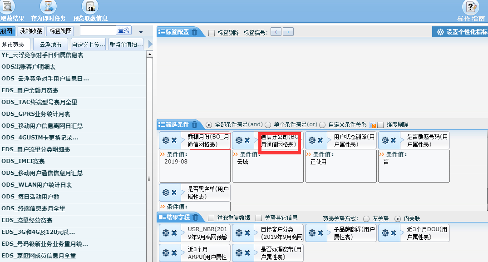
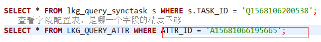

## 服务器

> 连接服务器的信息：

| ip        | 端口 | 账号   | 密码     | 备注             |
| --------- | ---- | ------ | -------- | ---------------- |
| 127.0.0.1 | 202  | gdsa   | Audi#369 | 自助分析前台     |
| 127.0.0.1 | 203  | gdsa   | Audi#369 | 自助分析前台     |
| 127.0.0.1 | 59   | gdsa   | Audi#369 | 自助分析后台     |
| 127.0.0.1 | 58   | gdsa   | Audi#369 | 自助分析测试环境 |
| 127.0.0.1 | 1331 | paaswh | Audi#369 | 下载中心ftp      |
| 127.0.0.1 | 1332 | paaswh | Audi#369 | 下载中心前台     |
|           |      |        |          |                  |
|           |      |        |          |                  |
|           |      |        |          |                  |

下载中心生产库的如果用数据库客户端登不上去的，用远程桌面登录连接，在 cmd 中输入 "远程桌面连接"，然后主机地址填入：`172.20.0.2:33142`，账号：`laiyongqi` ，密码：`1qaz@WSX`

## 数据库

> 打开 dbvisualizer 客户端工具，选择 `create database connection`，然后在 `Settings Format` 选项中选择 `Database URL`，然后在 Database URL 项中输入：下面相应的地址，填入对应的用户名和密码即可。

| Database URL                                                 | 账号    | 密码       | 备注           |      |
| ------------------------------------------------------------ | ------- | ---------- | -------------- | ---- |
| jdbc:db2://127.0.0.1:50000/sa1                               | db2inst | Audi#369   | 自助分析测试库 |      |
| jdbc:db2://127.0.0.1:55558/sa1                               | gdsa    | Audi#369   | 自助分析生产库 |      |
| jdbc:db2://127.0.0.1:55556/GDDW                              | qbar    | Audi#369   | 省库           |      |
| jdbc:oracle:thin:@(DESCRIPTION=(ADDRESS_LIST=(ADDRESS=(PROTOCOL=TCP)(HOST=127.0.0.1)(PORT=1071))(ADDRESS=(PROTOCOL=TCP)(HOST=127.0.0.1)(PORT=1051)))(LOAD_BALANCE=YES)(FAILOVER=YES)(CONNECT_DATA=(SERVER=DEDICATED)(SERVICE_NAME=SSYXZX))) | md      | QeAd!#%086 | 下载中心生产库 |      |

## 浏览器访问

> 访问自助分析：`http://10.252.157.203:9080/PowerShow/`
>
> 访问下载中心：`http://10.253.43.12:8080/dc/index.html#/login?token=84E788B1F327BCA88307456BB3DFF0FC`，必须要带 token，这个 token 是 admin账号的
>
> 访问自助分析时，如果账号是 admin，则密码就是 zzfx!@#admin，普通用户的密码就是 zzfx!@#123

## 自助分析问题维护

* 数据库连接：自助分析的生产库（jdbc:db2://127.0.0.1:55558/sa1）
* 在 `lkg_staff` 表中查询 staff_name 是维护人员名字的 staff_id
  * 然后登陆 http://10.252.157.203:9080/PowerShow/ 以该用户的账号和密码登陆
* 点击`自助取数` > `即时取数浏览`，根据创建人来过滤查询结果
* 找到那一条后，点击`另存取数任务`，预览取数信息，获取 sql 语句，登陆 `自助分析后台 59` 服务器，输入：` sqlplus js_zzfx/Gd\!ds358@DGDM ` 直连客户的数据库，去执行该条sql语句（注意：不同地市，只是@DGDM不同，比如深圳市就是 @SZDM等）；这种方式很慢，不推荐。

去自助分析生产库，查找 lkg_query_task_run 表，`select * from lkg_query_task_run as s where s.task_code='Q1568010104836';`，然后拿到了 `task_id`， 这个 id 对应于服务器上的一个目录，然后登陆 `自助分析后台 59` 服务器， 进入 `/data_tmp/SA_QT_2.6_GD/logs/` + 该 task_id，去看 TaskRun.log 日志

>  socket 日志: /home/gdsa/SOCKET/logs(自助分析59服务器)

>  后台日志：/data_tmp/SA_QT_2.6_GD/logs(自助分析59服务器)

>  大数据平台不支持导入上传文件的

步骤：

*1* 、先查看如下图片所示，记录该值：

*2* 、然后查询 即时任务表：

*3*、然后就获取到该任务的 task_id了，然后再上服务器，图示目录下去查询：

这里的红色标记地方就是上一步获取到的 task_id 值，替换此处的值然后进入该目录。

先看 如下标注的文件内有无异常或错误：

如果没有；在分别进去上面这几个其它的文件内查看。如下所示：

可以看到是由于 数据库表的第12列的精度不够导致的，

然后退出当前文件，重新进入到 TaskRun.log 文件中，找到如下内容：

注意要 数对第12列的，然后复制 ：A15681066195665 ,

然后，再进入到数据库的 `字段配置表 lkg_query_attr`，查看是哪一列引起的，然后修改该字段的精度即可。

然后看该表的哪一个字段是 char(1)，找到后，将其长度变大即可了。

## 数据表

| 表名                       | 备注                 |      |
| -------------------------- | -------------------- | ---- |
| lkg_staff                  | 员工信息表           |      |
| lkg_query_admin            | 员工管理员信息表     |      |
| lkg_query_table            | 宽表配置表           |      |
| lkg_query_attr             | 字段配置表           |      |
| lkg_query_view             | 视图配置表           |      |
| lkg_query_view_table       | 视图宽表关联表       |      |
| lkg_query_view_join        | 视图宽表字段关联表   |      |
| lkg_query_view_field       | 视图展示字段配置表   |      |
| lkg_query_list             | 即时任务记录表       |      |
| lkg_query_task             | 定时任务表           |      |
| lkg_query_upload           | 外部数据导入记录表   |      |
| lkg_query_report           | 报表记录表           |      |
| lkg_query_task_run         | 即时任务表           |      |
| lkg_query_synctask         | 推送文件日志表       |      |
| lkg_query_push_info        | 推送文件记录表       |      |
|                            |                      |      |
| lkg_tr_label               | 标签配置表           |      |
| lkg_tr_label_cnt           | 标签覆盖数表         |      |
|                            |                      |      |
| lkg_query_db_config        | 数据库配置表         |      |
| lkg_query_db_access_manage | 数据库授权用户配置表 |      |
| lkg_query_extsys           | 推送渠道配置表       |      |

## 下载中心

> 下载平台出云工单查询：根据文件名，查询 md.T_DC_FILE 表
>
> SELECT * FROM T_DC_FILE WHERE FILE_NAME LIKE 'SJXQZC-ST-19080600001981722924%';
>
> -- 下载平台出云工单
> SELECT * FROM T_DC_FILE WHERE FILE_NAME LIKE 'SJXQZC-CHIRLD-ST-19091100004111786772%';
>
> 然后登陆 下载中心ftp1331 服务器， 查看该日志：vi /home/paaswh/action/logs/server.log

## 查看日志

> 202主机日志：/app/logs/Controller.log
>
> 启动脚本：/app/gdsa/tomcat8.5.5/bin/startup.sh
>
> 停止脚本：/app/gdsa/tomcat8.5.5/bin/shutdown.sh
>
>  
>
> 203主机日志：/app/logs/Controller.log
>
> 启动脚本：/app/gdsa/tomcat8.5.5/bin/startup.sh
>
> 停止脚本：/app/gdsa/tomcat8.5.5/bin/shutdown.sh
>
>  
>
> 58 主机日志：/home/gdsa/TsTomcat/PowerShow/logs/Controller.log
>
> 启动脚本：/home/gdsa/TsTomcat/tomcat8.5.5/bin/ startup.sh
>
> 停止脚本：/home/gdsa/TsTomcat/tomcat8.5.5/bin/ shutdown.sh
>
>  
>
>  
>
> 59后台日志： /data_tmp/SA_QT_2.6_GD/logs /LogFile.log
>
> 启动脚本：/data_tmp/SA_QT_2.6_GD/ QueryToolNew.sh
>
> 停止脚本：/data_tmp/SA_QT_2.6_GD/ stopQueryTool.sh
>
>  
>
>  
>
> 59 后台socket日志：  /home/gdsa/SOCKET/logs/LogFile.log
>
> 启动脚本：/home/gdsa/SOCKET/ QueryToolNew.sh
>
> 停止脚本：/home/gdsa/SOCKET/ stopQueryTool.sh
>
>  
>
>  
>
> 59后台shell脚本日志：/home/gdsa/datafile/JS_DATA/bin/ALLFILE_FTP.sh.log